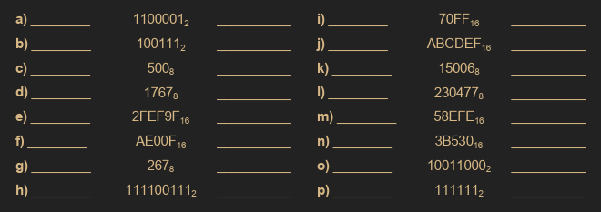
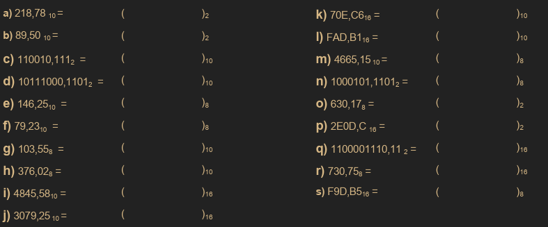
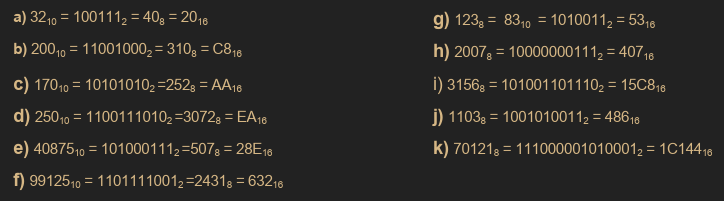
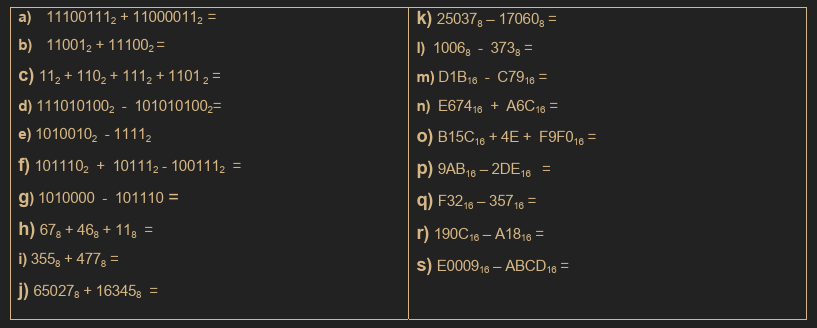
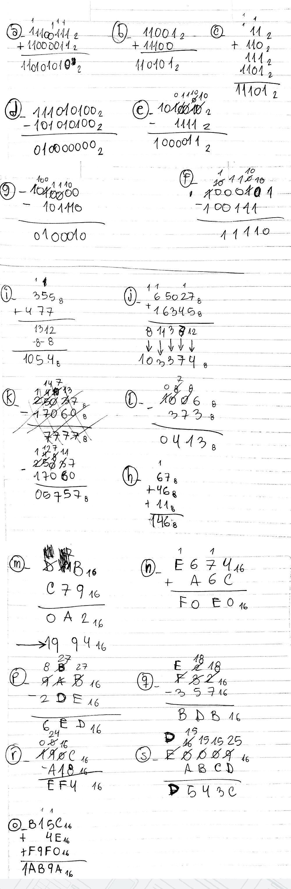
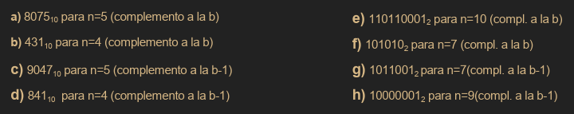
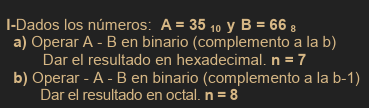
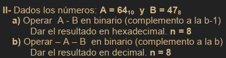
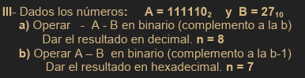
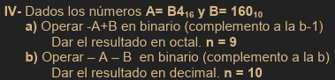

# Ejercicios Practicos: ACO

<!-- TOC -->
- [Sistemas Nuemricos](#sistemas-nuemricos)
    - [**Ejercicio 1**](#ejercicio-1)
    - [**Ejercicio 2**](#ejercicio-2)
    - [**Ejercicio 3**](#ejercicio-3)
    - [**Ejercicio 4**](#ejercicio-4)
    - [**Ejercicio 5**](#ejercicio-5)
    - [**Ejercicio 6**](#ejercicio-6)
<!-- /TOC -->

---

## Sistemas Nuemricos

### **Ejercicio 1**

Colocar el numero anterior y posterior:

**Rta:**
1. 1100000 y 1100010
2. 100110 y 101000
3. 477 y 501
4. 1766 y 1770
5. 2FEF9E y 2FEFA0
6. AE00E y AE010
7. 266 y 270
8. 111100110 y 111101000
9. 70FE y 7100
10. ABCDEE y ABCDF0
11. 15005 y 15007
12. 230476 y 230500
13. 58EFD y 58EFF
14. 3B52F y 3B531
15. 10010111 y 10011001
16. 111110 y 1000000

### **Ejercicio 2**

Realizar las siguientes conversiones:

**Rta:**
1. $218,78_{10} = 11011010,110001_2$ 
4. $10111000,1101_2 = 184,875_{10}$
7. $103,55_8 = 67,703125_{10}$
9. $4845,58_{10} = 20E,947AE1_{16}$
11. $70E,C6_{16} = 1807,125_{10}$
15. $630,17_8 = 110011000,001111_2$
19. $F9D,B5_{16} = 7635,564_8$

### **Ejercicio 3**

Determinar si son Verdaderas (V) o Falsas (F) y JUSTIFICAR las siguientes equivalencias:

**Rta:**
3. V: $232_8 = 10101010_2 \space AA_{16} = 10101010_2 \space 10101010_2 = 170_{10}$ 
6. F: $632_{16} = 110011010_2 \space 2431_8 = 10100011001_2 \rightarrow NO \space SON \space IGUALES$
8. V: $2007_8 = 10000000111_2 \space 407_{16} = 10000000111_2$

### **Ejercicio 4**

Realizar las siguientes operaciones aritmeticas:

**Rta:**

### **Ejercicio 5**

Obtener la representacion en Complemento de los siguientes numeros:

**Rta:**

### **Ejercicio 6**

Operaciones en binario con numeros representados en complemento y conversiones:

---

