# Notas de Clase: ACO

## Tabla de Contenidos

<!-- TOC -->
- [Tabla de Contenidos](#tabla-de-contenidos)
    - [03/08/2021 - Teorico](#03082021---teorico)
        - [**Introduccion**](#introduccion)
        - [**U1: Sistemas Numericos**](#u1-sistemas-numericos)
    - [17/08/2021](#17082021)
        - [Codigos Alfanumericos (Cat 3)](#codigos-alfanumericos-cat-3)
        - [Codigos de Instruccion (Cat 4)](#codigos-de-instruccion-cat-4)
        - [Codigos Detectores de Errores](#codigos-detectores-de-errores)
        - [Codigos con cantidades cosntantes de unos](#codigos-con-cantidades-cosntantes-de-unos)
    - [05/10/2021](#05102021)
        - [Tablas de Transicion](#tablas-de-transicion)
- [12/10/2021](#12102021)
    - [Arquitectura de Von Neumann](#arquitectura-de-von-neumann)
    - [Assembler](#assembler)
        - [Tipos de Instrucciones](#tipos-de-instrucciones)
        - [Modos de Direccioanmiento](#modos-de-direccioanmiento)
    - [19/10/2021](#19102021)
<!-- /TOC -->

**Cuerpo Docente:**
- _Teorico:_ Walter Lancioni
- _Practico:_ Alejandra Di Gionantonio

**Horario:**
- _Martes_: 8:00 a 11:20
- _Viernes_: 8:00 a 11:20

**Link Teorico:** meet.google.com/sdg-dhiv-nfi
**Link Practico:** ID=898 0118 5168 Clave=661211

---

### 03/08/2021 - Teorico

#### **Introduccion**

La CPU esta compuesta por:
- _Unidad AritmetiocaLogica_: Se encarga de las operaciones artimeticas (suma, resta, multiplicacion, division) y logicas (AND, OR, NOT, etc,) dentro del sistema. Es dirigido por la UC.
- _Unidad de Control_: Es el circuito encargado de dirigir las operaciones de la computadora, accediendo a emmoria para recueprar datos, operarlos en la ALU, y luego volver a almacenarlos en memoria principal.

Los componenetes internos se comunican mediante _buses_ que permiten el envio de informacion. Un bus posee tantas lineas de transmision como el tamaño de pal;abra de bit con el que trabaja el procesador (hoy en dia las PCs trabajan con 64 bits, por lo tanto los buses poseen 64 lineas de transmision). Los buses son:
- _Datos_
- _Direcciones_
- _Control_

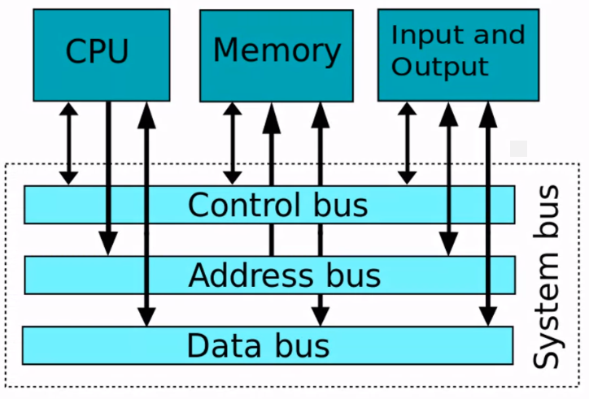

**ALU:**

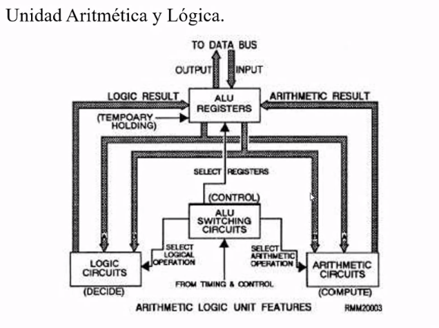

#### **U1: Sistemas Numericos**

<!--* Definicion -->
Un **sistema numerico** podemos definirlo como el conjunto de reglas que permiten nombrar y escribir cualquier numero, a partir de un numero finito de simbolos. Esta conformado por:
- Un conjunto finito y no vacio de cimbolos denominado _alfabeto_
- Unconjunto de reglas para formar numerales con los simbolos
- Un conjunto de reglas para operar entre los numerales

Podemos representarlo como:

$$
N = \{\{S\};\{R\}\}
$$

Los simbolos minimos de un sistema binario deben ser uno que represente la ausencia y otro que represente la unidad (0 y 1 respectivamente).

<!--* Definicion -->
La **base** de un sistema nuemrico se corresponde con la cantidad de simbolos permitidos del sistema.

Encontramos distintos sistemas posicionales identificados segun su base:
- Binario: Base 2 (2 simbolos).
- Octal: Base 8 (8 simbolos).
- Decimal: Base 10 (10 simbolos).
- Hexadecimal: Base 16 (16 simbolos).

El binario es utilziado en las computadoras porque es un sistema facilmente representable en circuitos electricos, utilziando distintos niveles de tension para los bit 0 y 1.

Los sistemas pueden ser **posicionales** o **no posicionales**:
- _Posicionales:_ Su valor depende del valor intrinsieco del simbolo, y de la posicion que ocupa el digito dentro del numeral.
- _No Posicionales:_ Su valor es puramente intrinseco y no tiene peso o valor la posicion del digito dentro del numeral (por ej. sistema numerico romano).

<!--* Definicion -->
**Teorema Fundamental de la Numeracion:**
Dado un sistema de Nuemracion de base b con b > 1, cualquier numero natural N puede descomponerse de la forma:

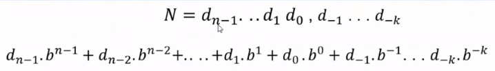

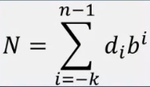

Considerar que _n_ se refiere a los digitos de la parte entera y _k_ de la parte fraccionaria.

Observamos entonces que un numero puede expresarse siempre como un **polinomio de potencias de la base**. Permite poder pasar cualquier numero expreso en cualqueir base a base decimal.

<!--! Ejemplo -->
Ejemplo:

$$
(123,15)_{10} = 1*10^2 + 2*10^1 + 3*10^0 + 1*10^{-1} + 5*10^{-2}
$$

Para poder pasar de base decimal a cualqueir otra base, se debe aplicar un metodo de division y multiplicacion segun el _algoritmo de Euclides_. Consiste en la division de la aprte entera por la base a la que se queire transformar, obteniendo los restos para conformar el numeral. Para la parte decimal, se multiplica por la base a la que se queire transformar, recuperando la parte entera resultante de dicho producto.

El proceso de conversion para la parte decimal se demuestra de la siguiente forma:

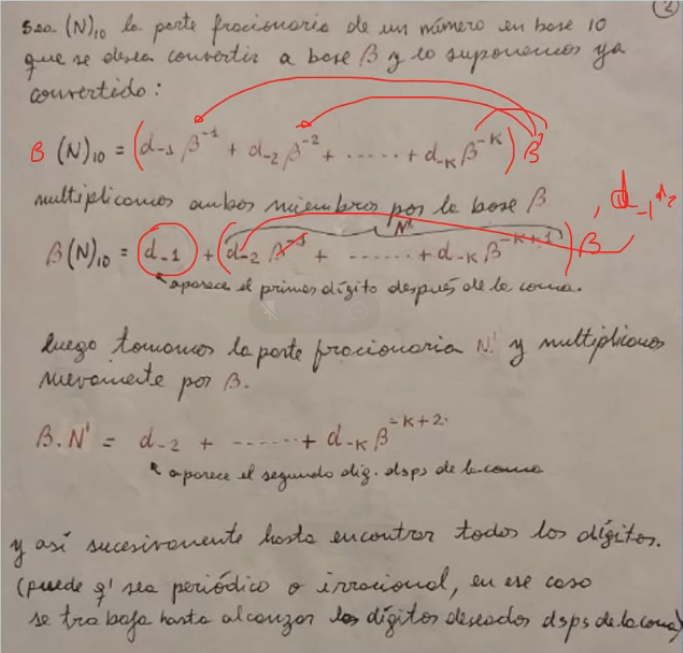

---

### 17/08/2021

#### Codigos Alfanumericos (Cat 3)

Existen versiones de **ASCII** de:
- 6 bits (original, poco uso actualmente)
- 7 bits
- 8 bits

Los codigos de represetnacion alfanumerica trabajan en binario, pero los humanos podemos usarlos en Hexadecimal por una cuestion de facilidad de comprension y uso.

#### Codigos de Instruccion (Cat 4)

Los _codigos de categoria 4_ son codigos de instrucciones, utilziados por los procesadores y que hacen que estos realicen una determinada secuencia de operaciones (por ej. Intel X86).

#### Codigos Detectores de Errores

El _Codigo de Hamming_ es un codigo que permite detectar y corregir errores, para lo cual debe cumpli con la ecuacion:

$$
2^p \geq i + p +1
$$

Donde p es la cantidad de bits de control, e i es la cantidad de bits de inforfmacion. Entonces, la palabra a transmitir debe cumplir que:

$$
m = i + p = 2^p -1
$$

Donde m es la cantidad de its de la pal;abra a transmitir.

<!-- Ejemplo -->
Deseo transmitir una palabra de 15 bits, donde 11 de estos bits son de informacion y 4 de control. Los bits de paridad ocupan lugares que son potencia de dos (bits 1, 2, 4 y 8).

Para determinar los bits de paridad, vamos a apalciar la operacion _mod 2_ a los bits de informacion del codigo que sean 1. Obtendremos como resultadop un palabra de p bits, donde cada bit se corresponde con cada uno de los bits de control.

Luego, en caso de un error en la transmision, se toman todos los bits (ya sean de informacion o control) que valgan 1 y se aplica la operacion _mod 2_, de forma que el rtesultado sera el bit que se envio de forma erronea.

<!---->

Llamamos **Distancia de Hamming** a la medida de la diferencia entre 2 terminos contiguos de un codigo. Entonces, la probabilidad de a y b se confundan disminuye mientras mas distintos sean ellos.

#### Codigos con cantidades cosntantes de unos

**Biquinario:** Es un codigo que emplea dos sistemas combinados, uno de 2 bits (binario) y uno de 5 bits (quinario). Es un codigo de tipo ponderado.

---

### 05/10/2021

EL **flip flop JK** posee un total de 4 entradas:
- J
- K
- Preset
- Clear

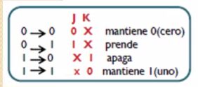

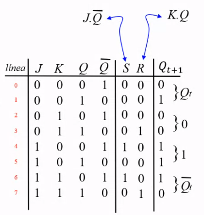

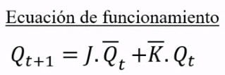

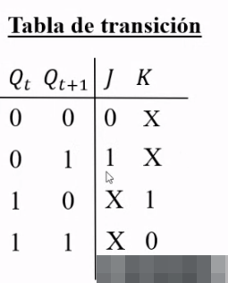

$S = J.Q_{negado}$ y $Q = K.Q$

#### Tablas de Transicion 

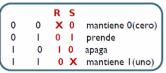

---

## 12/10/2021

### Arquitectura de Von Neumann 

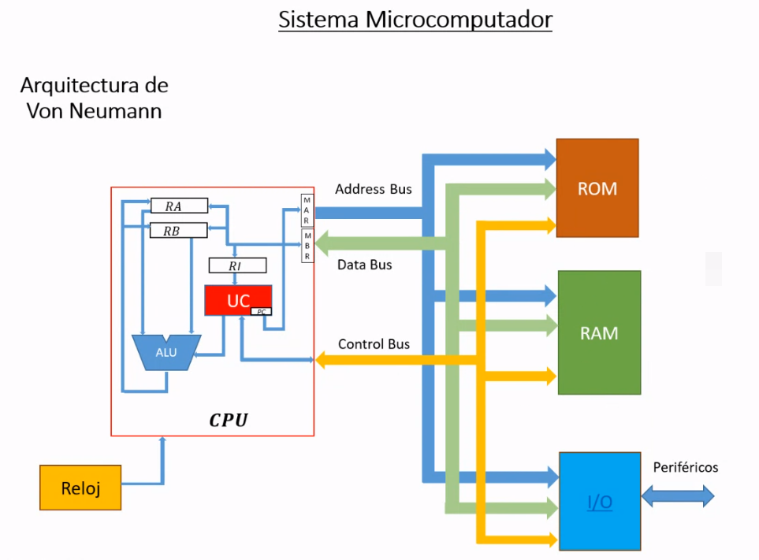

- _Microprocesador:_ Posee:
    - _Unidad de Control_
    - _Unidad Aritmetico-Logica_
    - _Registro de Instrucciones_
    - _Otros registros de almacenamiento_
- _Memoria ROM_
- _Memoria RAM_
- _Dispositivos de Entrada/Salida_
- _Reloj/Clock_

### Assembler 

Una **instruccion** es una operacion expresada mediante codificacion binaria. Se lo denomina _lenguaje de maquina_, el cual es distinto para cada computador, aunque existe la compatibilidad dentre familias.

Denominamos como **repertorio de isntrucciones** al conjunto de ordenes que puede ejecutar un computador. 

#### Tipos de Instrucciones 

- _De Transferencia:_ Copian en el destino (registro, posicion de memoria) la informacion del operando sin modificarlo. No modifican el estado de los flags/banderas (indican cuando existe una operacion esperada o no esperada). Pueden mover palabras, o bloques enteros (strings).

- _De Bifurcacion:_ Modifican la secuncia normal de ejecucion de un programa. Actuan sobre el contador de programa (PC o IP). Pueden ser de _saltos_ o _llamadas a subrutinas_.
    Los saltos pueden ser:
    - Incondicionales: Se abrevia JMP (IP $\leftarrow$ etiqueta)
    - Condicionales: Se abrevia J{Condicion} etiqueta.

    Las llamadas a subrutinas pueden ser:
    - Procedimientos: CALL etiqueta 
    - Interrupciones: INT ]

- _Aritmeticas y Logicas:_ 
    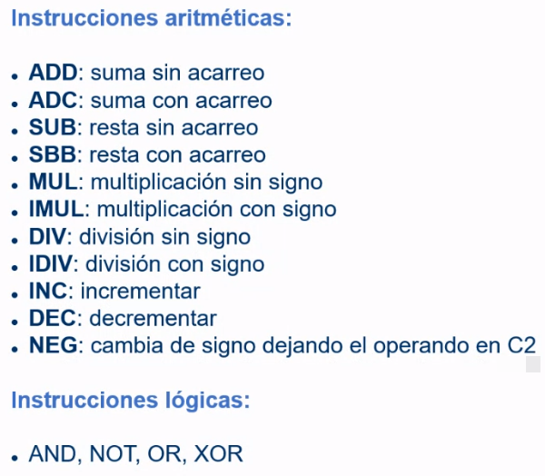

- _De Comparacion y de Bit:_
Las de copmapracion o almacenan el resultado, sino que se encartan de modificar flags. Por ejemplo, la intruccion CMP que comapra numeros para modfiicar los flags de estado. Las de instruccion tienen la funcion de modificar un solo bit o leer su estado.
    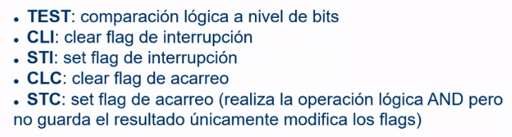

- _De Desplazamiento:_ Buscan desplazar el bit a la izquierda es equivalente a multiplicar por 2 en binario. Analogamente, desplazar a la aderc ha es equivalente a dividir por 2. Si la base es 10, se divide/multiplica por 10 y no por 2. Todas las instrucciones de desplazamiento y rotaciones tienen en comun que el ultimo valor desplazado se copia en el flag de acarreo.
    

- _De Entrada/Salida:_ 
    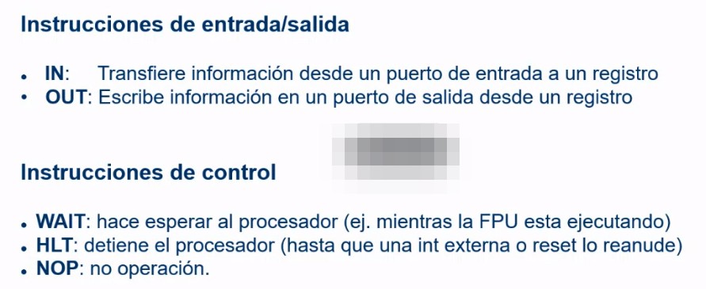

- De Control 

#### Modos de Direccioanmiento 

Son las distintas formas usadas por los microprocesadores para obtener o acceder a los oeprandos.

- **Inherente o Implicito:** La instruccion implicitamnete contiene la orden a realizar. Ejemplo: 
    - CLC (Clear Carry)
    - STI (Set Interrupt Flag)
    - CLI (Clear Interrupt Flag)

- **Directo**

- **Indirecto**

- **Relativo**

---

### 19/10/2021

