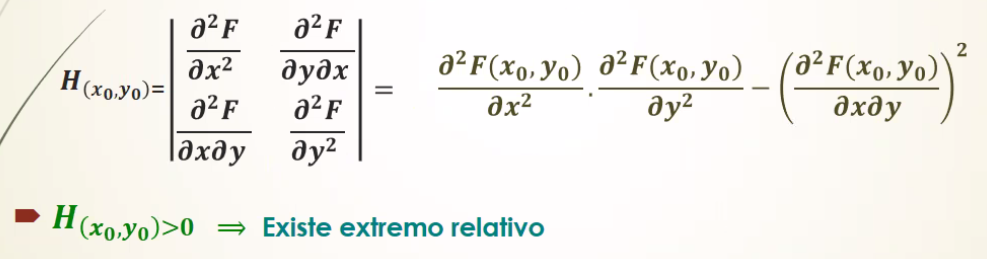

# Notas de Clase: Analisis Matematico II

**Cuerpo Docente:**
- _Teorico_:
- _Practico_: Roxana Manera - roxanamanera@gmail.com

**Horarios:**
- _Martes:_ 13:15 a 17:45 - Zoom (ID 86498417568, Clave: 998493)
- _Viernes:_ 13:15 a 16:15

**Condicion de Promocion:** Aprobar los practicos con 6.

---

## 03/08/2021 - Practico

### **Dominio**

<!--* Definicion -->
Una **funcion** es una relacion en la que a cada elemnto del conjunto dominio le corresponde uno y solo un elemento del conjunto imagen.

El **dominio** es el conjunto de puntos para los cuales la funcion esta definida (es decir, que para losc uales la funcion existe).

La **imagen** es el conjunto de valores numericos que puede tomar la funcion dentro del campo real.

Denominamos como **funcion escalar** de una **variable escalar** a toda funcion del tipo $y=f(x)$. Representa una _curva en el plano_ xy, es decir, esta en $R^2$. Su dominio, por lo tanto, esta en $R^1$. 

Una **funcion escalar** de **variable vectorial** es como conocemos a una funcion del tipo $z=f(x,y)$, dado que posee dos variables independientes de tipo escalar. Representan una _superficie en el espacio_, es decir, esta en $R^3$. Su dominio, por lo tanto, esta en $R^2$, dado que es la proyeccion de la "sombra" de la funcion en el plano xy. 

$$
Df(x,y) \in R^2 \rightarrow Dominio \space de \space z
$$
<!--*-->

Para poder graficar el dominio de una funcion de 2 o mas variables, lo primero es poder identificar las *restricciones* matematicas que impiden a la funcion tomar ciertos valores. Las restricciones fundamentales del dominio son 3:

- El radicando de una funcion no puede ser negativo: $\sqrt{x} \to x \geq 0$

- El denominador de una division no puede ser 0: $y/x \to x \ne 0$

- El argumento de un logaritmo debe ser positivo: $log(x) \to x \gt 0$

Es necesario saber identificar las formulas de las *conicas* que se presenten en el dominio:

- Circunferencia: $(x-h)^2 + (y-k)^2 = r^2$

- Elipse: $\frac {(x-h)^2} {a^2}+ \frac {(y-k)^2} {b^2} = 1$

- Hiperbola: $\frac {(x-h)^2} {a^2} - \frac {(y-k)^2} {b^2} = 1$

- Parabola: $y = ax^2 + bx + c \space \lor \space x = ay^2 + by + c$

**Fecha Tentativa de Parcial:** 14/09/2021 o 21/09/2021

**Tips:**

- El argumento de las funciones trigonometricas es cualquier numero real, y al ser ciclicas se debe considerar eso en caso de poseer algun tipo de restriccion (probablemente aporten un conjunto infinito de restricciones al dominio, mediante alguna serie calculable).

- Al considerar el valor absoluto se tienen 2 alternativas para dicha funcion (positiva o negativa). 

- Si la restriccion no especifica un =, entonces la curva se grafica puntuada, lo que implica que el dominio es abierto (es decir que no incluye a la frontera).

- Para restricciones que impliquen una union de semiplanos (tal como lo es el argumento de un logaritmo si dicho argumento es un cociente), planteamos y graficamos cada semiplano, y luego los unimos en un plano sobre le cual marcaremos las demas restricciones.

- En las funciones triginometricas inversas (arcoseno y arcocoseno) su dominio esta limitado entre -1 y 1, y su imagen es todos los reales.

---

## 17/08/2021

### Derivadas Parciales

Graficamente/Geometricamente, si tenemos una funcion z = f(x,y), identificamos una superficie en el espacio, donde P(a,b,c) es un punto sobre esta superficie. Encontramos un Punto P(a,b) que es aprte del dominio de la fuincion y se ubica en el plano xy. Podemos tomar a la variable y como cte, de forma tal que sobre la superficie f(x,y) podemos trazar una curva C1 = f(x,b), que pasa por el punto P(a,b,c). Si trazamos la recta tangente al punto P(a,b,c) sobre C1, el valor de su pendiente sera igual a la derivada parcial de z respecto dse x valuada en el punto P.

Analogamente, podemos trazar una curva C2 = f(a,y), de forma tal que la variable x se vuelve cte. Entonces, si trazamos la recta tangente al punto P(a,b,c) sobre C2, el valor de su pendiente sera igual a la derivada parcial de z respecto de y valuada en el punto P.

<!-- IMPORTANTE -->
$$
a^u = u' * \ln {a} * a^u
$$

### Derivadas de Orden Superior

---

## 07/09/2021

### Derivada Drieccional

La derivada direccional permite hallar la razon de cambio en cualquier direccion y sentido dados por un vector $\vec{v}$ o por un angulo $\alpha$.

La derivada direccional es el _producto escalar_ de dos vectores, el **vector gradiente** y el **vector de direcciones**.

El vector de direcciones debe ser **unitario**, es decir que su modulo debe ser igual a 0.

- La direccion del vector gradiente en la direccion en la que la derivda direccional es maxima, y su valor es igual al modulo del vector gradiente. En este mismo sentido, en sentido opuesto del vector gradiente, la derivada direccional es minima.

Si el vector gradiente y el vector de direccion son perpendiculares, entonces la derivada direccional es nula.

#### Tarea

---

### 14/09/2021

#### Extremos Relativos

Pueden definirse los extremos considerando la funcion incremental:

Si para todo incremento $\Delta_x$ o $\Delta_y$ lo suficientemente pequeño:
- $\Delta_x$ < 0 $\rightarrow$ Minimo
- $\Delta_x$ > 0 $\rightarrow$ Maximo

**Condicion Necesaria:** Que sus derivadas primeras se anulen en el punto $P(x_0,y_0)$. Resolviendo el sistema de ecuaciones planteado, vamos a identificar _puntos criticos_. No es suficiente porque un punto critico podria ser un _punto de ensilladura_, que no es maximo ni minimo.

**Condicion Suficiente:**  La funcion tednra un extremo en un punto critico si se cumple que el Hessiano en ese punto sea mayor a 0.

Para saber si dicho punto es maximo o minimo, debemos valuarlo en alguna de las derivadas segundas (no cruzadas). 

Si el Hessiano da menor a 0, entonces estamos en precensia de un punto no extremo (ensilladura). Si es igual a 0, entonces estamos en un _caso dudoso_. 

**Tarea:**

---

## 28/09/2021

### Integrales

**Tarea:**

---

## 12/10/2021 

### Integrales Curvilineas 

Cuando la curva a integras es cerrada, se puede resolver por suma de curvilineas o bien por la **Formula de Green**. 

#### Area de un Dominio 

> Se dice que existe **independencia de trayectora**, cuandoi al integrar a traves de un _campo vectorial_ entre 2 puntos A y B y respetando el setnido de integracion, el resultado es igual.

Un campo vectorial es **conservativo** si la derivada de P con respecto de y es igual a la derivada de Q con respecto de x. 

 

---

## 19/10/2021

### Ecuaciones Diferenciales

Es una ecuacion en la que la incognita es una funcion, y contiene no solo a la funcion sino tambien a sus derivadas y diferenciales.

Conceptos importantes:
- **Ordinarias:** Contiene funciones de una sola variable independiente y la derivada respecto de esa variable.
- **A Derivadas Parciales:** La funcion incognita contiene mas de una variable independiente y sus derivadas.
- **Orden:** Esta dado por la derivada de mayor orden que contenga la ED.
- **Grado:** Esta dado por la potencia a la que esta elevada la derivada de mayor orden de la ED.

#### Solucion General

Es una ecuacion libre de derivadas y diferenciales, y que satisface la ecuacion diferencial en forma identica. Tendra tantas cosntantes de integracion C como el orden del que sea la ED.

#### Solucion Particular

Es aquella funcion que ademas de pertenecer a la solucion general, cumple con alguna condicion. Por ejemplo, pasar por un punto determinado.

#### Forma General de una Ecuacion de 1er Orden

$$
M(x,y)dx + N(x,y)dy = 0
$$

Pueden ser:
1. _A Variables Separables_
2. _Homogeneas_
3. _Lineales_
4. _De Bernoulli_
5. _Totales o Exactas_

#### EDO: A Varaibles Separables

Si se pueden llevar a la forma $f_1(x)dx + f_2(y)dy = 0$, entonces se puede resolver como EDO a varaibles separables.

Para encontrar la solucion, separamos cada variable en cada miembro. Luego integramos ambos miembros y sumamos las constantes C. Finalmente, despejamos la variable $y$.

#### EDO: Homogeneas

Se reslveran como homogeneas si se pueden llevar a la forma $y' = F(x,y) \rightarrow frac {dx} {dy} = F(x,y)$. El objetivo es poder llevarlas a varaiables seprables para poder resolverlas.

Entonces, vamos a resolverla por sustitucion de variables:
$$
y = u.x
$$

$$
frac {dy}{dx} = frac {du}{dx}.x + u
$$

#### EDO: Lineal

Tienen la forma $y' + P(x).y = Q(x)$. Se resuelven realizando un cambio de variables:
$$
y = u.v \rightarrow y' = u'.v + u.v'
$$

Despejamos y planteamos que $v'+P(x).v$ es igual a 0.
s