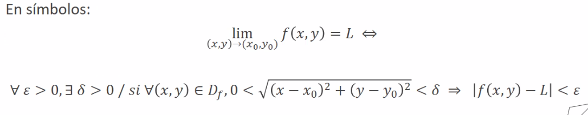
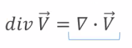

# Notas de Clase: Analisis Matematico II

**Profesor:** Ing. Marcelo Arcidiacono
**Horaios:** Viernes de 13:15 a 16:15
**Link a clase:** ID=831 6642 9261 Clave=001560

Los parciales teoricos son _optativos_. Se basa en preguntas multiple choice y dura de 20 a 30 minutos. Se rinde el mismo dia que el examen practico.

El **primer parcial** tendra lugar el 24/09/2021.
El **segundo parcial** tendra lugar el 02/11/2021.
El **recuperatorio** tendra lugar el 09/11/2021.
Se puede recuperar 1 teorico y 1 practico.

La aprobacion directa se logra con nota mayor o igual a 6 en todos los examenes. Luego, se debera rendir un **coloquio teorico** donde se tomaran TODOS los temas de la materia.

**Bibliografia:**
- Piskunov - "Calculo Diferencial e Integral"
- Monllor - "Analsis Matematico II"

---

## 06/08/2021

Las funciones de 1 variable independiente se denominan _funciones escalares_. Estas describen curvas en el plano, dado que su dominio es un conjunto de escalares (nuemros reales) y su imagen tambien es un conjunto de escalares.

Por esto decimos que la _dimension_ de los conjunto dominio e imagen es igual a 1. Podemos observar que si multiplicamos el dominio por la imagen, al multiplicar dos conjuntos en R, dara como resultado un conjunto R2 que representa a la grafica de la funcion en el plano.

Un _campo escalar_ se refiere a aquellas funciones de 2 o mas variables independientes. El conjunto de partida (dominio) es un conjunto de vectores, y la imagen en un conjunto de valroes reales. Transforman un vector de n componenetes (2 en este caso) en un numero.

A lo sumo podemos graficar campos escalares de 2 variables independientes, dado que no podemos graficar en R4.

Una _funcion vectorial_ consiste en un dominio real que permite llegar a una imagen que se corresponde con un conjunto de vectores. Se usan principalmente para poder describir trayectorias, en el plano o en el espacio.

Los _campos vectoriales_ son funciones que relacionan vectores con vectores. Es decir, tanto el dominio como la imagen son conjuntos de vectores. La dimension del dominio y la imagen son distintas de 1. 

Definimos al **entorno** de un punto P0 como al conjunto de todos los puntos que lo rodean en un radio $ \delta $, siendo P0 el centro de dicho entorno. No se incluye a la frontera de dicho entorno. La raiz cuadrada represetna la distancia _euclidea_ de cualqueir punto (x,y) del plano y el centro P0.

De forma similar, un **entorno reducido** de un punto P0 y radio $\delta$ es el conjunto de todos los puntos interiores al circulo de centro P0 y radio $ \delta $, excluyendo al punto P0.

Podemos representarlo tambien como:

### LIMITE

**Definicion Formal:**

<mark>INVESTIGAR PUNTO DE ACUMULACION</mark>

La unica forma de demostrar que el limite doble existe es mediante _calculo por sustitucion directa_ o bien mediante _definicion_ para encontrar el radio $ \delta $ adecuado para cualquier valor $ \epsilon $. 

**Pregunta:** Por que en limite consideramos el entorno reducido y no el entorno comun?
> Porque en limite no importa si la funcion existe en dicho punto, simplemente se busca saber si las trayectorias tienden a dihco punto.

--- 

## 20/08/2021

### Diferencial

<mark>TOMAR NOTA DEPSUES EN BASE A LAS FILMINAS DEL PROFE</mark>

Podemos demostrar la formula para el diferencial total de una funcion mediante el _Teorema del Valor Medio_:

$$
\Delta z = f'_x(a + \theta_1h,b).h + f'_y(a + h,b + \theta_2k).k
$$

Calculamos los limetes:

$$
\lim {(h,k)} {(0,0)}
$$

> Una posible aplicacion del diferencial de una funcion es determinar la continuidad de una funcion en un punto, sin necesidad de calcular el limite doble. Es decir, si la funcion es _diferenciable en el punto_, entonces es _continua_.

**Propiedades de la Funcion Diferencial:**
1. La condicion SUFICEINTE para que una funcion sea diferenciable en un punto es que tenga derivadas parciales continuas en dicho punto.
2. Si una funcion es diferenciable en un punto, entonces:
    a. Es derivable parcialemnte en el punto.
    b. Es continua en el punto.

El **incremento** y el **diferencial** de una funcion tienden a ser iguales (son aproximadadmente iguales para incrementos muy pequeños), es decir $dx=\Delta x$ y $dy=\Delta y$ lo cual se puede demostrar:
1. Partimos de la funcion $z=x$, por lo que $dz=dx$:

$$
dx=f'_x(x,y).\Delta x + f'_y(x,y).\Delta y \Rightarrow dx = \Delta x
$$

    Esto es apreciable dado que si diferenciamos z respecto de x obtenemos $f'_x(x,y)=1$ y si diferenciamos respecto de y obtenemos $f'_y(x,y)=0$.

2. Partimos de la funcion $z=y$, por lo que $dz=dy$:

$$
dy=f'_x(x,y).\Delta x + f'_y(x,y).\Delta y \Rightarrow dx = \Delta x
$$

Esto es apreciable dado que si diferenciamos z respecto de x obtenemos $f'_x(x,y)=0$ y si diferenciamos respecto de y obtenemos $f'_y(x,y)=1$.

3. Podemos reemplazar entonces $dx$ por $\Delta x$ y $dy$ por $\Delta y$, obteniendo la expresion:

$$
dz=f'_x(x,y).dx + f'_y(x,y).dy
$$

Observamos entonces que $dz=dz_x + dz_y$

### Plano Tangente

Podemos usar el diferencial para encontrar el **plano tangente** a la funcion en un punto $P_0$. Dicho plano se puede conformar a partir de las derivadas parciales de z en $x$ y en $y$.

---

## 15/10/2021 

### Funciones Vectoriales 

#### Dominio 

Para una funcion vectorial $f(t)=[f(t),g(t),h(t)]$, el conjunto de valores t que resulta de la interseecion de los dominios de las funciones escalares componentes $f(t)$, $g(t)$ y $h(t)$. 

#### Limite  

Su limite se obtiene tomando el limite de las funciones escalares componenetes: 

Para una funcion vectorial $f(t)=[f(t),g(t),h(t)]$, el limite de la funcion vectorial existira, siempre que los limites de las funciones escalares componenetes existan.

#### Continuidad 

Para una funcion vectorial $f(t)=[f(t),g(t),h(t)]$, la fuuncion es continua en un punto $t = t_0$ si sus funciones componenetes son continuas en $t_0$ y se cumple:

#### Derivada 

Para una funcion vectorial $f(t)=[f(t),g(t),h(t)]$, definiremos su derivada de la misma forma que lo hicimos con funciones escalares: 

 

Cada componenete/versor, represetna la razon de cambio de velocidad en cada una de las direcciones de cada variable. Su modulo es la tasa de cambio de velocidad total. Como todo vector, podemos calcular su modulo de la sigueinte forma: 

#### Integral 

Definimos la integral como la suma de las integrales de cada una de las funciones escalares componenetes. 

### Campo Vectorial 

Al tratarse de m funciones de n variabales, obtendremos m x n derivadas parciales que agrupan en la **matriz Jacobiana**.

El operador **nabla** es un transformados que permite obtener vectores a partir de campos escalares. 

La **divergencia de un Campo Vectorial** es un escalar que se calcula como la traza de la matriz Jacobiana.

Si la divergencia da negativa, queire decir que el punto donde la divergencia fue calcula es un punto donde la densidad aumenta (sumidero).

Si la divergencia da positiva, quiere decir que el punto donde la divergencia fue calculada es un punto donde la densidad disminuye (fuente).

Si la divergencia da igual a 0, entonces el fluido se mueve libremente con velocidad cosntante. Es un fluido incomprensible.

