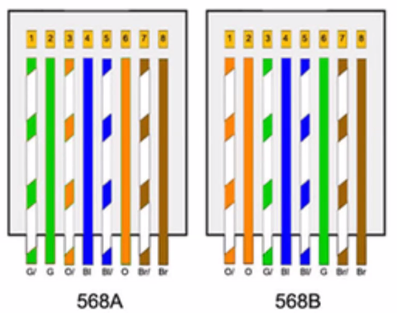
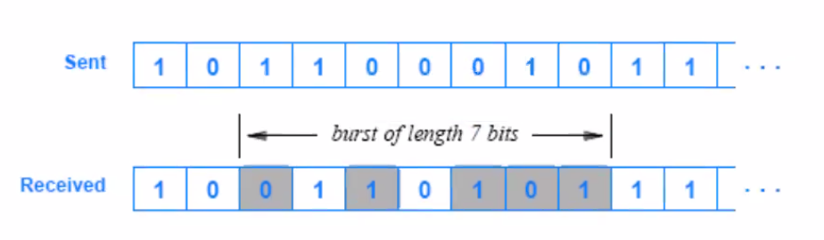

# Notas de Clase: 

<!-- TOC -->
- [18/05/2021](#18052021)
  - [Clase sobre Norma RS 232-C](#clase-sobre-norma-rs-232-c)
    - [Caracteristicas Electricas de las Señales:](#caracteristicas-electricas-de-las-señales)
    - [Analaisis de las Señales que intervienen en los circuitos de intercambio:](#analaisis-de-las-señales-que-intervienen-en-los-circuitos-de-intercambio)
    - [Ejercicios Practicos:](#ejercicios-practicos)
- [19/05/2021](#19052021)
  - [Norma IEEE 1284](#norma-ieee-1284)
- [26/05/2021](#26052021)
  - [USB](#usb)
    - [Versiones de USB](#versiones-de-usb)
- [31/05/2021](#31052021)
- [07/06/2021](#07062021)
  - [Fibra Optica](#fibra-optica)
- [09/06/2021](#09062021)
  - [Fibra optica: Parte 2](#fibra-optica-parte-2)
- [14/06/2021](#14062021)
  - [**Atenuacion en la F.O**](#atenuacion-en-la-fo)
- [16/06/2021](#16062021)
- [28/06/2021](#28062021)
  - [Cable Telefonico](#cable-telefonico)
- [30/06/2021](#30062021)
  - [Cableado Estructurado](#cableado-estructurado)
- [04/08/2021](#04082021)
  - [TP 2: Cableado Estructurado](#tp-2-cableado-estructurado)
- [11/08/2021](#11082021)
  - [Radioenlaces](#radioenlaces)
- [18/08/2021](#18082021)
  - [Propiedades Opticas Basicas](#propiedades-opticas-basicas)
    - [Absorcion](#absorcion)
    - [Reflexion](#reflexion)
    - [Refraccion](#refraccion)
    - [Difraccion](#difraccion)
    - [Interferencia](#interferencia)
  - [Modos de Propagacion de Ondas](#modos-de-propagacion-de-ondas)
    - [Modos de Propagacion por Longitud de Onda](#modos-de-propagacion-por-longitud-de-onda)
  - [Propagacion por Onda Espacial - Satelital](#propagacion-por-onda-espacial---satelital)
  - [Ventanas Atmosfericas del Espectro Electromagnetico](#ventanas-atmosfericas-del-espectro-electromagnetico)
  - [Transponder](#transponder)
- [23/08/2021](#23082021)
  - [Calculo del presupuesto de un enlace o margen de operatividad de un sistema](#calculo-del-presupuesto-de-un-enlace-o-margen-de-operatividad-de-un-sistema)
  - [Horizonta de Radio y de Vista](#horizonta-de-radio-y-de-vista)
  - [Distorsion por Multitrayectoria](#distorsion-por-multitrayectoria)
- [25/08/2021](#25082021)
  - [Antenas](#antenas)
  - [Lobulo de radiacion](#lobulo-de-radiacion)
  - [Tipos de Antenas](#tipos-de-antenas)
- [30/08/2021](#30082021)
  - [Tecnologias de Acceso Inalambrico](#tecnologias-de-acceso-inalambrico)
  - [Tecnologias/Redes Metropolitanas](#tecnologiasredes-metropolitanas)
    - [Tecnologias Moviles](#tecnologias-moviles)
- [01/09/2021](#01092021)
- [06/09/2021](#06092021)
- [08/09/2021](#08092021)
  - [Atenuacion](#atenuacion)
  - [Ruido](#ruido)
- [13/09/2021](#13092021)
  - [Interferencia entre Simbolos](#interferencia-entre-simbolos)
  - [Interferencia Electromagnetica](#interferencia-electromagnetica)
- [15/09/2021](#15092021)
  - [Jitter](#jitter)
  - [Latencia](#latencia)
    - [Diagrama de Ojos](#diagrama-de-ojos)
- [27/09/2021](#27092021)
  - [Modelo OSI](#modelo-osi)
    - [Estructura del Modelo OSI](#estructura-del-modelo-osi)
    - [Arquitectura de Red basada en el Modelo OSI](#arquitectura-de-red-basada-en-el-modelo-osi)
    - [Arquitectura de Redes](#arquitectura-de-redes)
    - [Capas de Modelo OSI](#capas-de-modelo-osi)
    - [Protocolo IP](#protocolo-ip)
    - [TCP (Protocolo de Control de Transmision)](#tcp-protocolo-de-control-de-transmision)
- [29/09/2021](#29092021)
  - [Estructura de los elementos de datos de protocolo](#estructura-de-los-elementos-de-datos-de-protocolo)
    - [PDU (Unidades de Dato de Protocolo)](#pdu-unidades-de-dato-de-protocolo)
- [04/10/2021](#04102021)
  - [Control de Errores en la Transmision](#control-de-errores-en-la-transmision)
    - [Deteccion](#deteccion)
    - [Correccion](#correccion)
  - [Distancia de Hamming](#distancia-de-hamming)
  - [CRC](#crc)
- [06/10/2021](#06102021)
  - [PDN](#pdn)
  - [Metodos de Acceso en Redes LAN](#metodos-de-acceso-en-redes-lan)
  - [Velocidad](#velocidad)
  - [Estandar X.25](#estandar-x25)
  - [Frame Relay](#frame-relay)
  - [ATM](#atm)
  - [TCP/IP](#tcpip)
- [18/10/2021](#18102021)
  - [Tecnologias y Redes de Acceso a Internet](#tecnologias-y-redes-de-acceso-a-internet)
    - [Dial Up](#dial-up)
- [20/10/2021](#20102021)
  - [Modem Dial-Up](#modem-dial-up)
    - [Comparativo entre Dial-Up y xDSLx](#comparativo-entre-dial-up-y-xdslx)
  - [xDSLx](#xdslx)
    - [Tipos de Cables Multipilares de Ultima Milla](#tipos-de-cables-multipilares-de-ultima-milla)
    - [Formula de Ruido en Ultima Milla](#formula-de-ruido-en-ultima-milla)
  - [FTTX](#fttx)
  - [DMT (Modulacion Discreta Multitono)](#dmt-modulacion-discreta-multitono)
<!-- /TOC -->

## 18/05/2021

### Clase sobre Norma RS 232-C

Esta interfaz nos permite comunicar un equipo _terminal_ de datos (DTE) con un equipo _comunicador_ de datos (DCE) mediante un intercambio de datos binarios y en serie (Transmision Asincrona de forma nativa, aunque puede reconvertirse en Sincrona).

El DTE va a realizar y controlar la transferencia de los datos.

La version _RS 232-C_ tienen una velocidad de transmision de 20KB/s, mientras que la verison _RS 422_ tienen una velocidad de transmision 2MB/s.

La pricipal **diferencia** entre ambas versiones es que RS 422 incorpora al hardware un buffer del tipo _FIFO_ (lo primero en entrar es lo priomero en salir).

El modo _null modem_ nos permite poder comunicar dos DTE entre si.

RS 232-C es un protocolo con _handshake_, que implica el estableciemiento de una comunicaion y el control de la transferencia de los datos. Este control se puede ejecutar desde el _hardware_ con correlato en circuitos electricos, o bien por _software_, es decir mediante el envio de codigos en la linea de transmision de datos (particularmetne codigos ASCII).

---

**Ventajas:**

- Resistencia y robustez frente al ruido.

**Desventajas:**

- No es hot plug and play.

---

#### Caracteristicas Electricas de las Señales:

- La distancia alcanzable entre dos aparatos RS232 dendenpe del cable usado y la gama de baudios (como toda transmision en serie).

- RS232 define una longitud maxima de cable segun su capacidad, la cual no debe sobrepasar los 2500pF (picofaradio). Esto, a modo general, se traduce en cables de aproximadamente 15 metros sin consideracion de la velocidad de transmision.

- Si se selecciona un cable de baja capacidad (unos 50pF/m), puede puntearse asi sin auxiliares adicionales una distancia de maximo 50m.

- En cuanto a niveles de tension, los _niveles logicos 1_ van a tener una tension entre -3V y -25V, los _niveles logicos 0_ van a tener una tension entre 3V y 25V, la _maxima corriente de salida_ va a ser igual a 10 mA, y finalmente la _carga maxima de entrada_ puede variar entre 3KOhm hasta 7KOhm.

- El rango entre -3V y 3V se define como el tercer estado y es una region util para determinar errores en la transmision de datos por hardware.

- La norma define el uso de conectores DB25.

- Estos conectores tienen formate trapezoidal permitiendo que solo pueda ser conectado de una unica manera.

- Se define tambien la sexualidad del conectar, siendo _hembra_ aquellos conectores que poseen los alojameintos, y como _macho_ a los que poseen pines.

- Por logica, los conectores hembras can en el DCE y los machos en el DTE.

#### Analaisis de las Señales que intervienen en los circuitos de intercambio:

- **Señales de Datos:**

  | PIN | DIRECCION  | FUNCION |
  | :-: | :--------: | :-----: |
  |  2  | DTE -> DCE |   Tx    |
  | 14  | DTE -> DCE |   Tx    |
  |  3  | DCE -> DTE |   Rx    |
  | 16  | DCE -> DTE |   Rx    |

- **Señales de Masa:**

  | PIN | DIRECCION  |   FUNCION   |
  | :-: | :--------: | :---------: |
  |  1  | DTE<-->DCE |   SHIELD    |
  |  7  | DTE<-->DCE | RETORNO/GND |

El pin 7 es el de descarga a tierra. Si no esta certificada la toma a tierra, es preferible no conectar el pin 1.

- **Señales de Control:**

  | PIN | DIRECCION  | FUNCION |
  | :-: | :--------: | :-----: |
  |  4  | DTE -> DCE |   RTS   |
  |  5  | DCE -> DTE |   CTS   |
  |  6  | DCE -> DTE |   DSR   |
  | 20  | DTE -> DCE |   DTR   |
  |  8  | DCE -> DTE |   DCD   |
  | 22  | DCE -> DTE |   RI    |
  | 23  | DTE -> DCE |  DSRS   |

La señal RTS o _Request to Send_ es una señal de salida (de DTE a DCE) donde solicita el envio de datos. El DCE responde con la señal CTS o _Clear to Send_ que indoca que el canal de transmision se encuentra libre. Una vez iniciada correctametne la transmision, el DCE envia una señal al DTE denominada DSR o _Data Set Ready_, la cual señala que el canal se encuantra ocupado por la transmision del DTE. La señal DTR o _Data Terminal Ready_ es una señal de salida para indicar que el terminal está listo para las comunicaciones y el módem puede iniciar un canal de comunicaciones Terminal de datos listo.

- **Canal de Sincronismo:**

  - **Pin 15:** Transmit Clock (TSET). Sicnronismo enciado por el MODEM emisor.

  - **Pin 17:** Receiver CLock (RC). Señal de reloj del emisor para ser regenerada por el ETD receptor.

  - **Pin 24:** External clock. Reloj de emision del terminal.

---

La _toma a tierra_ sirve para poder evitar que las perdidas de corriente es los dispsoitivos se envien a traves de los usuarios presetnando riesgo tranto para su salud como para sus dispositivos. Para esto, cada dispositivo tienen una descarga a una jabalina que entra en contacto directo con tierra.

En invierno, al disminuir la humedad aumenta la chance de almacenar cargas estaticas en neustro cuerpo, lo cual podria destruir componenetes si la energia queda atrap[ada y esta no tiene descarga a tierra.

---

#### Ejercicios Practicos:

1. Se necesita realizar una transferencia de datos desde un DTE hacia un DCE atraves del interface RS232. Cual seria el conexionado minimo necesario que garantice dicha transferencia?

   **Rta:** Se necesita el pin 2 para Tx (o el pin 14 que tiene el mismo proposito), el pin 7 para Retorno/GND, y opcionalemnte el pin 1 para proteccion. **1-2-7**

2. Se necesita realizar una transferencia de datos desde un DCE hacia un DTE atraves del interface RS232. Cual seria el conexionado minimo necesario que garantice dicha transferencia?

   **Rta:** Se necesita el pin 3 o 16 para Rx, el pin 7 de Retorno o GND, y opcionalmente el pin 1 de proteccion. **1-3-7**

3. Se necesita realizar una transferencia de datos entre un DTE y un DCE atraves del interface RS232. Cual seria el conexionado minimo necesario que garantice dicha transferencia?

   **Rta:** Al ser bidireccional, necesito los mismos pines que se obtendrian al combinar los de los ejercicos anteriores. **1-2-3-7**

4. Se necesita una transferencia de datos desde un DTE1 hacie un DTE2 atraves del interface RS232. Cual seria el conexionado minimo necesario que garantice dicha transferencia?

   **Rta:** Se aplica el formato null modem, y conectamos la linea 2 del DTE1 con la linea 3 del DTE2 ya que al ser ambos maestros no pueden recibir por la linea dos que es para transmision y no recepcion. Se completa la conexion con la linea de retorno 7 y la linea 1 de proteccion.

5. Se nevesita realizar una transferencia de datos desde un DTE2 hacia un DTE1 atraves del interface RS232. Cual seria el conexionado minimo neesario que garantice dicha transferencia?

   **Rta:** Se aplica el formato null modem, y conectamos la linea 3 del DTE1 con la linea 2 del DTE2. Se completa la conexion con la linea de retorno 7 y la linea 1 de proteccion.

6. Se necesita realizar una transferencia de datos entre un DTE1 y un DTE2 atraves del interface RS232. Cual seria la nocexion minima que garantice la transferencia?

   **Rta:** Al ser bidireccional, vamos a conectar la linea 2 del DTE1 con la linea 3 del DTE2 y la linea 3 del DT1 con la linea 2 del DTE2. Ademas empleamos la linea 7 de retorno y la linea 1 de proteccion si es que esta certificada.

7. Se necesita realizar una transferencia de datos desde un DTE hacia un DCE atraves del interface RS232. Se verifica previamente si el DCE se encuentra encandido. Cual seria el conexionado minimo necesario que garantice dicha transferencia?

   **Rta:** Primero debemos aplicar una señal de control para verificar que el DCE se encuentre encendido. Podemos usar la linea 4 de peticion de envio de datos, y cerramos el circuito en este caso con la linea 5. Luego usamos las lineas estandar para TX de DTE a DCE.**1-2-4-5-7**

8. Se necesita realizar una transferencia de datos desde un DCE hacia un DTE atraves del interface RS232. Se verifica previamente si el DTE se encuentra encandido. Cual seria el conexionado minimo necesario que garantice dicha transferencia?

   **Rta:** Primero debemos aplicar una señal de control para verificar que el DTE se encuentre encendido, por lo que usamos la linea 5 y luego cerramos el circuito con la linea 4. Luego usamos las lineas estandar para TX de DCE a DTE.**1-3-4-5-7**

9. Se necesita realizar una transferencia de datos entre un DTE y un DCE atraves del interface RS232. Se verifica previamente si el DCE se encuentra encandido. Cual seria el conexionado minimo necesario que garantice dicha transferencia?

   **Rta:** Primero debemos aplicar una señal de control para verificar que el DCE se encuentre encendido, por lo que usamos la linea 4 de peticion de envio de datos, y cerramos el circuito la linea 5. Luego usamos las lineas para una comunicacion bidireccional entre DTE y DCE. **1-2-3-4-5-7**

10. Se necesita realizar una transferencia de datos desde un DTE1 hacia un DTE2 atraves del interface RS232. Se verifica previamente si el DTE2 se encuentra encandido. Cual seria el conexionado minimo necesario que garantice dicha transferencia?

    **Rta:** Al ser bidireccional, para verificar si esta despierto el DTE2, vamos a conectar la linea 4 del DTE1 con la linea 5 del DTE2 y se envia la señal. Se cierra el circuito al conectar la linea 4 del DTE2 con la linea 5 del DTE1. Luego vamos a conectar la linea 2 del DTE1 con la linea 3 del DTE2. Ademas empleamos la linea 7 de retorno y la linea 1 de proteccion si es que esta certificada. **1-2-3-4-5-7**

11. Se necesita realizar una transferencia de datos desde un DTE2 hacia un DTE1 atraves del interface RS232. Se verifica previamente si el DTE1 se encuentra encendido. Cual seria el conexionado minimo necesario que garantice dicha transferencia?

    **Rta:** Al ser bidireccional, para verificar si esta despierto el DTE1, vamos a conectar la linea 4 del DTE2 con la linea 5 del DTE1 y se envia la señal. Se cierra el circuito al conectar la linea 4 del DTE1 con la linea 5 del DTE2. Luego vamos a conectar la linea 2 del DTE2 con la linea 3 del DTE1. Ademas empleamos la linea 7 de retorno y la linea 1 de proteccion si es que esta certificada. **1-2-3-4-5-7**

12. Se necesita realizar una transferencia de datos entre un DTE1 y un DTE2 atraves del interface RS232. Se verifica previamente si el DTE2 se encuentra encendido. Cual seria el conexionado minimo necesario que garantice dicha transferencia?

    **Rta:** Al ser bidireccional, para verificar si esta despierto el DTE2, vamos a conectar la linea 4 del DTE1 con la linea 5 del DTE2 y se envia la señal. Se cierra el circuito al conectar la linea 4 del DTE2 con la linea 5 del DTE1. Luego vamos a conectar la linea 2 del DTE1 con la linea 3 del DTE2 y la linea 2 del DTE2 con la linea 3 del DTE1. Ademas empleamos la linea 7 de retorno y la linea 1 de proteccion si es que esta certificada. **1-2-3-4-5-7**

13. Se necesita realizar una transferencia de datos desde un DTE hacia un DCE atraves del interface RS232. Se verifica previamente si el DCE se encuentra encandido y listo para recibir datos. Cual seria el conexionado minimo necesario que garantice dicha transferencia?

    **Rta:** Primero debemos aplicar una señal de control para verificar que el DCE se encuentre encendido, por lo que usamos la linea 4 de peticion de envio de datos, y cerramos el circuito la linea 5. Para verificar si esta listo emplemaos la linea 20 y contesta por la 6. Luego usamos las lineas para una comunicacion desde DTE hacia DCE. **1-2-4-5-6-7-20**

14. Se necesita realizar una transferencia de datos desde un DCE hacia un DTE atraves del interface RS232. Se verifica previamente si el DTE se encuentra encandido y listo para recibir datos. Cual seria el conexionado minimo necesario que garantice dicha transferencia?

    **Rta:** Primero debemos aplicar una señal de control para verificar que el DTE se encuentre encendido, por lo que usamos la linea 5, y cerramos el circuito la linea 4. Para verificar si esta listo emplemaos la linea 6 y contesta por la 20. Luego usamos las lineas para una comunicacion desde DCE hacia DTE. **1-3-4-5-6-7-20**

15. Se necesita realizar una transferencia de datos entre un DTE y un DCE atraves del interface RS232. Se verifica previamente si el DCE se encuentra encandido y listo para recibir datos. Cual seria el conexionado minimo necesario que garantice dicha transferencia?

    **Rta:** Primero debemos aplicar una señal de control para verificar que el DCE se encuentre encendido, por lo que usamos la linea 4 de peticion de envio de datos, y cerramos el circuito la linea 5. Para verificar si esta listo emplemaos la linea 20 y contesta por la 6. Luego usamos las lineas para una comunicacion entre DTE y un DCE. **1-2-3-4-5-6-7-20**

---

## 19/05/2021

### Norma IEEE 1284

Estandariza normas, entre ellas existen:

- **Unidireccionales:**

  - _SPP:_ 75KB/s

- **Bidireccionales:**

  - _EPP:_ 2MB/s

  - _ECP:_ 500KB/s

Emplean bus de datos de 8 bits.

Las **señales de control** definen el esatdo del funcionamiento del dispositivo. Van del DCE al DTE.

La **interfaz de tiempo** es una herramienta que nos permite programar los puertos de programacion y controlar el hardware. Es un grafico bidimensional de la _amplitud_ en funcion del _tiempo_. Es un protocolo de transmision paralelo. Al ser paralelo sufre de _induccion mutua_. Las siguiente señales de control ocurren en el siguiente orden (por ej. en el caso de un impresora):

1. SELECT: Es una señal de seleccion y le indica a microprocesador con que dispositvo va a dialogar, atraves del bus de control. Va del DTE al DCE. Es activa por alto en pulsos (usa un flip-flop).

2. INIT: Inicializa el dispositivo, borrando el buffer de lectura del bus de datos (genera un RESET). Es activa por alto en pulsos (usa flip-flop). Junto con SELECT conforma el _1er Ciclo_. Todas las señales suibsigueintes van a actuar 75000 veces por segundo cada una en SPP (es decir unas 300000 veces por segundo).

3. DATA: Esta conformada con los datos que se le envia al dispositivo para que pueda trabajar. Son 8 lineas de transmision (16 cables conectados).

4. STROBE: Su funcion es la validacion de los datos. Es activa por alto en periodos (usa comparador), por lo que la podemos negar para que sea activa por bajos en pulsos (con un flip flop).

5. BUSY: Va del DCE al DTE, y le indica al ordenador que esta trabajando y no se le deben enviar caracteres hasta que no se desocupe (en este caso imprimiendo). Es una señal activa por alto por pulsos. Al ser procesameinto mecanico, el tiempo de esta señal es _inamovible_ y defina la velocidad de impresion.

6. ACK: Es una señal de reconocimiento que se activa con la caida de la señal busy. Va del DCE al DTE, y una vez la reciba, reien en ese momento modifica la señal en el bus de datos. Es una señal activa por bajo (es decir esta negada). El retardo o tioempo de respuesta hasta detectar la caida de BUSY se debe a las propiedades capacitivas e inductivas de las lineas de transmision. Es decir,, la tension caera del 100% al 36% de manera no abrupta, y en ese momento establecemos la tension minima.

Si la señal se activa por pulsos, pasa por un _flip-flop_, y si esta activa por peridos entonces pasa por un _comparador_.

---

## 26/05/2021

### USB

**USB** es el acronimo de **Bus Universal Serial**. Es una conexion que soporta los sigueintes _modos de transmision_:

- Asincrona: NRZ1

- Sincrona: NRZ1

- Isocronica: Tx peridica

- Bulk: Tx no peridoico

- Control

- Interrupcion

- Deteccion de Errores CRC

Cuando hablamos de la _longitud_ del enalce habalmos de uhna longitud maxima de 5 metros. Es _plug and play_ (al conectar un dispositivo USB el ordenador busca el driver apropiado para marca y modelo, y si no lo reconoce instala un driver generico) y _hot plug and play_ ().

#### Versiones de USB

Un unico puerto USB nos permite conectar con 127 perifericos distintos.

_Full Duplex_ implica una transmision bidireccional entre el dispositivo USB y un perferico conectado a el.

El USB es una interfaz intelgiente con controladores en cuanto al manejo de la tension disponible.

USB 3.1 Gen 2 en adelante permite la carga de dispositivos demandantes como una notebook (suelen baterias de 12V).

Todas las versiones de USB son _retrocompatibles_, ajustadnose a la velocidad y corriente establecida por el dispositivo.

---

## 31/05/2021

el controlador es un dispositvo de hardware que va a dminsitrar el BUS USB. En tre sus tareads encontgramos:

- Asignar direcciones a los perifericos

- controlar la comunicacion entre perifericos

- asgina recursos del sistema entre perfiericos

- infroma errores de conexion

---

## 07/06/2021

### Fibra Optica

La **fibra optica** es un canal de comunicacion que permite transmitir luz mediante el uso de fotoconversores (conversores electro opticos) que transforman la señal electrica en una señal luminica y viceversa.

La fibra optica esta contituido por Dioxido de Silicio de alta pureza y tiene estructura coaxial. El indice de refraccion del nucleo debe ser mayor que el indice de refraccion del recubrimiento. Es decir que vamos a guiar un haz de luz por el nucleo de la fibra.

El grosor del nucleo de la fibra va a varias de acuerdo al modo (monomodo, multimodo, etc). Una fibra _monomodo_ permite el envio de una unica onda luminica/modo de propagacion. En este sentido, en una fibra _multimodo_ se pueden transmitir multiples onda por su nucleo, tal que cada haz de luz representa un pulso (es decir, un 0 o un 1).

Las fibras multimodo poseen un diametro de nucleo de $50 \mu m$ para uso de comunicaciones, y de $62,5 \mu m$ para uso industrial (aunque puede varias el tamaño).

Una fibra monomodo posee un nucleo de $9 \mu m$.

El fenomeno fisico que aprovechan las fibras opticas se denomina _reflexion total interna_. Esto es posible dada la diferencia de densidades entre el recubrimeinto y el nucleo de la fibra, donde la densisdad n1 de la fuibra es menor que la densidad n2 del recubrimiento.

Las fibras opticas trabajan en el rango de frecuencias de los infrarojos.

---

## 09/06/2021

### Fibra optica: Parte 2

La **interferencia** puede ser _destrucctiva_ o _construcctiva_, dado que se suman las amplitudes de las ondas. Cuando estas se cancelan, decimos que la interferencia es destructiva y por lo tanto no se emite luz. Analogamente, si las amplitudes no se cancelan entonces obtenemos intererencias construcctivas. Para esto es importante observar si las ondas se encuentran sincronizadas (en fase) o en _contrafase_.

Las ondas capaces de propagar dentro de la fibra optica (modos de propagacion) son aquellas ondas con la propiedad de interferencia constructiva. Para esto, las ondas deben tener la misma frecuencia.

Si el desfasaje entre ondas es de media longitud de onda, entonces la interferencia es destrucctiva (se cancelan).

Para poder lograr la dilatacion unifrome de la fibra optica, debemos _doparla_ para asegurar que obtenga otras propiedades. Dopar implica generar una reaccion quimica en el compuesto.

Las fibras monomodo son de mayor ancho de banda, ya que el ensanchamiento del pulso es minimo.

Las ondas luminicas que rebotan tendran mayor longitud y tardaran mas en llegar al receptor que aquellos que van derecho del transmisor al receptor sin rebotar en la fibre (como las monomodo).

**El** numero de modo N depende de:

$$
N \approx V^2/2 \space .\space g/(g+2)
$$

$$
g = Parametro\space del\space perfil
$$

El parametro estructural V es igual a:

$$
V = 2\pi . (a/\lambda) . AN = k.a.AN
$$

$$
\lambda = longitud\space de\space onda
$$

$$
a = radio\space del\space nucleo
$$

$$
AN = apertura \space numerica
$$

$$
k = indice\space de\space longitud\space de\space onda
$$

Para poder quitar un electron de la capa de valencia necesito un _energy gap_, es decir cierto nivel de energia que logre el movimiento del electron para separarlo de su orbita.

Los _emisores_ pueden ser:

- **LED**: Emision espontanea por recombinacion. Un electron se tranforma en un foton. Emite luz coherente (ondas con igual fase, frecuencia, amplitud). Posee un lobulo de radiacion menos concentrado que el Laser, y por esto desperdicia luz que no cumple con el angulo de aceptacion.

- **Laser**: Emision estimulada (de otro laser o LED) . Hay 2 espejos (reflexion maxima y coimador) donde se produce el fenomeno de interferencia constructiva, donde se potencia la luz para que sea emitida y reflejada por el espejo coimador a una determinada potencia. Un foton genera en avalncha una serie de fotones. Posee un lobulo de radiacion mucho mas concentrado que el LED.

---

## 14/06/2021

### **Atenuacion en la F.O**

La atenuacion en fibra optica se da por factores intrincsecos (caracteristicas fisicas de la fibra optica) y extrinsecos.

Dentro de los factores intrinsecos, encontramos las impurezas del medio (_bandas de absorcion_) y la _dispersion cromatica_. La dispersion cromatica implica la perdida de luz a traves del recubrimiento. Parte de esta se produce los CEO emisores, por otro lado por la falta de homogeneidad en la fibra optica por un estirameinto no lineal. Una medida del caracter dispersivo de la fibra optica es su ancho de banda.

El indice de refraccion es igual a la velocidad de propagacion de la luz en el vacio sobre la velcoidad de propagacion de la luz en el medio designado (el nucleo de la fibra). Si vamos generando distintas longitudes de ondas, vemos como la velocidad de la luz varia y por lo tanto pierde certidumbre respecto al angulo de incidencia necesario (angulo critico) para poder transmitir la luz a traves de la fibra. <mark>INVESTIGAR SCATTERING</mark>

Los factores extrinsecos son aquellos que se producen por el contexto en el que se encuentra la fibra optica. Identificamos:

- **Radiacion Nuclear**: Para absorver esta energia de radiacion nuclear, se puede recubrir con plomo la fibra.

- **Macro y Micro Deformaciones**: Para evitar estas deformaciones se puede construir un conductor de fibra optica que protege a la fibra de las deformaciones mecanicas. Puede estar fabricado en vidrio o incluso metal. Al superar el radio de curvatura de una fibra en el tendido, encontramos _macrocurvaturas_.

Para poder mantener la _estabilidad de la atenuacion_, debemos atrapar las moleculas de H2O o Hidrogeno Monoatomico (es la sustancia/molecula mas pequeña encontrada en la naturaleza) antes de que ingresen a la fibra optica. La sustancia _silica gel_ es especialemtne util para la absorcion de agua y humedad, volviendose mas densa y pesada y evitando que ingresen al nucleo.

La WDM o multiplexacion por division de onda permite la combinacion de onda de luz en un ancho espectral, produciendo asi _ruido homovino_.

---

## 16/06/2021

Para establecer sincronismo por hardware, pero sin linea de transmision, se debe setear la velocidad de transmision en ek receptor para que este puede leer las señales.

---

## 28/06/2021

### Cable Telefonico

Cuando hablamos de _planta externa_ estamos habalndo del par de cables que sale de la estacion y llega al hogar del consumidor. Al cable tambien se lo conoce como _acometida_ o _fachada_, y esta formado por cables conductores de cobre solido aislados en polietileno y recubiertos en PVC. Son ignifugos.

Encontramos un par (blanco y rojo), que puede extenderse (azul y naranja).

Los mejores conductores son de oro y cobre (el cobre es significativamente mas barato que el oro y por eso es mas utilizado, a pesar de ser peor conductor que el oro).

Los cables de cobres en paralelo generan capacitancia (ya que se comportan como un capacitor porque uno transmite carga negativa y el otro positiva), del mismo modo que si dichos cables se trenzan, se comportan como una bobina (es decir, hay inductancia).

Un cable multipliar es un cable que transporta multiples cables telefonicos en su interior (es decir, muchos pares trenzados, codificados y asignados mediante colores).

Los pares de UTP se identifican por un cable piloto y un cable compañero, clasificados segun sus colores. A cada par se le asigna a su vez un numero, lo que facilita su identificacion. Usamos 4 pares en los sistemas de datos para la construccion de la red:

- El Par 1 (blanco - azul) se usa para la telefonia en redes de 100Mb.

- El Par 2 (blanco - naranja) se usa para la transmision de datos.

- El Par 3 (blanco - verde) se usa para la recepcion de datos.

- El Par 4 (blanco - marron) se usa para cualqueir otro servicio adicional en la red.

El cable UTP es full-duplex, y puede llegar a frecuencias de Gb dado el caso.

---

## 30/06/2021

### Cableado Estructurado

El Ethernet surge con el cable coaxil RG-58 de $50\Omega$. Fue reemplazado por el par trenzado (2 hilos de cable aislados y trenzados entre si, <mark>VER CLASE ANTERIOR</mark>).

El _cableado estructurado_ es un unico cableado de un edificio o serie de edificios que permite interconectar equipos y dispositivos mediante la integracion de servicios. Busca cubrir las necesidades de los usuarios durante toda la vida util del edificio.

El _cableado de campus_ une los distintos cableados de multiples edificios entre si.

Las Normas que rigen sobre los cableados estructurados son:

- ANSI

- EIA

- TIA

- ISO

- IEEE

Los componenetes (subsistemas) del cableado estructurado son:

- Area de trabajo

- Cableado Horizontal

- Armario de Comunicaciones

- Cableado Vertical

- Sala de Equipos

- Backbone de Campus

El _cableado horizontal_ tiene las siguientes caracteristicas:

- No se permiten puentes, derivaciones ni empalmes a lo largo de todo el trayecto del cableado.

- Se debe considerar su proximidad con el cableado electrico (por la ge neracion de interferencia electromagnetica).

**Pregunta: Cuando se usa un cable UTP cruzado y cuando uno directo**
> **Respuesta:** Usamos directo cuando conectamos dispositivos distintos, es decir que posee la misma norma (568A o 568B) en cada extremo. Usamos directo cuando conectamos dispositivos iguales (DTE y DTE), y tambien cuando conectamos PC y router, es decir, que poseen normas distintas en cada extremo.

---

## 04/08/2021

### TP 2: Cableado Estructurado

Podemos saber que categoria es el cable UTP leyendo el revestimiento del mismo. Todos los elementos de una misma red LAN deben ser de la misma categoria para evitar downscaling o cuello de botella (trabajar la velocidad del cable de menor categoria).

La red LAN se clasifica en **clases** de acuerdo a la velocidad de transmsion que obtengamos, a partir de la calidad de los amteriales de construccion.

Las categorias de los cables UTP son:
- Cat 1
- Cat 2
- Cat 3
- Cat 4
- Cat 5
- Cat 5e
- Cat 6
- Cat 7

Los cables de datos usan RJ-45 y los cables telefonicos usan RJ-11.

La _crimpeadora_ permite poder pelar y manipular el cable para el armado del UTP, con distintos tamaños de conector dependiendo de la cantidad de cables que soporte. Sirve apra presionar un plastico en el conector para asegurar la fijacion entre el cable y el conector.

Los conectores poseen pines de cobre con cuchillas para poder cortar los recubrimientos de los cables, permitiendo la conductividad. De este modo no es necesario pelar los cables, lo cual podria producir contacto entre ellos y generando probelams en el armado y funcionamiento.

Deberiamos probar el funciomiento del cable antes de ponerlo en produccion, para lo cual usamos un tester especial.

<mark>Investigar Patch Cord, Patch Panel, Autocrimpleable, Fachera/Roseta</mark>

---

## 11/08/2021

### Radioenlaces

Consiste en utilzar un nuevo medio de transmision (en este caso no guiado), utilizando ahora el espacio atmosferico o bien el espacio exterior.

Hace uso de 2 transductores (antenas de transmision), uno de emision y uno recepcion. Dichas antenas son las encargadas de convertir la corriente electrica que circula a traves de los circuiutos en ondas electromagneticas que se propagan a una velocidad de 300000Km/s si se hiciera en el vacio.

Las caracterisitcas de la propagacion van a depender de la temperatura y de la composicion de la atmosfera, asi como cada uno de los niveles de la atmosfera.

Las señales se van a transmitir a traves del aire y espacio, y seran redirigidos por _satelites geoestacionarios_, ubicados a 36000Km de la superficie de la tierra.

Podemos observar que las caracteristicas de las OEM estan intimamente relacionadas con las frecuencias de las mismas. Los radioenlaces trabajan en el orden de las _micro ondas_.

<!--* Definicion -->

Las OEM provienen de la combinacion de un campo electricos y un campo magnetico cuando se aplica una corriente alterna a dos conductores. Los _campos electricos_ se hacen presentes al aplicar _diferencias de potencial_ a dos conductores, donde en uno se almacenan las cargas positivas y en el otro las negativas.

Los _campos magneticos_ se producen por la circulacion de una corriente electrica en un conductor. Las lineas de campo seran perpendiculares a la direccion de ciruclacion de la corriente.

Los campos electricos y magneticos son perpendiculares entre si, dado que su en ese isntante su capacidad es maxima. Maxwell plantea que el _producto vectorial_ de los vectores de campo electrico y de campo magnetica nos permite obtener un tercer vector conocido como _desplazamiento_ de la onda, y su velocidad de propagacion. 

<!--*-->
 
<!--* Definicion -->
 
Dicha _velocidad de propagacion_ esta definida como:

$$
Vp = \frac {1} {\sqrt {\mu_0 * \epsilon_0}}
$$

Donde:

$$
\mu_0 \rightarrow Constante \space de \space permitividad \space electrica \space del \space medio \space (F/m)
$$

$$
\epsilon_0 \rightarrow Constante \space de \space permeabilidad \space magnetica \space del \space medio \space (H/m)
$$

En el vacio, $Vp = C = 3 * 10^8 m/s$, es decir, la velocidad de la luz (dado que la luz es una onda electromagnetica).

<!--*-->

<!--* Definicion -->
 
Una **antena** es un transductor (dispositivo de transicion) que permite convertir una onda guida en una onda no guiada y viceversa, permitiendo la transmision de ondas electromagneticas a largas distancias por aire o vacio. Permiten interconectar un cirucito y un espacio.

Una antena _isotropica_ es una antena ideal que irradia la energia en todas las direcciones en forma esferica

<!--*-->

<!--* Definicion -->

El sistema de comunicacion del radioenlace se compone por:
- **Transmisor:** Genera una potencia que entrega a la antena a traves de una lines. Dicha potencia contiene el ancho de banda base.
- **Linea de Transmision:** Guia la potencia generada hacia la antena, en forma de onda plana TEM. Se supone que el espacio entre sus conductores es menor que $\lambda$. Podria ser un cable coaxial o guia de onda, y su conductor podria ser hueco a causa del _efecto skin_.
- **Antena Transmisora:** Radia la potencia que le llega del transmisor.
- **Onda en el Espacio:** La onda esferica radiada se visualiza como plana cuando llega a la antena receptora que se encuentra en campo lejano.
- **Antena Receptora:** Absorbe potencia del frente de onda que recibe. 
- **Receptor:** Recibe, a traves de la linea, la potencia que absorbe la linea receptora. Cada receptor posee una _potencia minima_ de señal que puede recibir. Dicho umbral se denomina _Sensibilidad del receptor_, y para esto es aconsejable poseer un _margen de desvanecimiento_ para mitigar los efectos de las variaciones de la atenuacion.

<!--*-->
 
Las ganancias y perdidas de _potencia_ en la transmision son:
1. **Perdida** en la linea de transmision (medida en dB).
2. **Ganancia** en la antena (medida en dBi), respecto de la antena isotropica, direccionando la energia.
3. **Perdida** en el medio no guiado por propagacion, atribuida al _espacio libre_ y sus caracteristicas.
4. **Ganancia** en la antena receptora (medida en dBi).
5. **Perdida** en la liena de transmision nuevamente (medida en dB).

La **Relación de Onda Estacionaria** o **ROE** se refiere a la razón geométrica existente entre el valor máximo y el valor mínimo de la amplitud de voltaje observado en una condición de onda estacionaria eléctrica como sería a lo largo de una línea de transmisión. Este fenómeno se explica mediante los conceptos de onda directa y onda reflejada. La relación de onda estacionaria es un número positivo sin dimensiones y siempre mayor o igual a uno. Si la onda reflejada es cero, no existirán máximos ni mínimos, o en otras palabras la amplitud es constante, y por lo tanto el valor de ROE=1. Por el contrario, si existe una onda reflejada, aparecerán voltajes máximos y mínimos y la ROE será >1. En el límite, si toda la onda directa se refleja habrá valores máximos y puntos donde el voltaje mínimo es cero, en este último caso la ROE será infinita.

Las **perturbaciones** a la transmision de datos en radioenlace pueden ser:
- Atenuacion
- Ruido
- Distorsion
- Interferencia

Si bien tanto la fuente de la informacion como la señal de transmision pueden ser indistintamente analogicas como digitales, en este curso vamos a poner especial consideracion a aquella transmisiones donde la portadora sea analogica:
- Analogica $\rightarrow$ Analogica: AM, FM, PM
- Digital $\rightarrow$ Analogica: ASK, PSK, FSK, QAM, OFDM

Los servicios mas notorios que utilizan radioenlace con _modulacion digital_ son:
- Radiodifusion TV digital
- TV satelital
- VSAT
- Telemetria
- Telecontrol
- Celular
- WIFI
- WIMAX

Por otro lado, los servicios que utilizan _modulacion analogica_ son:
- Radiodifusion AM y FM
- TV analogica
- Radiocomunicaciones

Un **dipolo** es una antena empleada para transmitir o recibir ondas de radiofrecuencia. Estas antenas son las más simples desde el punto de vista teórico. Su longitud debe ser igual a la mitad de la longitud de onda que se inyecta en el transmisor.

Las **Leyes de Gauss** establecen que:
1. En el primer 1/4 de ciclo del voltaje (direccion de corriente hacia la antena), se acumulan cargas positivas en el conductor superior y negativas en el inferior, generandose lineas de campo E.
2. En el siguiente 1/4 de ciclo se comienza a disminuir la cantidad de cargas que se introducen (la corriente disminuye), generandose lineas de campo E opuestas.
3. Una vez el voltaje se vuelve 0, la corriente se neutralzia (es igual a 0) y las lineas de campo E se vuelven sobre si mismas. 
4. Cada 1/2 de ciclo se repite el mismo proceso pero en direccion opuesta, de forma que se produce propagacion de ondas.

Las _ondas radiadas_ son ondas esfericas. Los _frentes de onda_ son esfera centradas en el centro de la antena y la amplitud y fase dependen de la distancia a la antena, que es el radio a la esfera.

Para medir la potencia que se esta propagando debemos considerar el _campo cercano_ (Zona de Fresnel) y el _campo lejano_ (Region de Fraunhoffer). EL campo cercano es la zona en la que se genera la OEM, y se mide en el campo lejano. Establecemos que el campo lejano es aquel que se ubica a una cierta cantidad de longitudes de onda de distancia. La onda, vista desde el punto de vista de un observador en campo lejano, parece ser una onda plana uniforme.

Una de las caracteristicas de las ondas planas es que los campos E y H y la direccion de propagacion son perpendicualres entre si (_modo TEM_).

La **ley de Ohm** oara circuitos se puede adaptar a ondas:

Dicha _impedancia caracteristica_ es una relacion constante en cualquier tiempo y espacio para cada medio, variando segun algunos parametros propios del medio tales como la humedad, clima, etc. La impedancia caracteristica del espacio libre es de 377 $\Omega$.

En el mismo sentido, podemos expresar a la _densidad de potencia_ para ondas de la sigueinte manera:

El **vector de Poynting** se corresponde con el producto vectorial de los campos E y H, que en campo lejano apunta siempre en la direccion de propagacion.

Los calculos de la densidad de potencia S se realizan SIEMPRE en campo lejano.

**Ejemplos de calculo de Densidad de potencia:**

1. Una onda tiene densisdad de potencia de $50 mW/m^2$ en el espacio libre. Calcule su intensidad de campo E.
> Primero, pasamos la densisdad de potencia S expresada en $mW/m^2$ a $W/m^2$, obteniendo que $S = 0,05 W/m^2$. Si estamos en el _espacio libre_, entonces $Z_0$ es igual a $377 \Omega$. Luego, sabemos que $S = \frac {E^2} {Z_0}$, por lo que multiplicamos ambos miembros por $Z_0$ y, finalmente, tomamos la raiz cuadrada de ambos miembros, arrivando a la expresion $\sqrt {S * Z_0} = E$. Si reemplazamos por lo valores sabidos, entonces obtenemos el vale del campo E: $E \approx 4,34 V/m$.
2. Una onda tiene densisdad de potencia de $50 mW/m^2$ en el espacio libre. Calcule su intensidad de campo H.
> Podemos basarnos en el ejercicio anterior para la resolucion de este. Pasamos S a $W/m^2$ y luego calculmos $Z_0$, que al estar en el espacio libre es igual a $377 \Omega$. S se relaciona con el campo magnetico a traves de la expresion $S = H^2 * Z_0$, por lo que podemos despejar H: $H = \sqrt {\frac {S} {Z_0}}$. Reemplazamos por lo vlaores sabidos y obtenemos $H \approx 0,011 A/m$.
3. Calcule la S que se requiere para producir un campo E de 100 V/m en el aire.
> Dado que la impedancia caracteristica del aire es de $377 \Omega$, podemos recurrir a la formula para la pontencia de onda derivada de la Ley de Ohm: $S = \frac {E^2} {Z_0}$. Reemplazamos E y $Z_0$ por lo valores correspondientes y calculamos: $S = \frac {100^2 V^2/m^2} {377 \Omega} \approx 26,5 W/m$.

La **polarizacion de la onda magnetica** se refiere a la orientacion de los campos E y H con respecto a la tierra. Encontramos:
- _Polarizacion Vertical:_ El campo E es perpendicular a la Tierra. Se encuentra en antenas verticales.
- _Polarizacion Horizontal:_ El campo E es paralelo a la Tierra. Se encuentra en antenas horizontales.

**Pregunta:** Si un OEM se propaga de tal modo que su campo magnetico H es paralelo a l superficie de l tierra, cual es su polarizcion?
> Vertical

Para una optima recepcion, las antenas receptoras deben tener la misma polarizacion que la onda. Eso es lo que se conoce como _polarizacion lineal_. El campo E simplemente va a variar en amplitud, y estara contenido en el mismo plano.

Las _ventajas_ de la polarizacion lineal son:
- Las antenas son baratas, sencillas y faciles de reparar.
- En general, es mu util para largo alcance ya que toda la energia se haya concentrada en un solo plano.

Las _desventajas_ de la polarizacion lineal son:
- Es muy sensible a las interferencias multipath (por rebotes en la señal)
- Ambas antenas (la transmisora y lar receptora) deben estar alineadas para conseguir mejor transmision, y en caso de que estas estuvieran dispuestas exactamente a 90°, la señal transmitida es minima (es decir, se pierden 30dB de potencia de la señal). A este fenomeno se lo denomina polarizacion cruzada.

Si el eje de polarizacion gira o rota a medida que se propaga la onda por el espacio, podemos observar dos tipos de polarizaciones:
- _Circular:_ La intensidad del campo E es igual en todos los angulos, y se reciben bien con antenas con polarizacion vertical, horizontal o circular. Puede ser de mano derecha (RHCP) o de mano izqueirda (LHCP).
- _Eliptica:_ La intensidad del campo E varia conforma cambia la polarizacion, siendo entonces una variante de la poalrizacion circular.

--- 

## 18/08/2021

Si bien la luz es una OEM, su principal diferencia con las ondas de radioenlace radica en su frecuencia (la luz posee frecuencia superior pues infrarojos > micro ondas) y en su longitud de onda (la luz posee menor longitud de onda que en los radioenlaces).

### Propiedades Opticas Basicas

Las **propiedades opticas basicas de una onda de radio** son:
- _Absorcion:_ Se transfiere energia al medio cuando viaja.
- _Reflexion:_ Se refleja en superficies (metales, agua y suelo) con el mismo angulo con el que impacta.
- _Refraccion:_ Se desvia su trayectoria cuando pasa de un medio a otro de distinta densidad.
- _Interferencia:_ Al interferirse con otra onda de la misma frecuencia, se amplifica o se anuila dependiendo de la realcion de fase o posicion relativa entre ellas.
- _Difraccion:_ Al incidir en un objeto se esparce en todas las direcciones o ingresando por los orificios <mark>Principio de Hyugens</mark>.

#### Absorcion

Cuando hablamos de **absorcion**, estamos habaldno de transferencia de energia al medio. Para las microondas, los medios absorbentes por exelencia son:
- _Metal:_ Los electrones se mueven por el metal y son capaces de oscilar (y por tanto absorber) la energia de una onda que lo atraviesa.
- _Agua:_ Las microondas provocan que las moleculas de agua se agiten y captuiren energia. Se produce vapor de agua en 22 GHz. La lluvia y la niebla suelen causar atenuacion y dispersion de la onda en el espacio libre.

La capacidad de absorcion de otros materiales, tales como madera, roca o ladrillo, dependera de la cantidad de agua que posea el material.

#### Reflexion 

Cuando habalmos de **reflexion**, estamos habaldno de la capacidad de la OEM de reflejarse en una superficie. En microondas, una rejilla metalica con separaciones ams pequeñas que la longitud de onda funcionara exactamente igual que una placa de emtal solida. Ademas, el agua y el suelo son buenos reflectores.

La reflexion va a _invertir_ la polaridad, provocando un desfasaje de $180 \degree$ en el campo electrico E.

Existen distintos _tipos de reflexion_:
- _Reflexion Difusa:_ Es la reflexion que se produce en forma dispersa, dada la irregularidad (no uniformidad) de la superficie reflectora.
- _Reflexion Especular:_ Se produce una reflexion muy buena, con poca absorcion de energia, utilizando una superficie lisa y perfectamente pulida y con alta eficiencia de reflexion.
- _Reflexion Semidifusa:_ Se da en sueperficies mixtas, de forma tal que hay un comportamiento entre el difuso (multiples reflexiones) y el especular (la mayor parte de estas reflexiones estara bien direccionada de acuerdo al angulo de incidencia).

Si $\lambda$ no es lo suficientemente pequeño, se pueden producir reflexiones multiples de la señal, dando lugar a la reflexion _multitrayectoria_.

#### Refraccion

Cuando hablamos de **refraccion**, nos referiomos al desvio producido en la trayectoria de la señal prodcuto de la diferencia de densidades sobre los emdios por lo que viaja la señal, alterando su velocidad de propagacion.

Es importante notar que la densisdad del aire disminuye con la altura, debido a la reduccion de presion, temperatura y humedad. Estas diferencias de densidad de las capas de la atmosfera ocasionas que la onda aumente su velocidad con la altura y se refracte o _doble_ hacia la Tierra.

El fenomeno de _inversion termica_ se produce en noche despejadas, y consiste en el enfriamiento del suelo por radiacion, y eventual enfriamiento del aire por contacto con el. Esto produce que la energia transmitida por el aire frio se extiende a una distanciaEn este aspecto afecta mucho la _longitud de onda_. mayor al rango normal.

#### Difraccion

Se basa en el **Principio de Hyugens**:
> Establece que, dado un _foco primario_ de emision de la onda, todo punto de un _frente de onda_ actua como _foco secundario_ de ondas esfericas. Los frentes de ondas son esfericos dado que las OEM son esfericas.

Dependiendo del obstaculo o tamaño del orificio respecto de la longitud de onda $\lambda$, vemos que si $\lambda$ es mucho mayor que dicho obstaculo, cualquier borde afilado del mismo va a generar focos secundarios, logrando que la onda se propague en todas las direcciones. Esto es lo que se conoce como **difraccion**.

Genera _conos de sombra_ donde no es posible tomar la señal. Mientras mayor sea la longitud de onda, menor sera el area del cono de sombra. Sin embargo, mientras menor sea la longitud de onda, mayor sera el alcance en cuanto a su propagacion.

Notamos tambien que la _potencia_ de la onda difractada es significativamente menor que la del frente de onda que la produce.

#### Interferencia

Cuando hablamos de **interferencia**, nos referimos a la interaccion entre ondas de la misma frecuiencia. Puede ser _cosntructiva_ o _destructiva_.

### Modos de Propagacion de Ondas

Identidficamos distintos modos de propagacion:
- _Propagacion Directa:_ Ocurre en la troposfera, y consiste en una onda emitida por una antena emisora, que alcanza la antena receptora en linea recta y sin desviacion alguna.
- _Propagacion por Reflexion:_ Consiste la recepcion de ondas que son reflejadas en superficies reflectoras durante su trayectoria. No es muy deseable dado que la antena receptora podria llegar a recibir señales reflejadas de la onda original, pero desfasadas, lo cual produce las conocidad "imagenes fantasma". Deben utilziarse antenas receptoras de gran directividad. Podria utilizarse efectivamente para evitar enviar la señal por una zona poco conveneinte, como una montaña o zona con mal clima, para lo cual se usan _repetidores pasivos_, comumente de aluminio y de eficiencia de reflexion de casi 100%.

- _Propagacion por Difraccion:_ La señal radioelectrica procedente de la antena emisora puede rodear objetos y obstaculos en el camino para arribar a la antena receptora.

- _Propagacion por refraccion:_ Busca que las ondas se refracten en la Ionosfera, lo cual permite que, dadas las condiciones correctas, se puedan transmitir señales a distancias muy lejanas, imposibles de recibir por propagacion directa.

#### Modos de Propagacion por Longitud de Onda

Identificamos 3 modos:
- _Por Onda de Superificie o Terrestre:_ La onda sigue la sueperficie de la Tierra. Posee polarizacion vertical y se usa para larga distancia (AM). Trabaja en frecuencias de 30KHz a 2MHz.

- _Por Onda Ionosferica:_ La onda se refracta en las capas ionizadas de la atmosfera (entre 60 y 400 Km de altura). Es dinamico (cambia segun dia y noche) ya que la Ionosfera se ve afectada por las temperaturas. Son de gran alcance pero poca estabilidad, y se utilizan en comunicaciones de barcos, aviones y radiodifusion de onda corta. Es posible que de hasta 20 saltos (se refleje 20 veces en la sueprficie de la Tierra), con un tamaño maximo de salto de 3200Km. Trabaja en frecuencias de 3MHz a 30MHz.

- _Por Onda Espacial:_ La onda se propaga en linea recta, de forma directa del transmisor al receptor. Se llama tambien _linea de vista_. Se suele utilizar en telefonia movil, difusion de television y microondas terrestres. Requiere antenas instaladas a la mayor altura posible. Trabaja en frecuencias de 30MHz a 30GHz.

Mientras mas cerca este de la Tierra, mas afectada se vera la onda por als propiedades de la misma.

### Propagacion por Onda Espacial - Satelital

Se caracteriza por utilizar radiacion directa entre la antena y de la estacion terrena y la de un _satelite_ ubicado a 36000 Km sobre la superficie de la Tierra. Este satelite funciona com un repetidor en el espacio. Este modo de propagacion se usa en radioenlaces de microondas satelitas, telefonia satelital y difusion de TV satelital. La mayoria de los satelites de comunicaciones son _geoestacionarios_, es decir, son satélites artificiales que se encuentran en órbita sobre el ecuador terrestre, con la misma velocidad angular que la Tierra, por lo que permanecen inmóviles sobre un determinado punto del globo.

Los satelites _asincronos_ orbitan a menor distancia, pero a mayor velocidad, por lo que las antenas deberan seguir al satelite utilziando telemtria. Poseen menor vida util que los geoestacionarios.

Denominamos como _pisada_ de un satelite a su area de cobertura, y su contorno se define por la potencia maxima transmitida hacia la Tierra (medida en dBW).

Las orbitas por las que pueden orbitar los satelites son:
- _LEO:_ Orbita baja, posee unos 1186 satelites.
- _MEO:_ Orbita media, posee unos 112 satelites.
- _GEO:_ Orbita geoestacionaria, posee unos 548 satelites.
- _HEO:_ Orbita alta mas alla de la geoestcioanria, posee unos 40 satelites.

### Ventanas Atmosfericas del Espectro Electromagnetico

Son espacios a traves de los cuales pasan las radiaciones electromagneticas para poder transmitir OEM:
- Por debajo de los 30 MHz la ionosfera absorbe y refleja las señales.
- Por encima de los 30GHz, la atmosfera inferior o Troposfera absorbe las señales a causa de la cantidad de oxigeno y vapor de agua.Inclusive, encontramos subventanas entre los 20 y 30 GHz.

Por eso, las bandas de frecuencia usadas en comunicacion satelital son:

Nos centraremos en la transmision por l;as bandas C, Ku y Ka. Cada banda va a tener un canal _ascendente_ y un canal _decentdente_.

### Transponder

Una de sus funciones principales es variar la frecuencia de la señal, de modo que cuando tenemos un uplink en determinada banda (por ejemplo C), esta es refleja nuevamente hacia la superfifice de la tierra a una frecuencia inferior (downlink). Esto es podes permitir acceso al satelite a las estaciones terrenas.

---

## 23/08/2021

### Calculo del presupuesto de un enlace o margen de operatividad de un sistema

El **alcance visual** es la distancia maxima a la cual pueden instalarse dos antenas de alturas determinadas, sobre la superficie de la Tierra, si se desea establecer una comunicacion entre ellas en linea recta.

Debemos considerar siemrpe la **Zona de Fresnel**, que es el campo resultante de los multiples elipsoides de revolucion que surgen al establecer comunicacion entre dos transductores. El 50% de la "energia" de la señal se produce dentro de la primer zona de Fresnel, y el resto se refracta en la atmosfera. De ese 50% de la primer zona, trabajamos con el 60% de la zona dado que no hay desvaneciemientos importantes y los enlaces siguen siendo estables. Esto queire decir que trabajamos con el 30% de la energia de la transmision.

Hay distintos tipos de radioenlaces:
- _Line of Sight (LOS):_ Se transmiste la señal sobre la linea de visionm, la cuakl no puede estar obstaculizada.
- _Near Line of Sight (nLOS):_ La zona de Fresnel esta obstaculizada pero la linea de visison esta despejeada.
- _Non Line of Sight (NLOS):_ La transmision se da sin linea de visison, es decir que esta se encuentra obstaculziada. Usan anteans especializadas llamadas array, del tipo _MIMO_.

Por Pitagoras, podemos saber la distancia maxima de transmision se va a dar por la formula:

$$
d = \sqrt {2Rh}
$$

$$
R = Radio \space de \space la \space Tierra
$$

$$
h = Altura \space de \space la \space antena
$$

La onda espacial utiliza **radiacion directa**.

### Horizonta de Radio y de Vista

Para poder aumentar la distancia de transmsion, podemos utrilizar una antena receptora de radio $h_2$

La formula para calcular la distancia maxima de enlace entre 2 antenas es:

$$
r(Km)= \sqrt {17.h_1(m)} + \sqrt {17.h_2(m)}
$$

**Ejemplo Practico 1:** Una compañia de taxis usa una antena en la aprte sueprior de una torre de 15m de altura. Las antenas sobre los techos de los taxis se ecnuentran a unos 1,5m del suelo. Calcule la distancia de comunicacion maxima:
> Partimos de la formula: $r(Km)= \sqrt {17.h_1(m)} + \sqrt {17.h_2(m)}$. Reemplazmos por $h_1 = 15$ y $h_2 = 1,5$ y obtenemos $r = 21Km$.

**Ejemplo Practico 2:** Una estacion de FM posee una antena de 50m sobre el terreno. Que tan lejos puede transmitir la señal?
a) A un auto con antena a 1,5m del suelo
>

b) 
>

c) 
> 

**Ejemplo Practico 3:** Calcule a que altura debe estar la antena de una estcion de TV terrestre para que su cobertura sea de 50Km a la redonda para receptores portatiles (1,5m de altura).
> 

**Ejemplo Practico 4:**
Un enalce de microondas tienen una antena a 100m de altura y la receptora a nviel del suelo (0m). Calcule la altura a la que se puede bajar la antena transmisora si la receptora se elva 10m, par aalcanzar la m9isma distacnia.
> Partimos de $h_1 = 100m$ y $h_2=0$. Calculamos entonces la dsitancia del enlace: $r = \sqrt {17.h_1} + \sqrt {17.h_2} = \sqrt {17.100m} + \sqrt {17.0m} = 41,23Km$. Entonces, $h_2$ cambia a $10m$, sabiendo que $r = 41,23Km$, despejamos $h_1$: $h_1 = \frac {[41,23Km]^2} {17}$.

El calculo del radio del elipsoide que confroma a la primer Zona de Fresnel se da con la formula:

$$
F_1(m) = 17,32 . \sqrt {\frac {r_1(Km).r_2(Km)} {r(Km).f(GHz)}}
$$

**Ejemplo Practico 5:** Un radioenalce de linea de vista que opera a una frecuencia de 6GHz y tiene una spearacion de 40Km entre antenas. Un obstaculo se situa a 10Km de la transmisora. Calcule el claro que debe existir entre la trayectoria directa y el obstaculo.
> Si fuera NLOS, no se requiere calcular el calro (se transmite con o sin claro). Al ser LOS...

**Ejemplo Practico 6:** 

### Distorsion por Multitrayectoria

Una onda directa se puede cancelar por desvanceiemitno. Hay una tolerancia de 20dB de perdida de potencia.

Existen 2 metodos basicos para poder tratar con el desvaneciemitno por multitrayectoria:
- _Sobre-construir el sistema:_
- _Tecnicas de Deversidad:_
  - Trabajar con multiples frecuencias para una misma señal.
  - Utilizar multiples antenas.

Si trabajmos con dispositivos en desplazamientos, no es dieal trabajar con enlaces LOS.

Distinguimos 2 mecqanismos de perdida/atenueacion en las ondas de radio:
- _Atenaucion en el eapcio libre:_ Si bien el espacio libre no absorve energia, la onda pierde potencia porque recubre una mayor region del espacio. La eprdida aumenta con la distancia y la frecuencia de la señal.
- _Atenaucion en el medio de propagacion:_ La onda pierde potencia por absorcion cuando su trayectoria apsa a traves de arboles, paredes, ventanas y otros obstaculos, incluyendo situadciones climaticas especificas. Tambien hay desvanecimeinto por interferencias multitrayectoria (reflexion, refraccion y difraccion).

**Pregunta:** Un medio Isotropico Prodcue refracciones?
> NO

---

## 25/08/2021

### Antenas

Los **parametros basicos** de las antenas pueden ser:
- **Circuitales:**
  - _Resistencia de radiacion_
  - _Temperatura de la antena_
- **Espaciales:**
  - _Diagrama de radiacion_
  - _Ganancia o directividad_
  - _Area equivalente_

Hay una impedancia al paso de la corriente en la antena.

Podemos modificar la longitud del dipolo para poder alterar los comportamientos capacitivas e inductivos en la antena.

### Lobulo de radiacion

Pueden ser del tipo:
- _Onmidireccional:_ Irradian OEM en forma uniforme en todas las direcciones.
- _Directiva:_ Irradian OEM en un sola direccion, similar a un cono de luz.

Un _radiador isotropico_ posee una densisdad de potencia que es inversamente proporcional al cuadrado de la dsitancia, e irradia en forma eserica en todas las direcciones.

La ganancia _pasiva_ de la antena dependera de si la antena es un rtadiador isotropico, un dipolo o un monopolo. Es decir, que si el lobulo es mas directivo, hay mayor ganancia.

Analizado esto, observamos que la gnaancia absoluta en la señal transmitida por al antena es igual a:

$$
G_r = \frac {S} {S_i} = 4 \pi r^2 \frac {S} {P_r}
$$

**Ejercicios Practicos:**

**EJ 16:** Se suministra 100W de potencia a un radiador isotropico. Calcule la densisdad de potencia que produce un punto distante a 10Km.
> La $S_i = 79,6 nW/m^2$. En terminos de radio, es una señal bastante fuerte.

**EJ 17:** Calcule la densidad de potenciaque prodcue un punto distante 10Km en la direccion de maxima radiacion, para un ganancia de antena transmisora $G_T = 2,15 dBi$, y se suministra una potencia de entrada de 100W.
>

**EJ 18:** Se suministran 100W de potencia a una antena Yagi de 12,5 dBi. Calcule S en un punto distante a 10Km.
>

Como la antena isotropica es irrealizable en la practico, se toma como referencia en la industria a la antena dipolo. Entonces surge la unidad dBd, que es una unidad respecto al dipolo.

Si cambiamos antenas dipolo por una yagi, por ejemplo, podemos observar que si bien hay un aumento en la ganancia (y por lo tanto del alcance), perdemos omnidireccionalidad. Es decir que las anteas poseen un aprametro denomidado _area equivalente de absorcion_:

$$ 

A_{eq}= \frac {\lambda ^2} {4 \pi} G_R
$$

### Tipos de Antenas

- _Dipolo_
- _Gamma Match_
- _Monopolo Corto:_ Son radiales sobre el suelo. Se encuentra en radios viejas que poseen una antna de ferrite.
- _Antenas de Hilo:_ Suelen dimensiuones como maximo de una longitud de onda. Usan las bandas MF, HF, VHF y UHF. Sus elementos radiales son conductores de hilo que tiuenen una seccion despreciable respecto a la longitud de onda de trabajo.
- _Yagi - UDA:_ Poseen un elemento director.
- _Antena de Espira:_ Es fuertemente direccional y se sua apra radiolocalizacion.
- _Antenas Helicoidales_
- _Antena de Apertura:_ Bocina, parabolica, etc.

---

## 30/08/2021

### Tecnologias de Acceso Inalambrico

Identificamos Bandas Licenciadas y Bandas no Licensiadas, tal como las frecuencias de trabajo de 2,4 GHz y 5 GHz.

**Tecnologias Inalabricas de Banda Ancha:**
- _WAN (Wide Area Network):_ Posee un alcance de unos 50Km, y una velocidad entre 10 - 140 Kbps y 2 Mbps.
- _MAN (Metropolitan Area Network):_ Posee un alcance de unos 20Km, y una velocidad de hasta 22 Mbps.
- _LAN (Local Area Network):_ Posee un alcance de unos 10 a 100m, y una velocidad entre 2 y 54 Mbps.
- _PAN (Personal Area Network):_ Posee un alcance de unos 10m, y una velocidad menor a 1 Mbps.

**Tecnologias de Red de Area Personal**
Algunas de las tecnologias usadas en WPAN son:
- _Bluetooth:_
  Su frecuencia de trabajo opera en la una banda libre de 2.402 a 2,480 GHz. Posee estructura maestro-esclavo, trabja de a pares. Es muy importante su _clase_, ya que define su potencia de transmision. Su _version_ tambien afecto su velocidad de transmsion. Asi se podra configurar una familia de dispositivos bluetooth para propositos especificos.

  

  El uso de _bluetooth smart ready_ permite un acceso inteligente que permite el autoemparejamiento. Se basan en las _piconet_ (redes de corto alcance que permite conectar hasta 8 dispositivos, uno maestro y el resto esclavos). Comunmente el dispositivo de mayor alcance se establece como el disp. maestro. El conjunto de las piconet interconectadas conforman una _scatternet_, de modo que los dispositivos mas perifericos de la piconet se comunican con otra piconet y transmiten informacion entre ellas. 
  La velocidad de transmision no es precisamente rapida en la scatternet, pero su proposito no apunta a eso, sino a la comunicaicon simultanes entre multiples dispositivos.

  

  La clase de cada dispositivo dependera de su funcion. Hoy por hoy, los dispositivos clase 4 son mas utilizados y requeridos por el IOT. 

- _Zigbee:_
  Es un protocolo abierto diseñado para domotica y IOT, que hace uso de ondas de radio de baja energia. Los dispositivos y sensores se comunicacan a traves de un hub central y le envian informacion a traves de internet. Este protocolo permite el dialogo entre todos los dispositivos conectados, evitando la saturacion de red. Esto la hace mas simple y menos costosa que bluetooth o wifi. Su alcance va de 10 a 20 metros, con velocidades de transferencia muy bajas (aprox. 250Kbit/s). Permite la conexion simultanea de hasta 65000 dispositivos. Trabaja en frecuencia de 2 GHz.

- _Z-Wave:_
  Es un protocolo privado para la comunicacion de dispositivos, principalmente en domotica. La frecuencia de tabajao depende del pais. Posee un alcance de 100m y permite la conexion de hasta 200 dispositivos, mediante el uso de un hub que permite la comunicacion de los dispositivos. El hub puede conectarse a internet. Trabaja a 100 Kbits/s, y ofece un bajo consumo de energia.

- _NFC:_
  Significa _Comunicacion de Campo Cercano_, ya que trabaja en el rango de los 20 cm aprox. Esto se produce por una cuestion de seguridad, para evitar que se intercepten las señales. Posee altas velocidades de transmision, con tasas de transferencia de 424 kbit/s, lo que permite una conexion casi instantanea. Puede ser activo (bateria) o pasivo (no usa electricidad, simplemente se acciona por proximidad al campo magnetico).

### Tecnologias/Redes Metropolitanas

Las redes WMAN permiten a los usuarios establecer conexiones inalambricas entre varias ubicaciones dentro de un area metropolitana, mediante ondas de radio o luz infraroja. 

**WiMAX** permite el acceso a internet mundial por microondas, es decir, en forma inalambrica. Es una tecnologia de amplia cobertura (promedio 50 Km desde la estacion base, dependera si el LOS o NLOS) que simplifica el acceso al cliente final ("ultima milla"). Posee anchos de banda de hasta 75 Mbps que ofrece a empresas y usuarios particulares.

El protocolo que establece este estandar es el IEEE 802.16. Posee las siguientes versiones:
- _802.16.e:_ Permite el acceso movil vehicular, con dispositivos en constante movimiento. 
- _802.16.d:_ Permite el acceso fijo y portatil.

Se desarrollo para un acceso fijo. Es una red que permite trabajar _punto a punto_ (conecta dos ubicaciones) o _punto a multipunto_ (conecta 3 o mas ubicaciones, utilizando una estacion base y multiples dispositivos). 

Es una alternativa/extension de otras tecnologias de ancho de banda (xDSLx, cable modem, PLC o Internet Satelital).

Un **hotspot** es un lugar que ofrece acceso a internet meiante red inalambrica y un rutado a un proveedor de servicio. 

Mientras menor sea la relacion SNR, la cual disminuye con la distanica, se dbee cambiar la modulacion. El ruido genera variaciones de amplitud, por lo que si la SNR es baja, modulamos en PSK ya que es mas estable.

Una de las ventajas de WiMAX es que es posible cambiar la simetria o asimetria del canal ascendente o descendente (ancho de banda). 

El **acceso multiple por division de frecuencia ortogonal (OFDMA)** es un esquema de multiplexacion de acceso multiple donde se transmite desde multiples usuarios a los subcanales de enlace descendente y ascendente. Es muy eficiente para antenas MIMO. 

Las conexiones Mesh o Malla estan definidas para comunicaciones entre 2 suscriptores sin necesidad de comunicarse con una estacion base, utilizando bandas no licensiadas. 

#### Tecnologias Moviles

- _1G_
- _2G_
- _3G_ 
- _4G_
- _5G_

Las principales diferencias del sistema de telefonia celular, comparado con otros sistemas de difusion de señales de radiofrecuencia (TV,radio, WLAN, etc.) son:
- _Rehuso de frecuencias:_ Se implementa a partir de 2G. Busca solucionar el numero finito de canales de comunicacion, por lo que en celdas adyacentes encontramos conjuntos de frecuencias disjuntos.
- _Movilidad_
- _Redistribucion de Cobertura (Cell Splitting):_ Es la posibilidad de subdivision de las celdas, dado un incremento de la cantidad de usuarios.
- _Traspaso (Handoff o Handover) itinerancia entre celda_ 
- _Roaming (itinerancia entre clusters)_
- _Mayor complejidad_

Una _celda_ es una pequeña area de cobertura de tecnologia movil, accesible gracias a una estacion transmisora de baja potencia. Conceptualmente las podemos representar como hexagonos, aunque realisticamnete son amorfas y distintas unas de otras, ya que el area de cobertura se ve alterado por el relieve y cualquier otro aspecto que pueda obstaculizar su zona de Fresnel. El principal beneficio de dividir en celdas es la reutilizacion de frecuencias.

Un _cluster_ es un conjunto de celdas de cobertura. Por lo general, cada area metropolitana tiene un cluster, pero podria tener mas. 

Hay una antena controladora base que ordena el direccionamiento de los arreglos de las antenas de proximidad en cada celda. Ademas, altera la potencia de los dispositivos segun sea necesario (mas distancia $\rightarrow$ mas potencia, menos distancia $\rightarrow$ menos potencia). Esto le permite que, en caso de haber un dispositivo en desplazamiento, que vaya aumentando su potencia meintras se aleja y, una vez que este en rango de otra celda, se conecte a la nueva antea volviendo a modificar su potencia a conveniencia del enlace y segun lo estipule la antena controladora.

La antena controladora posee un registro de la itinerancia y posicion de cada dispositivo.

<mark>Investigar Backhaul</mark>

---

## 01/09/2021

La norma IEEE 802.11 es la norma que rige las conexiones de red local inalambrica, tambien llamado **Wi-Fi**. Usa la frecuencia 2.4GHz porque es una banda libre (no regulada), al igual que la banda de frecuenia 5GHz. Trabaja en las capas 1 y 2 del modelo OSI. En la capa 2 trabajamos con la subcapa MAC. Define 2 tipos de redes:
- _Infraestructura:_ Se utiliza para conectar a los clientes de manera peer to peer sin un Access Point.
- _Ad Hoc:_ Se utiliza para conectar clientes a la red mediante un dispositivo access point.

Wi-Fi significa "Wireless Fidelity" y es un estandar desarrollado bajo la norma IEEE 802.11 para las redes inalambricas. Su objetivo es:
- Conectar usuarios moviles a una red cableada
- Permitir la instalacion de una LAN momentanea sin tener que realizar la inversion de la red cableada.
- Facilitar la conexion de puntos donde la geografia hace dificil la instalacionde una red cableada.

Las **variantes** de la norma IEEE 802.11 son:
- 802.11a: Es una extension de la norma para la banda 5GHz. Logra que trabaje con 12 canales no solapados y una tasa de transmision de hasta 54 Mbps.
- 802.11b: Es una extension de la norma para la banda 2,4GHz. Define uso de modulacion CCK y 11 canales, con tasas de transferencia de hasta 11 Mbps.
- 802.11g: una extension de la norma para la banda 2,4GHz. Logra que trabaje con 12 canales no solapados y una tasa de transmision de hasta 54 Mbps.
- 802.11n: Incorpora tecnologia MIMO para uso simultaneo hasta 4 antenas. Soporta tasas de transmision de hasta 100 Mbps.
- 802.11ac: Soporta hasta 8 antenas y tasas de transmison de hasta 450 Mbps.
- 802.11ax: Permite poder trabajar en las bandas 1GHz y 7GHz.

El **spread spectrum** es una tecnica de modulacion que expande una señal de transmision a traves de una amplia banda de frecuencias de radio. Es ideal para las transmisiones de datos debido a que es poco susceptible al ruido y produce poca interferencia.

La norma 802.3 es la norma de **Ethernet**.

El protocolo _Aloha_ permite identificar si hay una portadora en el canal, es decir que puede determionar si esta o no ocupado.

Un **access point** es una funcion de un dispositivo parea brindar acceso a red inamlambrica.

---

## 06/09/2021

Una **colision de paquetes** es el choque o contacto de 2 paquetes de informacion en una misma linea o medio.

Un **hub** es, escencialmente, un repetidor de la señal para potenciarla. El **switch**, por otro lado, posee un procesador lo cual le permite poder direccionar las señales y evitar las colisiones.

Los **parametros a medir** de los cables para su certificacion son:
- _Mapa de Cableado:_ Permite asegurar la adecuada conectividad del enlace. Indica, para cada uno de los 8 conectores lo siguiente:
  1. La conexion al pin correspondiente
  2. La continuidad
  3. Cortos
  4. Pares cruzados
  5. Pares invertidos
  6. Pares entremezclados
  7. Cualquier otro error
- _Longitud del Segmento:_ Debemos medir su longitud para poder determinar la resistencia electrica del cableado. Debe medir 90m mas 4m de los cables de prueba, haciendo que la longitud total del canal no deba ser mayor a 100m.
- _Atenuacion:_ Es una perdida de la potenciaa lo largo del enlace, y la expresamos como dB cada 100 metros. Si la atenuacion supera el 50%, medido de extremo aextremo, entonces ya no es certificable.
- _NEXT (Near-End Crosstalk):_ Es el ruido electrico en el cable inducido por por un par cerceno debido al acoplamiento de señales. Se reduce con el uso de cables trenzados. Mientras mayor sea en trenzado, mayor sera la cancelacion de los campos y por lo tanto menor sera el ruido (logrando asi una tasa efectivva de transferencia mayor).

El **delay** es el tiempo tomado por una señal para viajar a traves de un medio, comparado con la velocidad de la luz. Se compara con la luz porque se supone que deberian transmitirse a la misma velocidad, exceptuando las condiciones del medio.

La **perdida de retorno** son las perdidas de paquetes de informacion en las señales que se producen por la colision de paquetes cuando estos paquetes retornan por la misma linea.

El **Far-End Crosstalk** o **FEXT** es la paradiafonia o intermodulacion en el extremo lejano. Hay una variante conocida como **ELFEXT** o **Equal Level Far-End Crosstalk** que denota un mismo o igual nivel de intermodulacion en el extremo lejano. es igual al FEXT menos la atenuacion en dB:

$$
ELFEXT = FEXT_{(dB)} \space - \space Atenuacion_{(dB)# Julia ETH
0x154f4dc108695198aeb44400e2c6fddbf994e3ec
$$

El **Power Sum NEXT** o **PSNEXT** es la suma de los NEXT de cada transmisor involucrado en el canal.

---

## 08/09/2021

Las dificultades mas significativas en la transmision de señales son:
- Ruidos 
- Distorsion por retardo
- Atenuacion 

### Atenuacion

Si la potencia se reduce a la mitad, estamos hablando de -3dB, y este valor usualmente se usa como limite de corte en los filtros.

Trabajamos, por lo general, con dB, dBm o dBW. Identificamos tambien:
- _dBu_
- _dBc_

Usamos dB porque es una medida adimensional y relativa que permite expresar una relacion de cantidades, en nuestro caso, potencia. 

### Ruido

El ruido SIEMPRE es aditivo.

El ruido se puede clasificar en 4 categorias:
- **Ruido Termico:** Se debe a la agitacion termica de los electrones al depslazarse por el conductor, generando calor. Tambien se denomina ruido blanco. Estra distribuido en todo el espectro de frecuencia y son señales muy bajas. La cantidad de ruido termico presente en un ancho de banda de 1Hz es $N_0 = kT \space [W/Hz]$.
- **Ruido de Intermodulacion:** Es el ruido producido cuando señales de distintas frecuencias comparten el mismo medio de transmision. 
- **Diafonia:** Es el resultado de las acciones inductivas de los conductores sopbre las lineas de transmision paralelas.
- **Distorsion de Retardo:** Se produce por la variacion de velocidad de la señal transmitida, segun varia su fecuencia. Entonces se produce un corrimiento de fase entre las diferentes frecuencias. Es un factor que limita la velocidad de transmision maxima en un canal de transmsion.

---

## 13/09/2021

### Interferencia entre Simbolos

Los pulsos se van a ir superponiendo entre si, ya que estos se ven ensanchados por las acciones capacitivas e inductivas de la linea de transmision.

Identificamos, dentro del modulador, un **codificador de linea** y un **filtro** (este nos permitira tomar en ancho de banda base, el cual se duplica durante la modulacion).

Cada pulso (represetnado como un delta de dirac) posee una representacion en funcion del tiempo que se corresponde con la funcion sinc (porque la señal es analogica/continua y poseemos un ancho de banda finito). Entonces, en el receptor estos sinc de cada impulso se van a superponer. A todo esto se le debe sumar el ruido presente en el canal (ruido termico, ruidos externos, etc.).

Recordamos que tomamos la muestra en la mitad del intervalo significativo. Si se transmiten multiples pulsos simultaneos, para hacer una medicion correcta deberemos realizar la suma algebraica de las cada señal (las cuales estaran deformadas por lo explicado anteriormente).

Es util tambien lograr amortiguar la zona que rodea al pico de la señal en el dominio del tiempo, para tener una menor interferencia entre simbolos. Para ellos podemos utilizar un _filtro de transmision_, un _filtro de recepcion_ y un _filtro de canal_ (su conjunto se denomina _filtro global_). Estos filtros aplican una funcion conocida como _coseno alzado_.

El costo a pagar por la utilizacion de estos filtros es que se requerira un mayor ancho de banda (crece la representacion en frecuencia). Es decir, pasamos del criterio de Nyquist al criterio del primer nulo, y por lo tanto se duplica el ancho de banda de banda base.

### Interferencia Electromagnetica

Las señales que viajan dentro de un conductor pueden verse afectados por las interferencias electromagneticas, de distintos origenes.

Una forma de protegerse frente a las EMI es mediante el uso de _blindaje_, cuyo tipo va a variar segun la frecuencia (y longitud de onda) de la OEM en cuestion.

El aislamiento de los conductores podria darse entre pares (par trenzado, por ejemplo) o el un conjunto de cables.

Una mala puesta a tierrra tambien provocara EMI.

---

## 15/09/2021

### Jitter

**Jitter** es la fluctuacion de fase en la señal (distorsion por retardo).

El jitter es un retardo producido por las acciones capacitivas e inductivas del conductor, considerando al efecto skin que se produce con señales de alta frecuencia. Es decir, es una variacion temporal de la señal respecto de su instante de lectura.

Sus causas mas relevantes son:
- Filtrado insuficiente
- Inestabilidad en la frecuencia
- Varaiciones de la carga de osciladores
- Diferencias en las distintas trayectorias de la señal 

### Latencia

La **latencia** es el retraso en la propagacion de la señal a traves del canal.

**Ejemplo Practico:**

Si todos los paquetes tardan el mismo tiempo en atravesar la red y llegan al receptor igual de espaciados en el tiempo que cuando saleiron, entonces el kitter es 0.

El **ping** es un test de latencia para medir el tiempo de envio de paquetes entre el dispositivo y el servidor de donde este proviene. 

#### Diagrama de Ojos 

---

## 27/09/2021

### Modelo OSI 

[Material de esta Clase](http://www1.frm.utn.edu.ar/comunicaciones/modelo_osi.html)

El **Modelo de Interconexion de Sistemas Abiertos** o **Modelo OSI** es una estructura de normas comunes (estandar) dentro de las redes. Esto permitiria que se pudieran comunicar los dispositivos de distintas marcas. Originalente se propuso como un modelo para tecnologia WAN, aunque hoy en dia se aplica a todas las tecnologias. Fue creado por ISO.

Se puede entender como un lenguaje universal de comunicacion entre sistemas de redes informaticas. Las redes se diseñan como una secuencia de 7 capas abstractas, apiladas en vertical. Estas se pueden dividir en 2 grupos:
- *Servicios de transporte (niveles 1, 2, 3 y 4)*
- *Servicios de soporte al usuario (niveles 5, 6 y 7)*

Los **problemas de compatibilidad** entre equipos para su comunicacion son:
- *Procesador Central*
- *Velocidad*
- *Memoria*
- *Dispositivos de Almacenamiento*
- *Interace de Comunicaciones*
- *Codigos de Caracteres*
- *Sistemas Operativos*

Aporta una serie de **beneficios**:
1. Mayor comprension del problemas 
2. La soluciuon de cada problema especifico puede ser optimizada individualmente. 

#### Estructura del Modelo OSI

La **estruicutra del modelo OSI** se caracteriza por:

- *Extrucutra Multinivel:* Cada nivel resuelve solo una parte del problema de la comunicacion, con funciones especificas.
- *El nivel superior utiliza los servicios de los niveles inferiores:* Cada nivel N recibe un mensaje del nivel N-1, y se comunica con su homologo en el otro dispositivo.
- *Puntos de acceso:* Existen en cada nivel.
- *Dependencia de Niveles:* Cada nivel depende del inferior, asi como lo es del nivel superior. 
- *Encabezados:* Son formatos de control en los mensajes de cada nivel para poder hacer efectiva la comunicacion. 

Un _mensaje_ esta constituido de dos partes:
1. Encabezado 
2. Informacion 

#### Arquitectura de Red basada en el Modelo OSI

Las primeras capas son FISICAS o de BITS. La ultima capa es la de APLICACION.

Desde un punto de vista _logico_, posee una correspondencia capa con capa. 

Los _hostales_ se comunican atraves de una _subred_ de comunicaciones que se encarga de enviar los mensajes entre estos. Una subred se compone de 2 elementos:
- Las lineas de transmision de datos
- Los elementos de conmutacion, llamados IMP (Procesadores de Intercambio de Mensajes)

Existen 2 tipos de _canales_:
- _Canales punto a punto:_ Cotniene varias lineas comunicaciones, conectadas a un par de IMP.
- _Canales de difusion:_ Posee un solo canal de difucion que se comparte en todas las maquinas de la red.

**Punto a punto:**

**Difusion:**

#### Arquitectura de Redes

Las redes se diseñan en capas con el proposito de reducir la complejidad. Las capas se deben comunicar mediante interfaces con las capas adyacentes, y mediante protocolos con las capas equivlanetes de los demas dispositivos.

#### Capas de Modelo OSI

1. **Capa Fisica:** Se encuentran los medios materiales para la comunicacion (placas, cables, etc). Se ocupa de la transmision de _bits_, su tiempo de transmision y el voltaje para su representacion. Los _medios de transmision_ mas utilizados son:
- Cable coaxial
- Par trenzado 
- Fibra Optica 

Tambien hay medios _inalambricos_ de transmsiion, como el aire o espacio.

2. **Capa de Enlace:** Busca facilitar la transferencia de datos entre 2 dispositivos ubicados en una misma red. Para esto divide a la entrada de datos en _tramsa de asentimiento_. Soluciona tambien probemas de reenvio, o mensajes duplicados cuando hay destruccion de tramas. Es decir, es responsable del control de flujo y errores respecto a la comuncacion dentro de la red.

3. **Capa de Red:** Es la responsable de posibilitar la transferencia de datos entre 2 redes diferentes. busca eliminar los cuello de botella que se producen al saturarse la red de paquetes enviados. Se deben contabilizar los paquetes enviados a los clientes, asi como se debe solucionar la interconexion de redes heterogeneas.

4. **Capa de Transporte:** Su funcion principal es la de aceptar los datos de la capa superior, permitiendo asi la transmision de extremo a extremo entre 2 dispositivos. Para esto se dividen los datos en _segmentos_, que son rearmados en el dispositivo receptor. Tambien se realiza control de flujo y de errores, y se pueden multiplexar multiples conexiones en una misma red.

5. **Capa de Sesion:** Permite a los usuarios poder sesionar entre si permitiendo acceder a un sistema de tiempo compartido a distancia, o transferir un archivo entre maquinas. Debe implementar puntos de control para mantener la sincronizacion de operaciones con los tiempos de caida en la red.

6. **Capa de Presentacion:** Es principalmente responsable de preparar los datos para que los pueda usar la capa de aplicacion. Se encarga de la traduccion, cifrado y comprension de los datos, y de la sintaxis y semantica adecuada.

7. **Capa de Aplicacion:** Es la encargada de interactuar directamente con los datos del usuario. Contiene una variedad de protocolos que se necesitan frecuentemente, para lo que se manejan terminales virtuales de orden abstracto.

#### Protocolo IP

#### TCP (Protocolo de Control de Transmision)

---

## 29/09/2021

El **Modelo OSI** es un modelo de 7 capas, donde las comunicaciones deben pasar capa por capa para llegar de un equipo a otro y poder comunicarse efectivamente. 

Un **host** es cualquier equipo que se pueda identificar en una red.

Los **switch** trabajan en la capa 2, mientras que los **router** trabajan en capa 3, porque necesita los protocolos que trabajan en esa capa para el enrutamiento.

La comunicacion **fisica** es vertical y la comunicacion **logica** es horizontal o "capa a capa". 

### Estructura de los elementos de datos de protocolo 

En cada capa se leen los **encabezados** correspondientes, hasta llegar a los datos. 

#### PDU (Unidades de Dato de Protocolo)

Se usan para el intercambio entre unidades pares, dentro de la misma capa. 

Cada capa de comunicacion se comunica con su capa homologa.

Hay 2 clases de PDU:
- _Datos_
- _..._ 

Los PDU van a cambiar de nombre segun la capa en la que se ubiquen:

El modelo OSI distingue:
- _Servicios:_
- _Interfaces:_ Son la estrucutura que permite establecer una comunicacion entre capas.
- _Protocolos:_ 

---

## 04/10/2021

### Control de Errores en la Transmision 

Las 3 principales causas de errores son:
- _Ruido:_ Señal espuria originada en algun lugar del sistema de comunicaciones y que se suma a la señal que se quiere transmitir. Es aditivo.
- _Distorsion:_ Resultado de las acciones capacitivas e inductivas, que deforma el pulso o señal que viaja a traves del medio. 
- _Atenuacion:_ Perdida de potencia al atravesar un medio. 

Un error simple es lo que conocemos como **spike**, y es un error simple en un bit transmitido. Una peturbacion mas prolongada, se puede producir lo que conocemos como **rafaga** o **burst** de errores. 

Denominamos como **erasure** o **ambiguedad** al nivel de tension registrado en una zona ambigua, tal que no se puede diferenciar claramente si la señal corresponde a un 1 o un 0.

La _teoría de la información de Shannon_ sugiere una forma de reducir errores con respecto a la presencia de ruido. Se debe incrementar la relación señal/ruido, ya sea:
- Aumentando la potencia de la señal (No siempre es posible)
- Blindando o apantallando los conductores.

El ruido y/o la interferencia no puede ser eliminada
completamente. Existen 2 estrategioas para controlar los errores: 
- _Deteccion_
- _Correccion_

#### Deteccion 

Dentro de las tecnicas de deteccion, encontramos: 
- **ARQ (Automatic Repeat Request):** El receptor puede detectar la presencia de errores, mediante la decodificacion de mensajes enviados por el transmisor, como es eltado final de los datos transmitidos. Requiere un canal Half-Duplex o Full-Duplex. 

#### Correccion 

- **FEC (Forward Error Connection):** Permite al receptor determinar exactamente cuales bits fueron cambiados y calcular valores correctos. Para ello, se debe agregar informacion adicional a los datos que permitan que el receptor verifique los mismos.

Se pueden agregar nuevos bits (redundancia) a la señal para hacerla mas robusta. Para ellos vamos a utilizan **Codigos de Canal**:
- _Codigos de Bloque:_ Son codigos sin memoria que dividen a los datos a ser enviados en un conjunto de bloques, a los cuales se les adicionan _bits de paridad_. 
- _Codigos Convolucionales:_ Son codigos con memoria, que tratan a los datos como una serie de bits, y calcula su paridad sobre una serie continua. Es decir, el codigo calculado dependera de la entrada actual y de los bits enviados en el stream.

**Chequeo de Paridad Simple (n,k):** SPC define un bloque de k-bit de datos, donde el transmisor agrega un bit extra (bit de paridad), y luego transmite un bloque de n=k+1 bits. Este bit de paridad es utilizado para chequear si los bits recibidos son correctos. 

Un codigo posee **paridad par** cuando la cantidad de unos de la palabra es par, y analogamente, si posee una cantidad impar de unos entonces tiene **paridad impar**. 

SPC no puede corregir errores, simplemente detectar un numero impar de errores (si ocurre una rafaga de errores en un  numero par de bits, entonces SPC no detectara el error).

La _distancia minima_ de un codigo es la distancia minima entre todas las palabras del codigo. 

### Distancia de Hamming 

Dadas 2 palabras de n bits, cada uno, la distancia de Hamming se define como la cantidad de bits en las que ambas palabras difieren.

### CRC 

El **CRC** o **Codigo de Redundancia Ciclica** es una fornma de codigo de canal utilizado en redes de alta velocidad. Se fundamenta en las propiedasdes del algebra polinomial. Sus principales propiedades son:
- Pueden ser aplicados a mensajes de longitud arbitrarias.
- Excelente capacidad deteccion de errores.
- Pueden ser implementados en hardware con configuraciones economicas y simples.

**PASOS PARA CRC:**

---

## 06/10/2021

### PDN 

Una red publica de datos (PDN) es una red de telecomunicaciones de datos conmutados diseñada para la transferencia de datos solamente. Usan tecnicas de conmutacion comunes con Redes Publicas de Datos:
- _Conmutacion de Circuito:_ Se establece la llamada, se transmite la informacion y se desconecta despues de la llamada. La informacion se transfiere en tiempo real y cuando la llamada se termina, los circuitos estan disponibles para otro usuario.
- _Conmutacion de Mensaje:_ Es una forma de red de almacenar y enviar mensajes. Los datos no se transmiten en tiempo real. Esta conmutacion es mas eficiente que la de circuito porque los datos que entran a la red durante los momentos ocupados pueden mantenerse y retransmitirse mas tarde. 
- _Conmutacion de Paquete:_ Los datos se dividen en segmentos mas pequeños (llamados paquetes). Los paquetes se pueden enviar sobre la red en forma indepenediente al resto. Antes de ser enviados, deben identificarse para poder determinar que paquetes llegan a destino y cuales no. 

### Metodos de Acceso en Redes LAN 

Son las reglas que deben seguir las estaciones de trabajo para acceder al medio y transmitir su informacion en forma ordenada, evitando asi colosiones con consecuente eprdida de datos. Los emtodos de acceso mas utilziados actualemtne son:
- _CSMA/CD:_ La workstation sensa en medio con portadora, cuando detecta que el canal esta vacio transmite, sino espera un tiempo aleatorio y vuelve a intentar sensar.
- _CSMA/CA:_ Es un acceso de sensado de portadora, pero que combina multicanalizacion con division de tiempo para evitar colisiones. 
- _Token Passing:_ Cosniste en una pequeña señal electrica de paso que permite que la estacion que lo posea pueda transmitir. Luego el token circula por la red a la siguiente estacion y asi sucesivamente. 

### Velocidad 

Las redes de alta velocidad pueden realizar algunas de las siguientes acciones: 
- El proceso distribuido de datos 
- Aplicaciones Multimedia 
- Videoconferencia 
- Transmision de Imagenes 
- CAD 
- CAE 

Las principales tecnologias propuestas para alta velocidad son:
- **100BaseT para LAN:** Red convencional Ethernet que opera a 100 Mb en lugar de 10 Mb. Usa protocolo de acceso CSMA/CD.
- **100VGAnyLAN para LAN:** Tecnologia definida por el estandar IEEE 802.12 que provee un rango de velocidad de 100 Mbps. Soporta Token Ring y Ethernet 10 BaseT.
- **FDDI para LAN y MAN:** Esta tecnologia especifica un medio de transmision de 2 anillos de fibra optica con un protocolo de acceso al medio de Token Passing a una velocidad de 100 Mbps. Esta definido por 4 especificaciones separadas:
  - _MAC (Media Access Control):_ Señala como es accesado el medio incluyendo el formato de la trama, el manejo de Token, el direccionamiento, el algoritmo para calcular el valor del ciclo redundante y los mecanismos para la corrección de errores.
  - _PHY (Physical Layer Protocol)_
  - _PMD (Physical Layer Medium)_
  - _SMT (Station Management)_
- **SONET/SDH para WAN:**És una tecnologia que es usada para interconectar LANs a 100 Mbps entre si y formar una WAN de alta velocidad. 
- **SMDS para MAN:**És un servicio de transporte de datos basado en la conmutacion de celdas y orientada a no conexion. Soporta protocolos claves usados en redes LAN y WAN tales como TCP/IP, IPX, DECNET, AppleTalk, SNA y ofrece administracion de red usando SNMP.

### Estandar X.25

Es una red de conmutacion de datos que trabaja dentro de las 3 primeras capas del modelo OSI (Capa Fisica, de Enlace y de Red). Maneja un conjunto de normas asociadas (X.3, X.28 y X.29) para la conexion de equipos asincronos y para la conexion con otras redes (X.75), utilizando la conmutacion de paquetes (tramas) para lograr la transmision de datos. 

### Frame Relay 

Es un estandar internacional de redes de datos para redes publicas y privadas. Se define sobre el estandar ISDN. Permite multiples conexiones logicas sobre un solo enlace fisico. Las fibras opticas modernas poseen un BER de 1/1000000000 (1 error en 1 billon de bits).

Frame Relay opera bajo el supuesto de que las conexiones son confiables y transporta unicamente datos. Requiere menos procesameitno que X.25. Soporta velocidades en el rango de 256 Kbps y 34 Mbps. 

El proceso de seguido de Frame Relay es:
1. Los datos desde un equipo terminal son encapsulados sobre un paquete Frame Relay.
2. La direccion del destinatario esta junto al paquete de Frame Relay con los datos sobre el apropiado circuito virtual.
3. El equipo destino retira la informacion Frame Relay y entrega solamente la informacion original. 
4. Frame Relay no hace correccion de errores. 
5. Los paquetes dañados son descartados.
6. Si la red esta congestionada, los apquetes pueden ser descartados. 

Las ventajas de Frame Relay son: 
- Tiene un bajo costo 
- La inversion no depende del trafico 
- El precio no esta basado en el uso (costos variables)
- Se pueden tener varias conexiones logicas sobre una simple linea de acceso. Soporta multiples protocolos y equipos con pocos puertos.
- Soporta facilmente ambientes de malla. 
- Permite un rapido desarrollo en redes digitales. 

### ATM 

El Modo de Transferencia Asincrono se define como una tecnologia para la transferencia de informacion entre redes de datos. Esta tecnologia transmite informacion a velocidades que van del orden de los Mbps a los Gbps.

Los elementos de ATM son:
- Celdas ATM: Es la unidad principal en ATM y ha sido definida con un tamaño fijo de 53 bytes (424 bits). Las celdas pueden ser:
  - Celdas No Utilizadas 
  - Celdas No Asignadas 
  - Celdas VP/VC

  

- Direccionamiento: La dirección de la celda está contenida en los campos VPI y VCI; éstos indican la dirección hacia donde se dirige la celda. Cuando un conmutador ATM recibe una celda, el VPI y VCI dicen la procedencia de la celda, después se los cambia a la celda con base en una tabla de "conexiones" almacenada en su base de datos, y la envía por el siguiente enlace hacia el próximo nodo (conmutador o equipo de usuario). 
- Control de Flujo: El primer campo de la celda (GFC) le permite a un conmutador ATM controlar la velocidad de un equipo de usuario que va a comunicarse a través de la red.
- Tipo de Informacion: El campo PT le indica al conmutador la clase de información que forman los datos de la celda. Existen celdas con datos de usuario, de señalización y de mantenimiento. 
- Prioridad de la Celda: Este le indica al conmutador si la celda es prioritaria o no, si tiene prioridad se descartará como ultima instancia en caso de congestión; las celdas sin prioridad son las primeras que se descartan durante los episodios de congestión.

### TCP/IP 

Es una tecnologia desarrollada para resolver los probelmas de heterogeneidad de las tecnologias de redes de computo. 

Los protocolos de transporte son:
- _TCP (Transmition Control Protocol):_ Es un protocolo confiable orientado a conexiones que permite que un flujo de datos originado es una maquina sea entregado sin error en otra maquina. 
- _UDP (User Datagram Protocol):_ Es un protocolo no confiable, no orientado a conexiones para aplciaciones que no pueden ser soportadas por TCP o sin control de flujo. Se usa comunmente para la transmision de informacion en la cual el retardo es mas importante que la precision, tal como transmsiion de voz y video. 
- _TELNET:_ Es un protocolo que hace posible el acceso a terminales remotos a traves de una red. 
- _FTP (File Transfer Protocol):_ Es un protocolo especializado para la transferencia de archivos entre 2 anfitriones. 
- _SMTP (Simple Mail Transfer Protocol):_ Es el protocolo usado para la transferencia de correo electronico, entre 2 anfitriones diferentes TCP/IP. 
- _DNS (Domain Name Server):_ Es el servicio que hace amigable la estructura de la red gracias a la asignacion de nombres significativos a los computadores, en vez de numeraciones de estructura compleja. 

---

## 18/10/2021

### Tecnologias y Redes de Acceso a Internet

Se denomina **ultima milla** a la distacnia entre el proveedor de servicio de acceso a internet y el domicilio del usuario final.

#### Dial Up

Las rees de telefonia fija utilizan modulacion analgoica, donde la voz es la portadora.

Utiliza conmutacion por circuitos entre el usuario y el destino. Es decir, hay un ciruito real fisico dedicado exclusivamente a la transmsion de los datos. Los ususarios seran asignados a un canal de 4 KHz.

Tambien se caracteriza por el conrol de la transferecncia de los datos mediante el uso de _handshake_. 

Cada usuario va a comunicarse con su central, y estas van a comunicarse entre si mediante enlaces troncales.

Los modems cuentan con registros apra pdoer alamacenar la informacion necesaria para la transmision. Los modems se programaban mediante los comandos AT. Esto queire deir que la instalacion de un modem requiere de la instalacion de drivers.

Los modems busccan sincronizarse para trabajar en la misma velocidad. Para ello se envian señales/codigos. Es conveniente setear el modem en la velocidad mas baja para mejorar la relacion señal ruido.

A la ultima milla tambien se la conoce como **planta externa**. 

El modem utiliza un especro efectivo de 2400 Hz de los 4000 posibles del canal.

Exiten distintas etapas durante la transmsiion:
1. Etapa de Control: DSR y DTR.
2. Retardo: Verifica que este online, revisando toda la secuencia de enlace. Responde a RTS con CTS.
3. Modulador: Estado para la transmision de datos. Envia datos con TXD y estabelce sincronismo con SINC.
4. Oscilador: Genera una protadora mediante la seAñl DSRS.

La seañl resutlante de la compuerta logica se inserta en un transofrmador de linea, y retorna al DTE.

---

## 20/10/2021

### Modem Dial-Up 

Con xDSLx, llegamos a velocidades de 100 Mbps en canales tanto ascendentes copmo decendentes.

#### Comparativo entre Dial-Up y xDSLx 

El cuello de botella es la _relacion S/R_.

### xDSLx 

_ADSL_ divide el resto del espectro en 2 canales:
- **Ascendente o Upstream**
- **Descendente o Downstream**

El crecimeitno de la velocidad de transmision es siempre a expensas del ancho de banda. 

La _Ultima Milla_ sigue siendo igual que en Dial-Up, con un dispositivo añadido llamadao DSLAM, y con un espectro que corresponde tanto a la telefonia fija como a la transmision de datos. 

Las señales seran filtradas. Para poder ir al DSLAM (las de datos). 

**DSLAM** usa TDM con ATM y conmutacion de celdas de cada uno de los modem que lo conforman. Permite transportar señales de alta frecuencia (antes solo se trabajaba con los 4 KHz de la linea telefonica). 

#### Tipos de Cables Multipilares de Ultima Milla 

Los gabinetes de distribucion n oueden estar a mas de 300 metros de los domicilios.

El efecto skin va a estar mas presente en las seánels que se operan en ultima milla.

La BER o Ruido Impulsivo es de $10^{-7}$, es decir que esa es la tasa aceptable. Como trabajamos en QAMn diferenciamos los elemtnos de la constelacion con un vector que se encutra respecto a una _fase_ y a una _amplitud_. Mi _MER_ o _Error de modulacion_ se mide como la potencia de la señal recibida sobre la enviada, y se puede expresar en dB. 

Cuiadno hay errores detectados, el modem solicita retransmisiones y por eso, por ejemplo.

#### Formula de Ruido en Ultima Milla

### FTTX 

Busca reemplazar el medio de ultima milla por _fibra optica_.

- _FTTB:_ Hasta el edificio
- _FTTC:_ Hasta el gabinete 
- _FTTH:_ Hasta el domicilio. Implica que el cliente tenga un modem optico.
- _FTTN:_ Hasta el <mark>...<mark>

**PON** son redes de fibra optica pasivas, que no teienn amplificadores.

Al trabajar con 3 longitudes de onda ya se comienza a producir _Ruido Homovino_.

### DMT (Modulacion Discreta Multitono)

Dividimos los canales en portadoras distintas (upstream, downstream, POTS). 

Hay 256 canales descendentes y 32 canales ascendentes.

En dial up tenemos un modulador que trabaja en la frecuencia de la portadora, pero ahora se encesitan tantos moduladores como canales DMT posea. Estos canales se van a multiplexar con OFDM, cada uno con su propia frecuencia de portadora.

Como son ortogonales, las señales pueden solaparse dado que se cruzan siempre en ... . Esto permite ahorrar ancho de banda. 

#### Velocidades de Tranmision en DMT 

### Tecnicas de Recuperacion del Canal xDSL 

Denominamos **Interleaving** a la caracteristica que permite disminuir la incidencia de interferencias o ruidos aleatorios.

Las redes conmutadas por apqeutes permiten poder diferenciar aquella infromascion que corresponde a cada servicio, dominio web, etc.

#### Distribucion Region A: VDSL 

Una estrategia a utilizar cuando hay zonas muy ruidosas del espectro es trabjaar con otro plan de banda, por ejemplo con el doble de ancho de banda. Esto es poprque el comportamieunto respecto de la relacion S/R cambia. 

Sobre una conexion fisica puedo enviar varias conexiones logicas (CVPs - Circuitos Virtuales Permenentes).

El enlace entre el DSLAM y el usuario solamente trabaja en nivel 1. Es decir, Dial-Up y xDSLx trabajan solo en nivel 1 (Fisico).

#### Protocolos Utilizados en ADSL 

