# Notas de Clase: DSI Practico

<!-- TOC -->
- [06/05/2021](#06052021)
  - [1  Entrega:](#1--entrega)
- [10/06/2021](#10062021)
  - [Requerimientos No Funcionales](#requerimientos-no-funcionales)
- [05/08/2021](#05082021)
  - [Caso Frigorifico](#caso-frigorifico)
- [12/08/2021](#12082021)
  - [Caso Frigorifico](#caso-frigorifico)
  - [Tips para 2do Parcial](#tips-para-2do-parcial)
    - [RNF](#rnf)
    - [Patrones Arquitectonicos](#patrones-arquitectonicos)
    - [Vista de Diseño](#vista-de-diseño)
    - [Vista de Funcionalidad](#vista-de-funcionalidad)
<!-- /TOC -->

## 06/05/2021

### 1  Entrega:

- Implementacion
  
  - Consistencia con el analisis (revision de codigo)
  
  - Defensa oral
  
  - Implemnetacion correcta y sin que se rompa
  
  - Documento con el Stack tecnologico

- Realizacion CU
  
  - Diagrama de Secuencia (con patrones GRASP)
  
  - Vista de Clases de Analisis

**Software Candidato:**

- C# (.NET y WebForms)

- Web (Angular, Bootstrap)

Prestar atencion a los patrones a la hora de programar.

---

## 10/06/2021

### Requerimientos No Funcionales

Son los requeriemintos que brindan soporte a los Requeriemintos Funcionales y establcen caracteristicas fisiscas y restricciones del sistema que afectan significativamente la arquitectura del sistea. Se capturan durante el Workflow de Requerimientos.  Deben especificarse de manera medible y *verificable*.

Las caracteristicas de los requisitos de Calidad de producto son:
- **Adecuacion Funcional**: Alude al grado con el cual un producto o un sistema provee funciones que cumplan con las necesidades establecidas e implicitas cuando son utilizadas bajo condiciones especificas.

  - *Completitud Funcional*: Señala el grado con el cual un conjunto de funciones cubre todas las tareas especificads y los objetivos de los usuarios. 

  - *Correccion Funcional*: Señala el grado con el cual un producto o sistema provee los resultados correctos con el grado de precision necesaria.

  - *Pertenencia Funcional*: Señala el grado con el cual las funciones facilitan la realizacion de tareas y funciones especificas.

- **Eficiencia de Desempeño**: Alude al desempeño relativo a la cantidad de recursos utilizados bajo determinadas condiciones establecidad.
  
  - *Comportamiento Temporal*: Mide el grado con el cual la respuesta, los tiempos de procesamiento, tasas de rendimiento de un producto o sistema cuando ejecuta sus funciones cumple con los requerimientos.
  
  - *Utilizacion de Recursos*: Mide el grado con el cual las cantidades y los tipos de recursos utilizados por un producto o sistema, cuando ejecuta sus funciones cumplen con los requerimientos.
  
  - *Capacidad*: Mide el grado con el cual los límites máximos de los parámetros de un producto o sistema cumplen con los requerimientos. Los parámetros pueden ser ítems almacenados, usuarios concurrentes, ancho de banda, rendimiento de las transacciones y tamaño de base de datos.

- **Compatibilidad**: Alude al grado con el que un producto, sistema o componenete puede intercambiar informacion con otros productos, sistemas o componentes, ejecutando sus funciones requeridas mientras comparte el mismo hardware o entorno operativo.
  
  - *Coexistencia*: Mide el grado con el cual un producto puede ejecutar sus funciones requeridas mientras comparte el entorno y los recursos con otros productos sin impactar en detrimento de los otros productos.
  
  - *Interoperabilidad*: Mide el grado con el cual dos o mas productos, sistemas o componentes pueden intercambiar informacion y utilizar esa informacion intercambiada.

- **Usabilidad**: Alude al grado con el cual un producto o sistema puede ser utilizado por usuarios especificos para cumplir con sus objetivos con efectividad, eficiencia y satisfaccion en un contexto de uso especifico.
  
  - *Reconocimiento de Correccion*: Señala el grado con el cual los usuarios pueden reconocer que un producto sistema es apropiado para sus necesidades.
  
  - *Aprendizaje*: Mide el grado con el cual un producto o sistema puede ser utilizado por usuarios especificos para cumplir objetivos de aprendizaje establecidos para ejecutar el producto o sistema con efectividad, eficiencia, libre de riesgos y satisfaccion en un contexto determinado de uso.
  
  - *Operabilidad*: Señala el grado con el cual un producto o sistema posee atributos que lo hacen facil de operar y controlar.
  
  - *Proteccion frente a errores de ususario*: Mide el grado con el cual un producto o sistema protege a los usuarios de cometer errores.
  
  - *Estetica*: Señala el grado con el cual una interface de usuario permite una interacción placentera y satisfactoria a los usuarios.
 
  - *Accesibilidad*: Mide el grado con el cual un producto o sistema puede ser utilizado por personas en el sentido amplio de caracteristicas y capacidades para lograr un objetivo establecido en determinado contexto de uso.

- **Fiabilidad**: Mide el grado con el cual un producto, sistema o componente puede ser utilizado por personas en el sentido amplio de caracteristicas y capacidades para lograr un objetivo establecido en determinado contexto de uso.
  
  - *Madurez*: Señala el grado con el cual un sistema, prodcuto o componente cumple las necesidades de confiabilidad durante la operacion normal.
  
  - *Disponibilidad*: Señala el grado con el cual un sistema, producto o componente esta operativo y accesible cuando es requerido su uso, pudiendo definirse como el porcentaje de tiempo durante el cual el producto, sistema o componente esta en condiciones de ser usado.
  
  - *Tolerancia a fallos*: Mide el grado en el que un sistema, producto o componente opera segun lo previsto a pesar de fallas en el software o hardware.
  
  - *Capacidad de Recuperacion*:Mide el grado en el cual en un evento de interrupción o falla, un producto o sistema puede restaurar la información afectada y reestablecer el estado deseado del sistema.

- **Seguridad**:  Mide el grado con el cual un producto o sistema protege la informacion y datos de personas o sistemas que tienen el grado de acceso a datos apropiados a sus tipos y niveles de autorizacion. La seguridad aplica tantova datos guardados como a datos transmitidos.
  
  - *Confidencialidad*: Mide el grado con el que un producto o sistema asegura que los datos son accesibles solo a aquellos autorizados a acceder.
  
  - *Integridad*: Señala el grado con el que un producto, sistema o componente previene el acceso no autorizado o modificaciones a un programa de computadoras o datos.
  
  - *No Repudio*: Señala el grado con el que acciones o eventos pueden ser probados que existieron de manera que esas acciones o eventos no puedan ser luego repudiados. 
  
  - *Autenticidad*: Mide el grado con el cual pueda establecerce y demostrarse la identidad de una persona o un recurso.
  
  - *Responsabilidad*: Mide el grado con el cual una accion de una entidad puede trazarse univocamente hacia esa entidad.

- **Mantenibilidad**: Mide el grado de eficiencia y eficacia con el que un producto o sistema pueda modificarse por necesidades evolutivas, correctivas o perfectivas, lo cual incluye la instalacion de nuevas actualziaciones o versiones.
  
  - *Modularidad*: el grado con el que acciones o eventos pueden ser probados que existieron de manera que esas acciones o eventos no puedan ser luego repudiados. 
  
  - *Reusabilidad*: Mide el grado con el cual un activo puede ser utilizado en mas de un sistema o en la construccion de otros activos. Activo refiere a cualquier software o hardware caracterizado por sus atributos y su relacion con otros activos.
  
  - *Analizabilidad*: Mide el grado de eficiencia o eficacia con el que es posible evaluar el impacto de un producto o sistema que requiere ser modificado en una o varias de sus partes, o diagnosticar un producto a cerca de sus fallas y deficiencias o identificar las partes que necesitan ser modificadas.
  
  - *Capacidad de ser Modificado*: Señala el grado en el que un producto o sistema puede ser eficiente y eficazmente modificado sin introducir defectos o degradas la calidad actual del producto
.
  
  - *Capacidad de ser Probado*: Mide el grado de eficaci y eficiencia con que los criterios de prueba pueden establecerse para un sistema, producto o componente, y las pruebas pueden ejecutarse para establecer si los criterios se cumplen.

- **Portabilidad**: Mide el grado de eficacia y eficiencia con el que un sistema, producto o componenete puede ser transferido de un hardware, software u otro entorno operativo de uso a otro.
  
  - *Adaptabilidad*: Señala el grado con el cual un producto o sistema puede ser efectiva y eficientemente adaptado para otros hardware, software o entornos operacionales o usos diferentes y evolucionados.
  
  - *Facilidad de Instalacion*: Mide el grado de efectividad y eficiencia co nel que un producto o sistema puede ser instalado o desinstalado exitosamente en determinado entorno.
  
  - *Capacidad de ser Reemplazado*: Mide el grado con el cual un producto puede reemplazar otro producto de software específico con el mismo propósito y en el mismo entorno.

---

## 05/08/2021

**DUDAS 2da Enmtrega PPAI:**
- RNF de Puestos de Trabajo
- RNF de Concurrencia

- RNF de Tecnologia Web Responsive
- RNF de Reconocimiento de Donaciones
- RNF de Generacion de Reportes (no especifica que son graficos)

### Caso Frigorifico

Podemos utilizar el **Patron Layered** para el desarrollo de la aplicacion. Consiste en capas independientes para el ordenameinto del software:
- Capa de Presentacion Web de Frigorifico
- Capa de Presetnacion Mobile de Recorridos de Frigorifico
- Capa de Servicio de Frigorifico
- Capa de Logica de Negocios de Frigorifico
- Capa de Acceso a Datos de Frigorifico

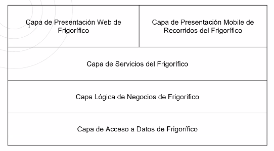

Podemos utilizar tambien los patrones **N-Tier** y **Broker**, de acuerdo a los RNF planteados.

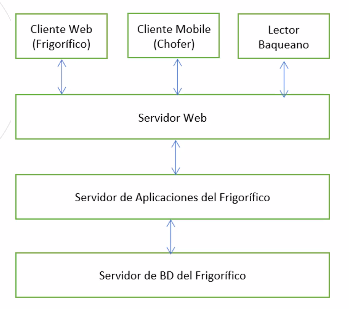

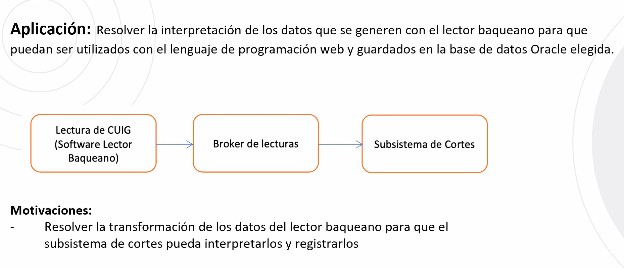

**Vista de la Funcionalidad**

Los ABMC representativos para entidades son:
- Punto de Entrega
- Corte Vacuno
- Empleado
- Camara

Los ABMC representativos para transacciones son:
- Pedido
- Plan de Entrega
- Motivos de Rechazo
- Generar Estadisticas/Informes
- Verificar fechas de corte vacuno (CU Automatico)

Excepto aquello que no sea desarrollado con tecnologia web, podemos considerar que dicho CU puede ser significativo si usamos alguna tecnologia/lenguaje de programacion dedicada para dicho CU.

Los CU _automaticos_ no poseen actor en la descripcion, o dice _tiempo_ en su lugar.

---

## 12/08/2021

### Caso Frigorifico

Las capas del sistema son:
- Logica Negocio Persistente
- Logica Negocio No Persistente
- Administracion de persistencia

Cuando estamos habaldno de sistemas web donde surge el tema del acceso a la informacion, es importante tener en cuenta el "iniciar sesion".

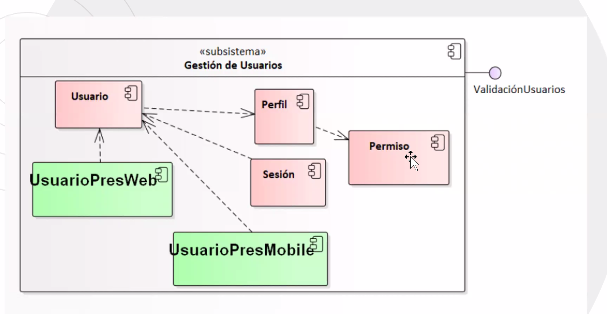

Podemos identificar subsistemas de:
- Cobro
- Pedidos y Clientes
- Logica de Distribucion
- Gestion de usuario
- Gestion de productos
- Notificaciones
- Interfces
- Informes/Reportes
- Administracion de persistencia

### Tips para 2do Parcial

#### RNF

- Hay que estar atentos en caso de _servidores_, de que se pueden observar numerosos RNF: podria haber un RNF sobre la cantidad de servidores, uno sobre el SO utilizado (_compatibilidad_), etc. Todos son SPA.
- Tecnologia Web es de _compatibilidad_ y es SPA.
- Si se requeire comunicacion con otro servicio, entonces hay RNF de WebService. Es SPA.
- Los formatos de video/imagen pueden ser SPA dependiendo de su peso.
- Todo lo que sea seguridad de usuarios/perfiles es SPA.

#### Patrones Arquitectonicos

- **Layered:** Estratificacion de la arquitectura. Cada capa es uno o multiples subsistemas. La capas basicas son _admnistracion de datos_, _logica de negocios_ y _presentacion_. La app puede ser web, con lo cual habria una capa de _servicios web_ y tantas capas de presentacion como dispostivos que usaran el sistema (navegador web, mobile, etc). Tambien puede haber un hibrido web y escritorio, con lo cual la capa de presentacion se dividira en n capas horizontales (algunas seran web y otras no, estas ultimas no tendran capa de servicios web). <mark>Se usa cuando se desea construir nuevas facilidades sobre los sistemas existentes o cuando se requieren capas multinivel</mark>
  - _Aplicacion:_ Se utiliza el patrón para organizarla implementación de este sistema en capas de servicios auto-contenidos, para logar un sistema mantenible, de bajo acoplamiento, adaptable y escalable.
  - _Motivacion:_ 
    1. Independencia antes los cambios. Las interfaces estandarizadas entre capas limitan el efecto de cambios de código a la capa a modificar.
    2. Reutilización de servicios brindados por la interfaz brindada por cada capa.
    3. Mejorar la portabilidad. Los cambios de hardware, del sistema operativo y todo lo que afecta solamente a una capa, se puede modificar sin alterar al resto de las capas.
    4. Cohesión alta en las capas que contienen componentes relacionados a una única responsabilidad.
  - _Ejemplos:_
    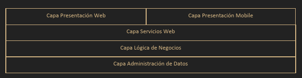
    
    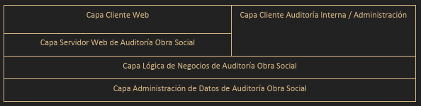  
  - _Ejemplo Propio:_ Se plantea el desarrollo de una app de cine con cliente web y cliente mobile que permita a los usuarios poder ver la cartelera en emision, comprar entradas y suscribirse a peliculas a estrenar para poder ser notificados el dia de su estreno.

- **N-Tier:** Destaca la distribucion del software en los nodos de hardware (maquinas/computadoras fisicas). Soporta la estructura cliente-servidor, donde los clientes realizan peticiones a traves de la red a los servidopres, y estos responden a dichas peticiones en forma apropiada. <mark>Se usa cuando se requieren multiples equipos de hardware apra soportar el sistema.</mark>
  - _Aplciacion:_ Se utiliza el patrón para implementar el sistema/app de [_Nombre de la app_] para dar soporte a [_Clientes web y/o Clientes de escritorio_] livianos con una alta disponibilidad de los servicios de lógica de negocio y de base de datos.  Corresponde a la vista de ejecución (runtime) que destaca sobre la estructura de capas del patrón layered las comunicaciones entre las capas y sienta las bases para la distribución de estas capas en los niveles de hardware de la arquitectura.
  - _Motivacion:_ 
    1. Comunicaciones síncronas para manejar las transacciones respetando la performance y confiabilidad requerida.
    2. Posibilidad de utilizar clientes Web livianos y por consiguiente, no demanda requerimientos adicionales sobre el hardware.
    3. Separación de los distintos intereses en varios niveles lógicos, facilitando las modificaciones y extensibilidad del sistema.
    4. El patrón presenta una solución arquitectónica para toda la aplicación. [_Depende_] 
  - _Ejemplos:_ 

    

    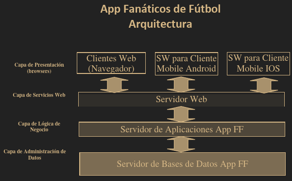

    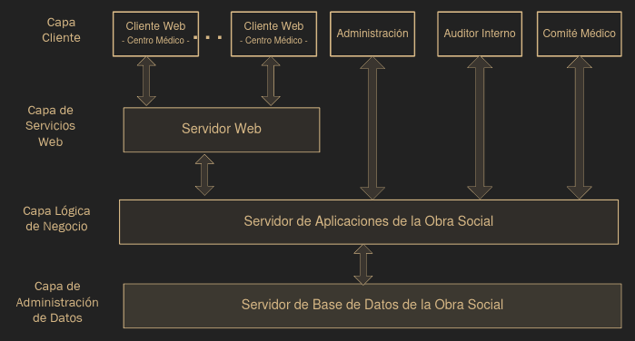
  - _Ejemplo Propio:_ Se plantea el desarrollo de una app de cine web y cliente mobile que permita a los usuarios poder ver la cartelera en emision, comprar entradas con envio de las mismas por mail, y suscribirse a peliculas a estrenar para poder ser notificados el dia de su estreno.

- **Publish-Suscribe:** Los suscriptores se suscriben a topicos que son registrados por publicantes. No hay necesidad de que alla mas de un topico. <mark>Se usa en sistemas muy flexibles que requieren la comunicaicon uno a muchos, muchos a uno o muchos a muchos, en forma asincrona.</mark>
  - _Aplicacion:_ Se propone este patrón para resolver el envío de notificaciones por un evento generado por la organización a los Smartphone de un grupo de clientes. Los clientes destinatarios de las notificaciones serán seleccionados dependiendo de si son o no impactados por el evento que se notifica.
  - _Motivacion:_
    1. Se utilizará para la publicación de las noticias y eventos de [_topico en cuestio_].
    2. El componente que contempla el envío de notificaciones que actualizan el tópico correspondiente.
    3. Los suscriptores son los smarthphones de los usarios de la APP , que necesitan publicar la notificación para que cada cliente pueda visualizarla. [_Para un sistema mobile_]
    4. En todos los casos, la notificación refleja la suscripción de los Smartphone de los usarios de la APP FF impactados por el evento. [_Para un sistema mobile_]
  - _Ejemplos:_ 
    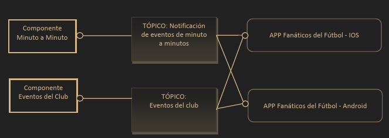
  - _Ejemplo Propio:_ Se plantea el desarrollo de una app de cine con cliente web y cliente mobile que permita a los usuarios poder ver la cartelera en emision, comprar entradas y suscribirse a peliculas a estrenar para poder ser notificados el dia de su estreno.

- **Messaging:** Permite la comunicacion asicrona entre clientes y servidores mediante el uso de una cola de mensajes. Soporta bajo acoplamiento dado que se desconocen los componenetes (agrega indireccion). Los cleintes no requieren del mensaje en el mismo instante que ingresan a la controlar.
  - _Aplicacion:_ Se utiliza para resolver la concurrencia a la hora de encolar [_Mensaje/Artefacto en cuestion_] y su posterior consumo por el componente [_Receptor_], de manera que ninguna orden deje de ser procesada por un desbordamiento de la capacidad del sistema.
  - _Motivacion:_
    1. Los [_Mensaje/Artefacto en cuestion_] pueden ser encoladas de forma asíncrona mientras el componente [_Receptor_] las va procesando, sin interrumpir el funcionamiento del resto de las funcionalidades.
    2. Permitiría asignarle prioridad de procesamiento a los [_Mensaje/Artefacto en cuestion_].
  - _Ejemplos:_ 

  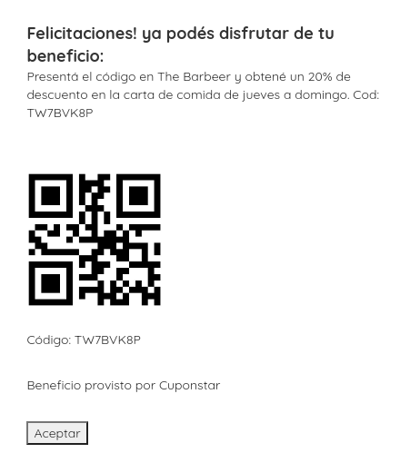

  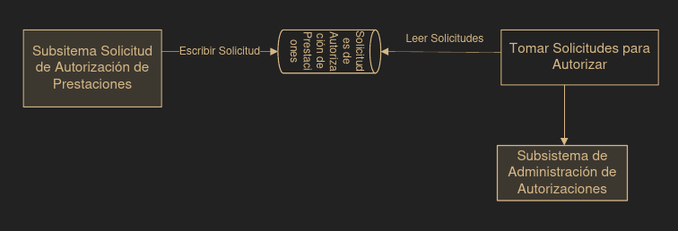

  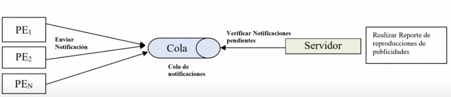

#### Vista de Diseño

- Los subsistemas se pueden hacer a partir de los alcances del sistema.
- Por lo general encontramos, dentro de la capa de logica de negocios, de 5 a 8 subsistemas.
- Los subsistemas que SIEMPRE suelen estar son:
  - _Capa de Persistencia:_ Aporta las interfaces _Materializar_ y _Desmaterializar_. No utiliza interaces.
    - Subsistema de Administracion de Persistencia: BD, Persistencia
  - _Capa de Logica de Negocio:_ Aporta una _interfaz de LogicaProgramacion_ y consume las interfaces _Materializar_ y _Desmaterializar_ que aporta el subsistema de Administracion de Persistencia. 
    - Subsistema de Gestion de Usuarios:
      1. Componentes: Usuario, Perfil, Sesion, Permiso
      2. Interfaces Provistas: Autenticacion y LogicaUsuarios
      3. Interfaces Utilizadas: 
    - Subsistema de Generacion de Reportes/Informes: Generador de Reporte
      1. Componentes: 
      2. Interfaces Provistas: LogicaReporte
      3. Interfaces Utilizadas: Consume de los subsistemas que requiere para poder hacer el reporte.
  - _Capa de Presentacion_: Hay un componenete de presentacion por cada subsistema dentro de Logica de Negocio.
- En general, todos los subsistemas de la capa de logica de negocio (excepto el de reprotes y el de usuarios), requerira consumir de la interfaz de autenticacion que provee el subsistema GestionUsuarios.
- Cada subsistema de la capa de Logica de Negocio aporta una interfaz de logica, que utilizara su compoenente respectivo en la presetnacion.

#### Vista de Despliegue

- Hay 3 servidores basicos: _Servidor de Base de Datos_, _Servidor de Aplicaciones_ y _Servidor Web_.
- Se añadiran Clientes dependiendo de si el sistema es web y/o mobile y/o escritorio.
- Se debe prestar atencion a cualquier RNF que aclare la distribucion del software en los servidores.
- Si hay conexion con banco, se agrega _Sistema Bancario_.
- Si se utiliza alguna plataforma de pago particular (VISA, Mercado Pago), se agrega un _Sistema Cobro_.
- El _Cliente Web_ tendra dentro suyo un componenete Browser.

#### Vista de Funcionalidad

- Unicamente contemplamos los RNF significativos.
- Hay que resolver:
  - Inicio de Sesion
  - ABMC Entidad Significativa
  - Transaccion Significativa
  - Proceso Automatico (NO TIENE ACTOR)
  - RNF Significativos no contemplados anteriormente

---

## 09/09/2021

### Correciones

#### RNF

- Web Service: Se requiere otra justificacion, desarrollo de un componenete que resuelva la comunicaccion.
- Pantallas Informativas: No se puede justificar como que no afecta a la arquitectura.
- Diseño Interaces: IDEM 
- Exposicion Virtual: Agregar a justificacion lo de SO mobile y lenguaje mobile.
- Guia Virtual: Resolver el guardado de la voz en la BD.
- Concurrencia de Usuarios: No se requiere concurrencia masiva de ususarios por lo que se soporta simplmenete con la propia BD. No es SPA. 

#### Patrones

- Los Broker no serian necesarios hoy por hoy.
- Publish Suscribe para web service.

#### Vista Funcional 

- ABMC no resuelve web service.
- Pusimos 2 reportes.
- Para resolver web service usar CU 87.
- Para resolver tecnologia mobile utilizar caso 85.

#### Vista de Diseño

- Usar 2 notificadores de reserva.
- Autenticacion de las sedes debe ser requerido.

---

## 16/09/2021

### Patron State 

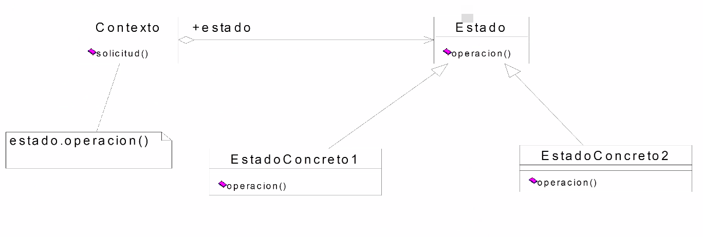

Se aplica a clases que cambian su comportamiento cuando cambia de estado, es decir, se aplcia a clases que defnen un comportameinto dependiendo del estado en que se encuentran. 

**Ventajas:**
- Elimina las sentencias CASE mediante polimorfismo
- Permite crecimiento en la variacion de la logica de negocio en funcion de los cambios de estado. 

**Pseudocodigo:**

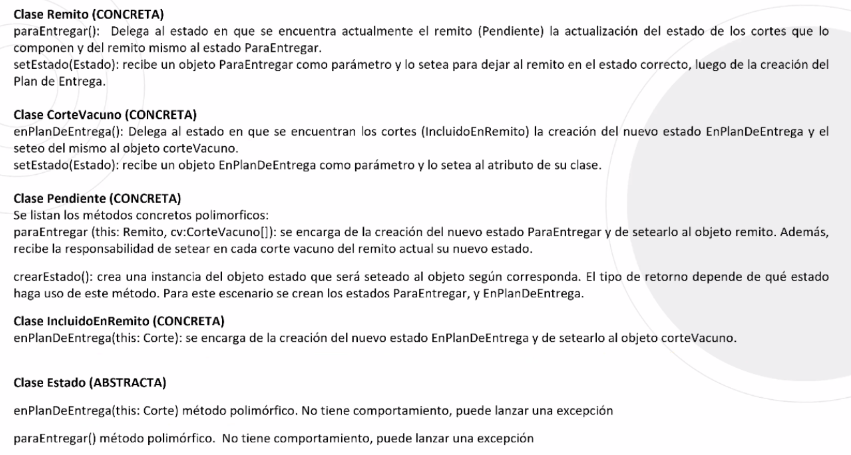

---

## 23/09/2021

### Patron Strategy

**Proposito:**
- Define una familia de algoritmos, encapsula cada uno y permite intercambios. Permite variar los algoritmos de forma independiente a los clientes que los usan.

Escensialmente funciona como el State pero para estrategias, en base a un estimulo externo. Se puede implementar con herencias o realizaciones.

#### Consigna y Resolucion

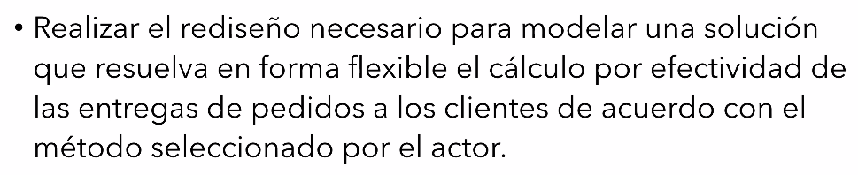

- Usamos un Strategy porque se requiere una variacion "de acuerdo al metodo seleccionado por el actor" (estimulo externo). 

- Debemos tener en cuenta 3 puntos clave para rediseñar:
  1. Cuales son las estrategias posibles del calculo?
  2. En que metodo se define que estrategia se debe utilizar?
  3. Que responsabilidad delegamos?

- Segun el CU 85, identificamos que se debe rediseñar en el paso 7 (_"Solicita se seleccione el metodo de calculo de efectividad"_). Se establecen las siguientes estrategias/metodos:

- En la vista dinamica, el enganche (paso 7) se modela asi: 

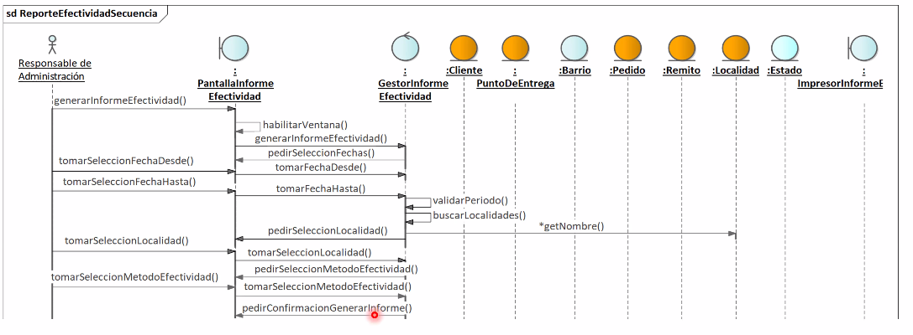

- Identificado esto, debemos:
  1. Rediseñar la estructura (diagrama de clases):
    * Encontramos nuevas clases: _EstrategiaEfectividad_, _PedidosRecibidos_, _PedidosNoRealizados_ y _PedidosCumplidosParcialmente_.

    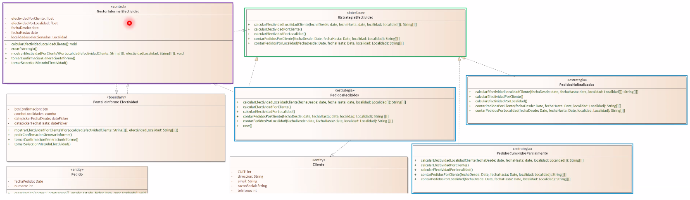

  2. Rediseñar la 

**Explicacion o Pseudocodigo:**

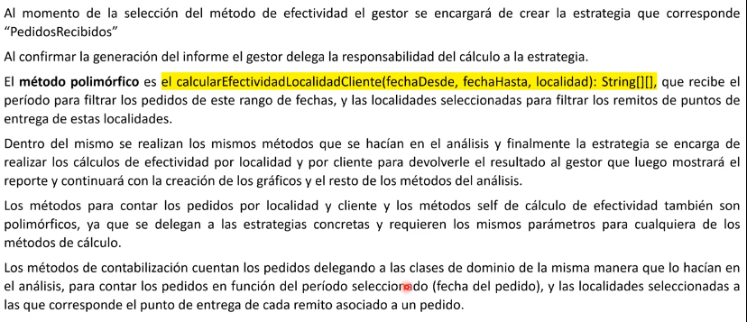

### Patron Template Method

Define el esqueleto (esquema, patron) de un algoritmo en una operacion, difiriendo algunos pasos a las subclases. Permite a las subclases redefinir ciertos pasos de un algoritmo sin cambiar la estructura del algoritmo.

Este patron hace uso de la herencia para centralziar las operaciones que son comunes en una superclase, favoreciendo la reutilizacion. Este metodo invoca a los sucesivos emtodos abstractos y de enganche de manera organizada para recueperar los datos que componen cada parte de informacion que debe ser retornada.

#### Como identificarlo?

Se requiere de algun mecanismo _generico_ o similar, que posibilite que las clases puedan redefinirse _sin cambiar la estructura del mecanismo_.

#### Pasos de Aplicacion

Definimos en la clase de contexto un metodo plantilla y metodos abstractos y de engancha. Las clases hija van a heneredar los metodos abstractos, y pueden redefinirlos de acuerdo a lo que se adecue a la clase (son variables). 

Los metodos hook o de enganche son aquellos que no se modifican y son genericos para todas las subclases.

El metodo plantilla va a llamar a los demas metodos dentro de las sublcases, asi como a los metodos de enganche segun corresponda.

### Patron Builder

#### Como identificarlo?

La consigna habla de un proceso de creacion que es necesario resolver, dada la complejidad de este proceso.

#### Pasos de Aplicacion

Para rediseñar usando un Builder debemos tener en cuenta:
- Cuales son los objetos que tengo que construir?
- Que datos necesito para construirlos?
- Cuales son las partes que hay que construir?

Identificamos el _enganche_, que es el paso dentro de CU que dispara el momento de rediseño.

1. Creamos/Identificamos una clase _director_ en el cual se encontraran todos los parameros encesarios para la construccion de loss objetos deseados.
2. Asociamos una interfaz de cosntruccion a la que llamamos como _iConstructor_ y del cual heredaran aquellas clases que son _Constructores Concretos_. La interfaz tendra un metodo _construirProducto()_ y un metodo _obtenerProducto()_, para que el director pueda llamar a este metodo sin importar en que constructor concreto se encuentra. Cada constructor concreto devolvera su producto concreto en el metodo _obtenerProducto()_.
3. Se crea una clase por cada producto complejo que permite construir cada constructor concreto.

Es muy importante que, antes de iniciar el patron, se creen tanto el constructor completo como el director, y que el director conozca al constructor (lo reciba como parametro en algun mensaje, como el metodo _construir()_).

Finalmente se debe recuperar el prodcuto, de modo que el gestor ya posee la informacion necesaria para poder visualizarlo.

#### Patron Factory Method

Es un metodo que nos ayuda a construir los productos concretos, para que estos sean de un mmismo tipo y que sean mas polimorficos. Es decir, es un metodo de creacion.

Para ello debemos identificar las clases concretas que nos convendria que hereden/provengan de la misma clase.

Entonces, agregamos una clase de interfaz. En el caso del Builder, todos los objetos concretos van a realizar la interfaz.