# Notas de Clase: DSI

<!-- TOC -->
- [07/06/2021](#07062021)
  - [Workflow de Diseño](#workflow-de-diseño)
- [14/06/2021](#14062021)
  - [Diseño Arquitetonico / Diseño de Arquitectura de Software](#diseño-arquitetonico--diseño-de-arquitectura-de-software)
  - [**ACTIVIDADES DEL PROCESO DE DISEÑO DE LA ARQUITECTURA**](#actividades-del-proceso-de-diseño-de-la-arquitectura)
  - [Patrones](#patrones)
- [28/06/2021](#28062021)
  - [Arquitecturas de Sistemas Distribuidos](#arquitecturas-de-sistemas-distribuidos)
- [02/08/2021](#02082021)
  - [Proceso de Diseño de la Arquitectura de Software](#proceso-de-diseño-de-la-arquitectura-de-software)
  - [Tipos de Vistas](#tipos-de-vistas)
  - [Vistas Arquitectonicas (PUD)](#vistas-arquitectonicas-pud)
- [23/08/2021](#23082021)
  - [Estrategia de Prototipado](#estrategia-de-prototipado)
  - [Estrategia de Ensamblado de Componentes](#estrategia-de-ensamblado-de-componentes)
  - [Componente](#componente)
  - [Tipos de Composiciones](#tipos-de-composiciones)
  - [Diseño en el PUD](#diseño-en-el-pud)
    - [Artefactos del Diseño](#artefactos-del-diseño)
    - [Trabajadores del Diseño](#trabajadores-del-diseño)
    - [Flujo de trabajo](#flujo-de-trabajo)
  - [06/09/2021](#06092021)
    - [Patrones SOLID](#patrones-solid)
  - [13/09/2021](#13092021)
    - [Patrones de Diseño](#patrones-de-diseño)
    - [Patron State](#patron-state)
    - [Patron Strategy](#patron-strategy)
    - [Patron Template Method](#patron-template-method)
    - [Patron Observer](#patron-observer)
    - [Patron Factory Method](#patron-factory-method)
    - [Patron Builder](#patron-builder)
    - [Patron Composite](#patron-composite)
    - [Patron Adapter](#patron-adapter)
- [04/10/2021](#04102021)
  - [Diseño de Persistencia](#diseño-de-persistencia)
    - [Modelo Entidad-Relacion](#modelo-entidad-relacion)
<!-- /TOC -->

---

## 07/06/2021

### Workflow de Diseño

Podemos definir **diseño** como el proceso _iterativo_ mediante el cual se aplican varias tecnicas y principios con el objetivo de definir un dispositivo, un proceso o un sistema con suficiente nivel de detalle como para permitir su realizacion fisica, permitiendo transformar un _modelo logico_ en un _modelo fisico_ de acuerdo a las _restricciones_ del negocio.

**Diferencias del Analisis y el Diseño en el PUD:**

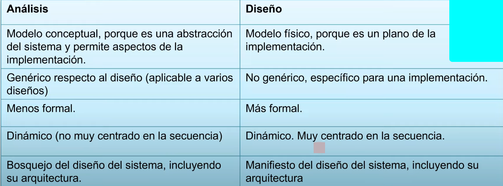

El diseño es un modelo *fisico* centrado en la arquitectura (caracteristica del PUD). 

Las tendencias de la Ingenieria de Software son:
- Darle un papel protagonico a la etapa de requerimientos.
- Poner especial atencion en la arquitectura de software.
- Utilizar las mismas herramientas para modelar.
- Utilizar un proceso (por ej. PUD)

Los aspectos que debemos modelar del software son:
- Arquitectura
- Datos
- Procesos
- Interaccion Humano-maquina
- Formas de Entrada/Salida
- Procediemitnos Manuales (no se implementa solo con codigo)

Los primero es diseñarse siempre es la _arquitectura_.

El *diseño arquitectonico* es la pieza principal a partir de la cual se desarrollan los demos diseños, siempre alineados con el diseño arquitectonico que funciona como un plano. Modela los requerimeintos de calidad o *no funcionales*. Dado que involucra un proceso de decisiones significativas, es importante que se documente  cada decision, su justificacion y contexto, dada la naturaleza evolutiva y cambiante de la tecnologia.

El *Diseño de Datos* busca transformar los requerimienos en las estructuras de datos necesarias para hacer persistir el software.

El *Diseño de los Procesos* transforma elementos estructurales en una descripcion procedimental de los componenetes del software. Por ejemplo si los CU son automaticos o temporales. Hay que tener en cuenta procesos para seguridad, autentiucacion de usuarios, backups y recuperacion, etc. Es decir, transforma las Realizaciones de CU de Analisis en Realizaciones de CU de Diseño.

El *Diseño de Interaccion Humano-Maquina* es la disciplina relacionada con el diseño, evaluacion e implementacion de sistemas computacionales interactivos para uso humano. Una parte de este diseño es la UX y la UI. Tambien se tienen el cuenta el diseño de la posicion corporal del usuario final del software. Busca que los usuarios puedan utilizar el software de la mejor manera posible.

El *Diseño de Formas de Entrada/Salida* describe como se ingresa informacion al software y como se presentaran las salidas del mismo.

Los sistemas *criticos* son aquellos que no deberian fallar dado la magnitud de sus consecuencias.

El *Diseño de los Procedimientos Manuales* describen como se integra el software ya puesto en produccion al Sistema de Negocio, teneindo en cuenta las adaptaciones necesarias por parte del negocio para que se pueda integrar correctamente. Suele usarse BPMN para representar dicha integracion.

---

## 14/06/2021

### Diseño Arquitetonico / Diseño de Arquitectura de Software

Podemos definir a la *arquitectura* como el conjunto de decisiones significativas que tomamos para poder resolver los RNF teniendo en cuenta el contexto (es decir el negocio donde va a a funcionar dicho sistema), y se modela a traves de vistas. En PUD, una arquitectura estable y madura es indicacion de que es hora de salir de la etapa de Elaboracion para inicar la Etapa de Construccion.

Entonces el *diseño de la arquitectura* se define como un diseño estrategico (porque define aspectos globales de decision, que luego se implementan en tacticas mas detalladas) que se encarga de asignar modelos de requerimientos escenciales a una tecnologia especifica.

**TEMAS PARCIAL 2:**

- Patrones Arquitectonicos

- Vistas Arquitectonicas

- RNF

### **ACTIVIDADES DEL PROCESO DE DISEÑO DE LA ARQUITECTURA**

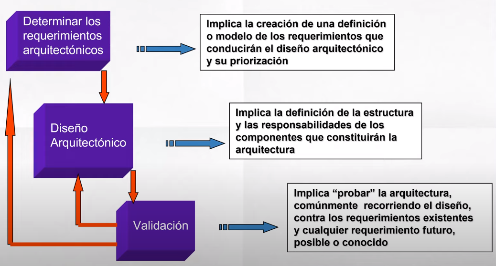

- **Determinar Requerimientos Arquitectonicos:**

  Los requerimientos (funcionales y no funcionales) son una ENTRADA del Workflow de Diseño. Se van a analizar los RNF para poder determinar si son significativos para la arquitectura (si impactan o no impactan en las decisiones significativas para la arquitectura). Inicialemente, es suficiente ubicar los requerimientos en 3 categorias:

    - **Alto:** La aplicacion debe soportar este requerimiento. Se los debe atender desde la primer iteracion y no se pueden posponer. Conducen el diseño de la arquitectura.

    - **Medio:** Necesitara ser soportado en alguna etapa, pero no necesariamente en el primer release.

    - **Bajo:** Estos son parte de la lista de deseos. Las soluciones que los incluyen son deseables, pero no son conductores del diseño.

    La *priorizacion* es un concepto engañoso dado que los requeriemientos pueden entrar en conflicto entre si, ademas que algunos RNF se condicionan entre si, lo que implica que se deban implementar en la misma iteracion y que tengan la misma prioridad entre si. Dado un escenario de iteraciones, si determinamos que la prioridad de un RNF es alta, entonces esos RNF se deben atender en la primer iteracion del software.

- **Diseño Arquitectonico**: Se compone de 2 actividades:

  - **Elegir el Framework de Arquitectura:** Un framework esta compuesto por una serie de Patrones Arquitectonicos, que implican soluciones conocidad. Estas soluciones estan probadas y son validas por lo que nos permiten minimizar los riesgos. En base a los Requerimeintos significativos para la arquiotectura, se debe elegir el Framework adecuado de acuerdo a los patrones arquitectonicos que deseamos aplciar en el software.

  - **Distribuir Componentes:** Implica la definicion de la estructura y las responsabilidades de los componenetes que constituiran la arquitectura.

- **Validacion:** Implica un proceso de control para probar la arquitectura, comunmente recorriendo el diseño contra los requerimeintos existentes y cualquier requerimiento futuro, posible o conocido.

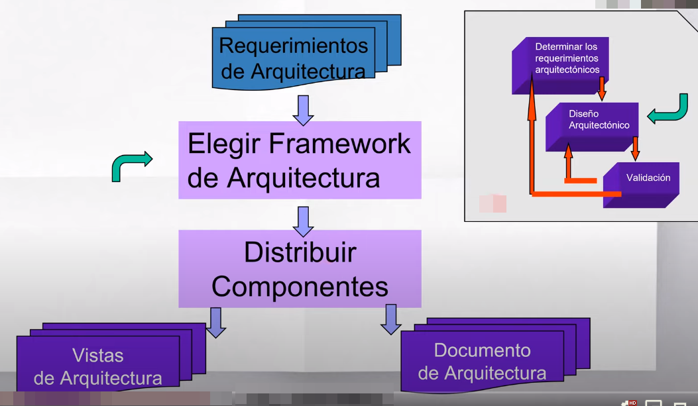

### Patrones
Los **patrones arquitectonicos** son soluciones de alto nivel, validos y probados, que nos permiten resolver aquellos RNF que son significativos para la arquitectura de froma que minimizamos los riesgos y modelamos de forma correcta y consistente. Comunmente se aplican a partir de Frameworks.

Los patrones pueden ser:
- **Platonicos:** Es un patron idealizado, rara vez se aplica al codigo en forma exacta.
- **Embebidos:** Se lo ve en los sistemas reales, y a menudo rompen las restricciones estrictas de los patrones platonicos, generalemente a favor de una gran compensacion.

La distincion entre un _patron arquitectonico_ y un _estilo arquitectonico_ radica en que los estilos son de una jerarquia mayor que los patrones, de forma que multiples patrones pueden aparecer en un mismo diseño. Por otro lado, un sistema tiene usualmente un unico estilo arquitectonico dominante.

Los patrones que vamos a ver son:

- **Patron Layered:** La **arquitectura estratificada** o **en capas** implica la estratificacion de la arquitectura en una serie de capas para poder organizar los componenetes de software teneindo en cuenta el bajo acoplamiento y la alta cohesion, y donde cada una se encuentra en un nivel conceptual distinto. Es decir, cada capa funciona como un subsistema. Aplica a elementos de codigo y es parte del tipo de vista _modulo_. Las capas basicas son:

  - _Presentacion:_ Aloja a todas las clases de tipo boundary, es decir, las pantallas e interfaces con las interactua el usuario. Es la mas cercana al usuario.

  - _Logica de Negocios:_ Alberga a aquellos algoritmos y procesos que resuelven los RF y algunos de los RNF. Abarcaria a las clases de entidad y las de control. 

  - _Administracion de Datos:_ Aloja la base de datos. Es la mas alejada del usuario.

Podriamos adicionar una capa de _servicios web_, una de _persistencia_, etc.

<!--! Ejemplo -->
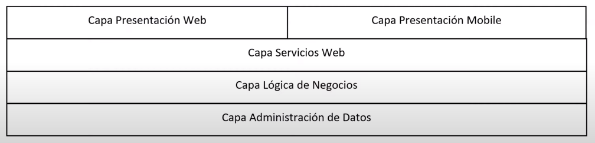

- **Patron N-Tier:** Una **arquitectura cliente-servidor** diferencia una maquina de cliente que hace peticiones a un servidor atraves de la red, el cual atiene a las peticiones del cliente. Se puede combinar con la arquitectura en capas. Podemos aplicar hasta N niveles para tener una arquitectura de software distribuida. Posee comunicaicon _sincronica_.

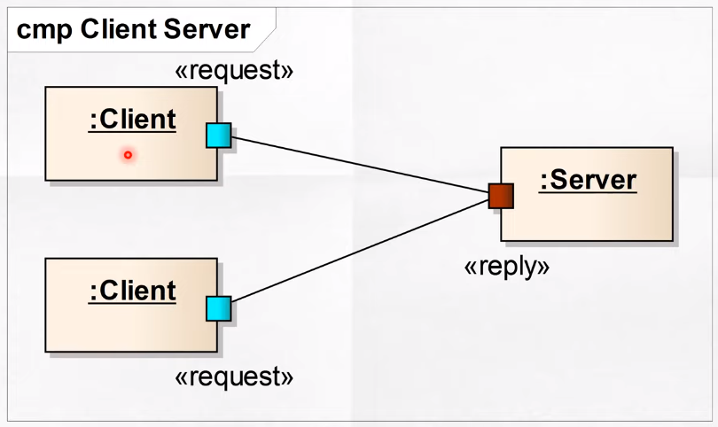

- **Patron Publish-Suscribe:** Consiste en un conjunto de componenetes de software denominados _suscriptores_, que deben manifestar en interes de estar notificados sobre la ocurrencia de un cierto evento, y un componente _publicante_ que frente a dicha ocurrencia informa sobre ello a traves de la creacion o publicacion de un _topico_ al cual se suscribe cada suscriptor para ser notificado. Es una estructura muchos a muchos. Posee muy bajo acoplamiento (desconocimeinto entre suscriptores y publicantes). Es muy utilizado en los entornos mobile. Posee comunicacion _asincronica_.

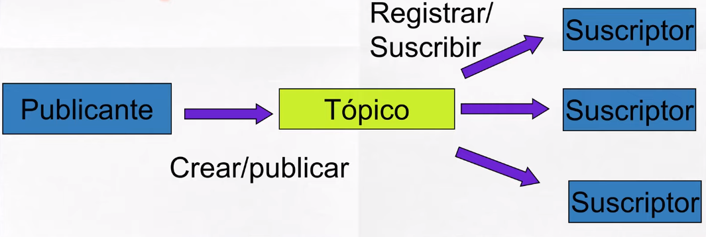

- **Patron Broker:** Su motivacion es atender problemas de _compatibilidad de formatos_ entre componentes, permitiendo a los _receptores_ comprender la informacion proveniente de los _remitentes_ en un formato de entrada, brindando un formato de salida interpretable por el sistema. Utiliza un sistema de _ruteo_ para poder enviar a los receptores correspodnientes aquella informacion proveniente del remitente indicado, mediante puertos de entrada y salida. Comunmente es utilizado cuando el sistema se comunica con sistemas externos para enviar o recibir informacion. Posee comunicacion _asincronica_.

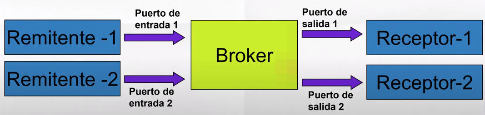

<mark>CAPAS = Software</mark>
<mark>NIVELES = Hardware</mark>

---

## 28/06/2021

- **Patron Messaging (Arquitectura Comunicando):** Funciona a partir de una estructura cliente - servidor, donde se implementa una cola (por lo general, FIFO) en la cual se acumulan los mensajes, de modo que funciona de modo *asincrono*. Se va a configurar la calidad de servicio, modificando la cantidad de intentos, los mensajes prioritarios, etc. Un tipo de sistema que utiliza mucho esta arquitectura son los *sistemas de afluencias*. Lo podemos observar principalemnete en los servicios de correo y los sistemas de afluencia.

Si se desea tener alta disponibilidad, se debe implementar *redundancia* en la cola de mensajes.

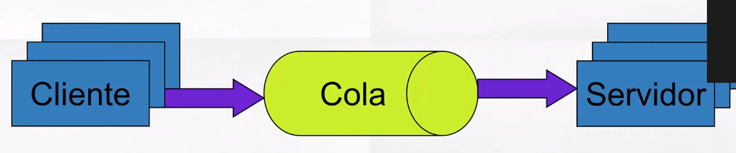

- **Patron Process Coordinator (Arquitectura Coordinador de Proceso):** Es un patron para dar soporte a procesos de negocios complejos en cuanto a la cantidad de pasos, o en cuanto a las reglas de negocio que hay que resolver, procesar y validar, o bien que posee una logica variable. Se implementa un modulo _coordinador de proceso_, quien es el responsable de atender la solicitud del negocio y entrega el resultado correspondiente, mediante la colaboracion con x servidores que lo asisten cada uno con un paso del proceso. Este coordinador posee la logica del negocio, lo cual puede ser ventajoso a la hora de la modularidad, pero puede ser desventajoso porque puede actuar como un cuello de botella para el rendimiento del sistema. Funciona de forma *asincrona*. Los servidores no se conocen (posee bajo acoplamiento).

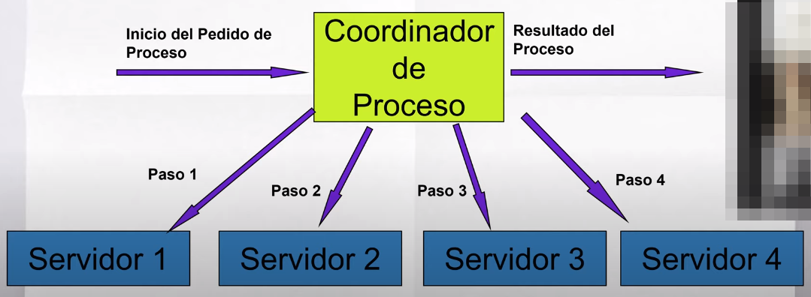

- **Patron MVC (Model View Controller):** Consiste en una serie de _vistas_ que manifiestan su interes en el estado de un _modelo_, el cual contiene la inforamcion sobre el estado de todos los objetos de interes. Es decir que las vistan son representaciones particulares del modelo que aportan multiples formas de ver e interactuar con los daots, y que se relacionan a traves de un objeto denominado _controlador_, que separa la presentacion e interaccion de los datos del sistema. Tiene la ventaja de permitir que los datos cambien de manera independiente de su presentacion y viceversa, y ofrece soporte a distintas representaciones de los mismos datos, y los cambios en una represetnacion se muestran en todos ellos (evitando asi inconsistencias). Por otro lado, tiene la desventaja de que puede implicar codigo adicional y complejidad de codigo cuando el modelo de datos y las interacciones son simples. Posee comunicacion _asincronica_. Separa la presentacion e interaccion de los datos del sistema (bajo acoplamiento).

### Arquitecturas de Sistemas Distribuidos

Un _sistema distribuido_ es un sistema de software que se ejecuta en un grupo de procesadores cooperativos integrados, conectados por una red. Poseen las siguientes caracteristicas:

- *Comparticion de Recursos:* Recursos de hardware y software asociados a una red.
- *Apertura:* Son sistemas abiertos, que se diseñan sobre protocolos estandar que combinan equipamiento y software de diferentes vendedores.
- *Concurrencia:* Permiten que varios procesos esten operando al mismo tiempo sobre diferentes computadoras de la red.
- *Tolerancia a Fallas:* Dada la alta disponibilidad de recursos y el potencial para reducir informacion se permite un cierto nivel de tolerancia a fallos.
- *Escalabilidad:* Pueden crecer incrementando recursos para cubrir nuevas demandas. Pueden crecer en _tamaño_, _distribucion_ y _manejabilidad_.

Sus _desventajas_ son:
- _Complejidad:_ Son mas dificiles de comprender y probar.
- _Seguridad:_ Se difivulta asegurar la integridad y la degradacion del servicio.
- _Manejabilidad:_ Los defectos pueden propagarse de maquina a otra, implicando que es mas dificil de gestionar y administrar.
- _Impredecibilidad:_ La respuesta depende de la carga total en el sistema, de la organizacion y de la red.

Identificamos una serie de arquitecturas para los sistemas distribuidos:
- **Arquitectura Maestro/Esclavo:** Fueron el primer nivel de distribucion de arquitectura, permitiendo multiples procesadores para un mismo hardware. Consiste en un procesador principal denominado _maestro_ que delega y asigna acciones de procesameiunto a los procesadores secundarios (denominados _esclavos_). Deriva en la *arquitectura cliente/servidor*, donde ademas se comienza con la adicion de capas para lograr arquitecturas de n-capas que sirven a los sistemas distribuidos.
- **Arquitectura Peer-to-peer (Descentralizada):** Los componentes de software (nodos) funcionan todos con un mismo rol, pudiendo funcionar independientemente como cliente o como servidor. Su principal problema es la redundancia, de forma tal que las respuestas a peticiones pueden ser contestadas por multiples nodos. Posee alguna arquitecturas derivadas como la Peer-to-peer Semi Centralizada, que utiliza un servidor llamado _superpar_.

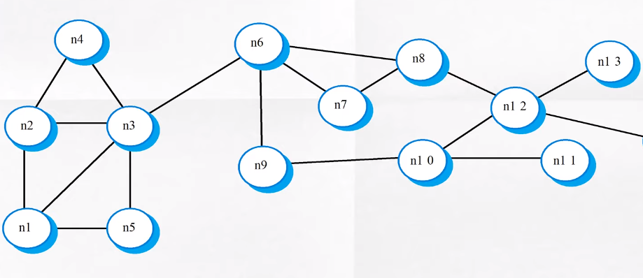

Encontramos tambien _arquitecturas de vista de distribucion_ para poder atender a software de alta disponibilidad:
- **Arquitectura Espejada (Mirrored):** Implica la duplicacion o triplicacion de los elementos de hardware en linea y que corren en paralelo, segun los requerimeintos de disponibilidad. Permite mantener alto funcionamiento aun frente a fallas en algun equipo de hardware.
- **Arquitectura Rack:** Los servidores se acomodan el pilas para utilzar mejor el espacio, y todas se conectan a la misma red. Dicha red puede tener multiples conexiones a internet.
- **Arquitectura Granja de Servidores:** Implica la utilizacion de multiples racks en una misma habitacion, aportando un recurso masivo para alojar cualquier aplciacion. Es muy facilmente escalable.

Encontramos clientes _livianos_ y clientes _pesados_:
- Liviano: No posee la capa de logica de negocios (se encuentra en el servidor).
- Pesado: Posee la capa de logica de negocios.

<!--! Ejemplo -->
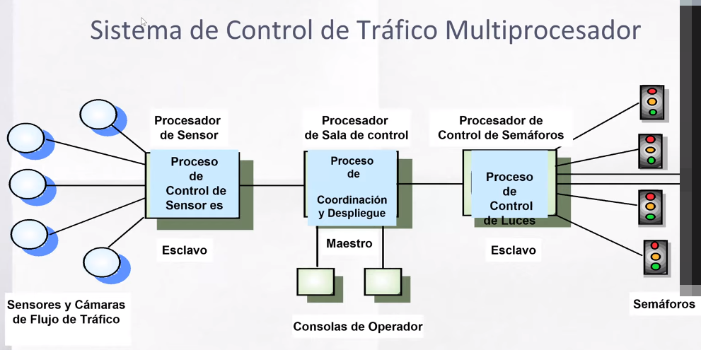

---

## 02/08/2021

### Proceso de Diseño de la Arquitectura de Software

**DESCRIPCION DEL PROCESO DE DISEÑO ARQUITECTONICO:**
- _Determinar los requerimientos arquitectonicos:_ Implica la creacion de una definicion o modelo de los requerimientos que conduciran el diseño arquitectonico y su priorizacion. Es decir, implican una decision del diseño arquitectonico.
- _Diseño Arquitectonico:_ Implica la definicion de la estructura y las responsabilidades de los componenetes que constituiran la arquitectura.
- _Validacion:_ Implica un proceso de control, para probar la arquitectura, comunmente recorriendo el diseño contra los requerimeintos existentes y cualquier requerimiento futuro, posible o conocido.

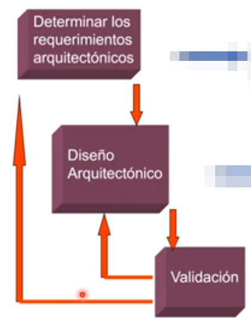

A partir de los _requeriemientos de la arquitectura_ elegimos el _Framework de Arquitectura_ apropiado, para luego distribuir los _componentes_. Permitien obtener como resultado vistas y documentos.

### Tipos de Vistas

Un **modelo de diseño** es un conjunto o categoria de vistas que pueden ser facilmente conciliadas unas con otras. Las vistas que no pueden ser conciliadas perteneces a tipos de vistas diferentes.

Los tipos de vistas son:
- **Vistas de Modulo:** Contiene vistas de los elementos que se pueden ver en tiempo de compilacion. Definiciones de tiempo de componentes, puertos, conectores, clases e interfaces. Encontramos al Patron Layered.
- **Vistas de Ejecucion (Runtime):** Conteine vistas de los elementos que se pueden ver en tiempo de ejecucion. Incluye escenarios de funcionalidad, lista de responsabilidades y ensambles de compoennetes. Instancias de componentes, conectores y puertos (como objetos). Encontramos al Patron Cliente Servidor N-Tier.
- **Vistas de Distribucion:** Contiene vistas de elementos relacionados con la distribucion del software del hardware. Incluye al resto de los patrones (Messaging, Broker, Publish and Suscribe, Process Coordinator, Cliente Servidor N-Tier).
- **Vistas Spanning (Atrviesan):** Se utilizan para mostrar ciertos requerimientos con tal de que estas no colicionen. <mark>INVESTIGAR</mark>

Una **vista** es una proyeccion de un modelo/s para un involucrado o interesado en prticular, desde sus interes, perspectivas y necesidades. Por lo tanto, la vista es una abstraccion del modelo/s que se adecua para el interesado. El **punto de vista** es una definicion teorica que explica lo que la vista va a mostrar.

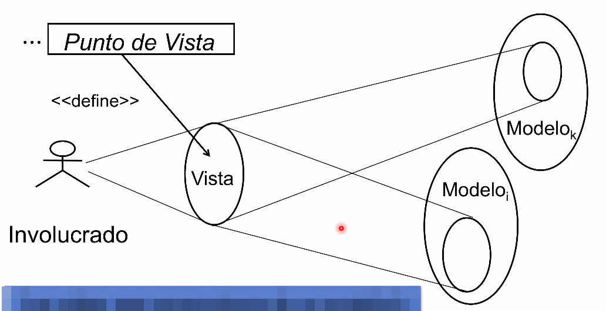

Al ser abstracciones, deben ser lo mas _minimas y pequeñas_ posibles. Aproximadamente, solo del 10% al 15% de los CU son significativos para la arquitectura.

NO TODAS LAS VISTAS CON Arquitectonicas

### Vistas Arquitectonicas (PUD)

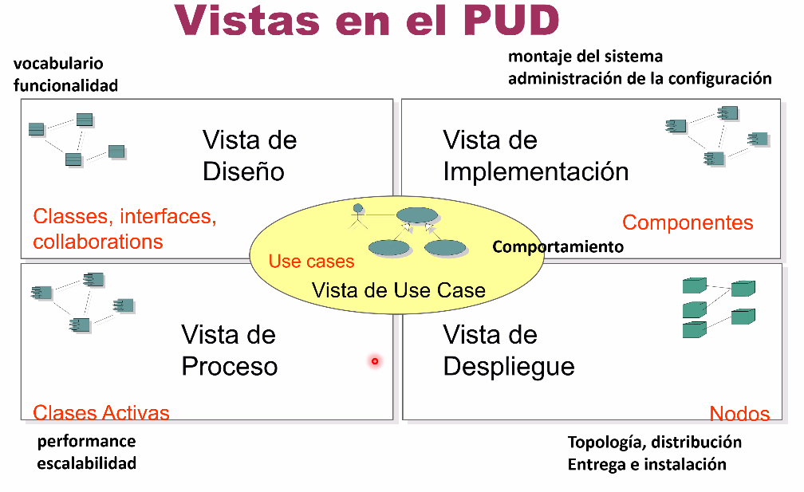

Las vistas propuestas por el PUD son TODAS arquitectonicas, y poseen una parte estatica y una dinamica, usando diagramas de UML. Las vistas del PUD son:
- **Vista de Casos de Uso:** Es la primer vista que se observa en el PUD. Llamada tambien _vista de fuincionalidad_, muestra unicamente aqullos CU que son relevantes para resolver la arquitectura (es decir, aquellos CU significativos para la arquitectura, segun plantean las caracteristicas del PUD). Su parte _estatica_ se modela mediante un Diagrama de Casos de Uso, y su parte _dinamica_ mediante Diagramas de Colaboracion o de secuencia. Es artefacto del WF de Requeriemientos (parte estatica) y Analsis (parte dinamica).
- **Vista de Diseño:** Permite mostrar los elementos relevantes en terminos de subsistemas de componenetes, y las relaciones entre dichos elementos para satisfacer los requerimeintos significativos para la arquitectura. La parte _estatica_ se construye mediante Diagrama de Clases o de Componenetes. Definimos a un _componente_ como un tipo especial de clase, con la aprticualridad de que es fisico (es codigo). La parte _dinamica_ se representa mediante Diagrama de Secuencia. Es artefacto del WF de Diseño.
- **Vista de Implementacion:** Implica el hecho de la codificacion del producto. Define como se van a configurar los entornos de desarrollo, y mantiene la integridad del codigo mediante la administracion de configuracion para no perder informacion relevante y mantener consistencia. Su parte _estatica_ se mdoela mediante Diagrama de Componentes. La parte _dinamica_ se representa mediante Diagrama de Secuencia. Es artefacto del WF de Diseño.
- **Vista de Proceso:** Hace foco en los procesos relacioandos a las _clases acticas_, que son las clases que poseen el hilo conductor del sistema. La parte _dinamica_ se representa mediante Diagrama de Secuencia. La parte _estatica_ se representa mediante Diagrama de Componenetes. Es artefacto de WF de Diseño.
- **Vista de Despliegue:** Muestra la distribucion del software en los nodos de hardware para que pueda ser desplegado, de forma tal que el hardware de soporte a la arquitectura del sistema. La parte _dinamica_ se representa mediante Diagrama de Secuencia. Su parte _estatica_ se modela mediante Diagrama de Nodos. Es artefacto del WF de Diseño.

Las vistas estaticas del PUD correspondel a las Vistas de Modulo, y las vistas dinamicas corresponden a las Vistas de Runtime.

No siempre son necesarias todas las vistas, asi como hay situaciones donde se peuden requerir vistas adicionales, siempre de acuerdo a los requerimientos y necesidades del producto de software.

Podriamos utilizar una _Vista de Datos_ para completar el Modelo 4+1, ya que atiende el punto de mayor retardo en un sistema: Los accesos a BD relacionales.

---

## 23/08/2021

Los temas que SI O SI al _parcial practico_ son:
- Vista Funcional
- Vista de Diseño / Subsistemas
- Vista de Despliegue / Nodos

Los temas del _parcial teorico_ son:
- Definicion del Diseño
- Aspectos
- Estrategias de Prototipado y Ensamblaje de Componentes
- Diseño en el PUD, Trabajadores, Actividades (Cap. 9 del Libro del PUD)

A proceso de estrategias de prototipado se lo conoce tambien como **Ingenieria de Software basada en Componentes** o **ISBC**.

### Estrategia de Prototipado

La _Estrategia de Prototipado_ es una elección de modelo de proceso que se recomienda elegir a la hora de implementar un proyecto complejo, con dominio no familiar, que utilizará una tecnología desconocida; de ahí que surge la necesidad de requerirse el uso de prototipos en el diseño y la implementación, además de utilizarlos
durante la validación de requerimientos.

Es un modo de desarrollo de software, implementando prototipos.

Un **prototipo** es una primera version de un nuevo tipo de producto, en el que se incorporan solo algunas de als caracteristicas del sistema final. Funciona como maqueta del sistema para facilitar la comprension del problema y entender sus posibles soluciones. La finalidad de los _prototipos_ es probar varias suposiciones formuladas por analistas y usuarios respecto a las caracteristicas requeridas por el sistema. Se crean con rapidez, evolucionan a traves de un proceso interactivo y tienen un bajo costo de desarrollo.

Los prototipos poseen las siguientes caracteristicas:
- Poca fiabilidad
- Funcionalidad limitada
- Caracteristicas de operaciones pobres.

En general siempre es recomendable usar prototipos, pero es especiamente ventajoso cuando:
- El area de aplicacion no esta bien definida.
- Hay un elevado costo de rechazo.
- Se utilizan nuevas tecnologias o tecnicas.
- Se desconocen los requerimientos.
- Hay elevados costos de inversion.
- Hay factores de riesgo asociados al proyecto.

Los _beneficios_ que provee el uso de prototipos son:
1. Aumento de la productividad
2. Desarrollo planificado
3. Entusiasmo de los usuarios

Los _Tipos_ de prototipos son:
- _Prototipado de Interfaz de Usuario:_ Modelos de pantallas.
- _Prototipado Funcional:_ Implementa algunas funciones y las corrije y refina.
- _Prototipos Arquitectonicos:_ Permiten evlauar decisiones arquitectonicas de infraestructura, tecnologia e integracion.
- _Modelos de Rendimiento:_ Evaluan el rendimiento de una aplciaicon critica.

Respecto a su _utilidad_, pueden ser:
- _Rapidos:_ Se desechan luego de cumplir su proposito, que es el analisis y validacion de requisitos.
- _Evolutivos:_ El prototipo va mutando, auemtnando a medida que se descubren nuevos requisitos hasta convertirse en el sistema requerido.

Respecto al _alcance_, pueden ser:
- _Vertical:_ Desarrolla completamente alguna de las funciones.
- _Horizontal:_ Desarrolla parcialemtne todas las funciones.

Las _etapas_ del modelo de prototipos son:
1. Identificacion de los requerimientos conocidos.
2. Desarrollo de un modelo de trabajo.
3. Participacion del usuario.
4. Revision del prototipo.
5. Iteracion del proceso de refinamiento.

### Estrategia de Ensamblado de Componentes

La _Estrategia de Ensamblado de Componentes_ es una decisión arquitectónica y de diseño de la solución final del software a construir, que implica desde decidir implementar por componentes, definir la granularidad del componente hasta su ensamblando final y prueba de integración.

Es un modelo evolutivo para el desarrollo del software, con un enfoque iterativo.

### Componente

Es una _pieza de software_  (clase) independiente de software, que tiene el proposito de poder ser _reutilizada_ con facilidad, aportando _modularidad_ y _alta cohesion_. Encapsulan alguna funcionalidad expuesta mediante interfaces estandar. Debe diseñarse de forma tal que a la hora del ensamblamiento a otros componentes en el contexto del sistema, estos componenetes posean _bajo acoplamiento_.

Los _beneficios_ de la reutilziacion es que permite poder reducir los tiempo de desarrollo drasticamente, asi como el coste de los proyectos. Esto deriva en un mayor indice de productividad.

Las _ventajas_ del ISBC son:
- _Reutilizacion del Software_
- _Simplificacion de las pruebas_
- _Simplificacion del mantenimiento del sistema_
- _Mayor calidad del software_

### Tipos de Composiciones

Pueden ser:
- **Secuencial:**
- **Jerarquica:**
- **Aditiva:**

---

### Diseño en el PUD

El modelo de analisis es una entrada escencial del modelo de diseño, dado que impone una estructura del sistema que debemos esforzarnos para conservar lo mas fielmente posible.

El diseño debe ser mantenido durante todo el ciclo de vida del software. Su foco se da entre las ultimas iteraciones de la etapa de elebaoracion y las primeras de la fase de construccion, segun el PUD.

#### Artefactos del Diseño

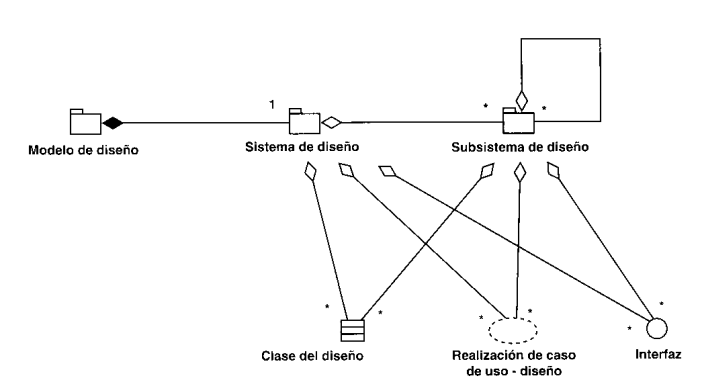

Los **artefactos** del Diseño son:
- _Modelo de Diseño:_ Modelo de objetos que describe la realziacion fisica de los casos de uso, centrandose en como los RNF y otras restricciones tienen impacto en el sistema. Es un plano de la implementacion y por lo tanto es una entrada fundamental de las actividades de implementacion. Denota subsistemas (que son escencialmente abstracciones) que permiten organziar el modelo en porciones manejables, favoreciendo la alta cohesion y el bajo acoplamiento.
- _Clase de Diseño:_ Es una abstraccion _sin costuras_ de una clase o construccion similar en la implementacion del sistema. Ser sin costuras implica:
  - Se especifican en un lenguaje de programacion.
  - Su visibilidad es especifica de una frecuencia.
  - Pueden posponer el manejo de algunos requisitos para actividades subsiguientes de la implementacion.
  - Pueden proporcionar interfaces.
- _Realizacion de CU-Diseño:_ Es una colaboracion en el modelo de diseño que describe como se realiza y ejecuta un CU especifico en terminos de las clases de diseño y sus objetos. Es decir, proporciona una realziacion fisica de la Realziacion de CU-Analisis trazada. Posee una parte estatica represetnada por diagramas de clases, y una parte dinamica represetnada con diagramas de interaccion.

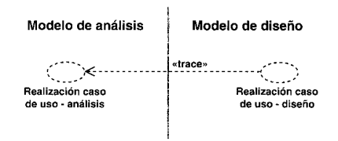

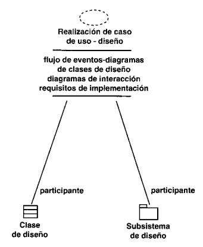

- _Subsistema de Diseño:_ Consiste en una pieza manejable dentro del diseño para poder organziar a los demas artefactos del diseño, represetnando una separacion de los aspectos del diseño. Esta conformado por clases de diseño, realizaciones de CU-Diseño, interfaces y otros subsistemas. Ademas, permite tambien exportar su funcionalidad en terminos de operaciones, mediante el uso de interfaces. Sus contenidos estan fuertemente asociados (alta cohesion) y sus dependendias con otros subsistemas so nminimas (bajo acoplamiento).

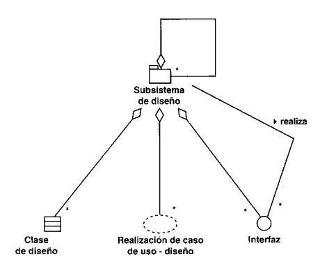

- _Interfaz:_ Constituye una forma de separar la especificacion de la funcionalidad, de modo que permite especificar que oepraciones proporciona una clase o subsistema del diseño. Son escencialemtne _cascaras_. Definen las interacciones permitidas entre los susbsistemas.
- _Descripcion de la Arquitectura (Vista del Modelo de Diseño):_ Contiene una vista de la arquitectura del modelo de diseño que meustra sus artefactos relevantes para la arquitectura. Los artefactos que suelen considerarse _significativos_ para la arquitectura son:
1. Los subsistemas, interfaces y dependencias entre ellos.
2. Las clases de diseño fundamentales.
3. Las Realziaciones de CU-Diseño que describen alguna funcionalidad importante y critica que debe desarrollarse pronto dentro del ciclo de vida del software.
- _Modelo de Despliegue:_ Es un modelo de objetos que describe la distribucion fisica del sistema en terminos de como se distribuye la funcionalidad entre los nodos de computo. Cada nodo representa un recurso computacional (dispositivo o hardware similar) y poseen relaciones que denotan la comunicacion entre ellos 
- _Descripcion de la Arquitectura (Vista del Modelo de Despliegue):_ Contiene una vista de la arquitectura del modelo de despliegue que meustra sus artefactos relevantes para la arquitectura. Todos los aspectos del modelo de despleigue deberian mostrarse en la vista arquitectonica.

#### Trabajadores del Diseño

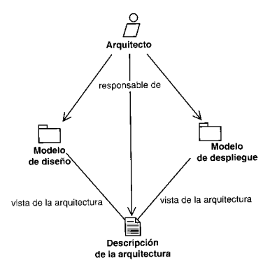

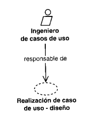

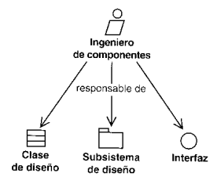

- _Arquitecto:_ Es el responsable de la integridad de los modelos de diseño y despleigue, garantizadno que estos sean correctos, consistentes y legibles como un todo (que cumplan su funcionalidad esperada). Tambien es el responsable de la descripcion de la arquitectura de ambos modelos ya mencionados, de acuerdo a las vistas arquitectonicas.
- _Ingeniero de CU:_ Es el responsable de la integridad de una o mas realziaciones de CU-Diseño, garantizadno que cumplen con los requisitos esperados de ellos y que cumplan con los comportameintos su correspondiente realziacion de CU-Analisis. No es responsable de las clases, subsistemas, interfaces y relaciones del diseño.
- _Ingeniero de Componentes:_ Define y mantiene las operaciones, metodos, atributos, relaciones y requisitos de implementascion de las clases de diseño, garantizadno que cumplan con su funcionalidad esperada. A su vez es el responsable de mantener la integridad de uno o mas subsistemas y su contenido, lo cual incluye a las interfaces que estos proporcionan.

#### Flujo de trabajo

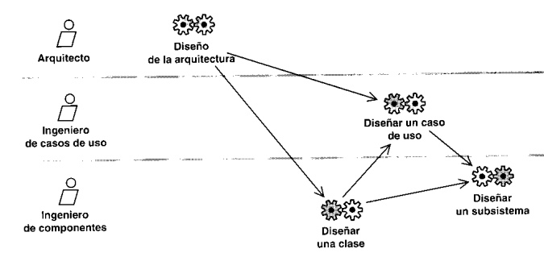

- _Diseño de la Arquitectura:_ Tiene como objetivo esbozar los modelos de diseño y despliegue y su arquitectura mediante la identificacion de:
  - Nodos y sus configuraciones
  - Susbsistemas y sus interfaces
  - Clases de Diseño SPA
  - Mecanismos de diseño genericos que tratan requisitos comunes
- _Diseño de un Caso de Uso:_ Sus objetivos son:
  - Identificar las clases del diseño participantes en las realizacion de CU-Diseño
  - Describir las interacciones de los objetos que interactuan en las realziaciones de CU-Diseño
  - Identificar los subsistemas e interfaces participantes en las realziaciones de CU-Diseño
  - Describir las interacciones entre los subsistemas
  - Capturar los requisitos de implementacion de los CU
- _Diseño de una Clase:_ Su objetivo es crear clases de diseño que cumplan con su papel en las realziaciones de CU-Diseño y los RNF que se aplican a estos, incluido el mantenimiento de las clases. Para ello se debe:
  - Esbozar las calses de diseño
  - Identificar las operaciones
  - Identificar los atributos
  - Identificar asociaciones y agregaciones
  - Identificar las generalizaciones
  - Describir los metodos
  - Describir estados
  - Tratar los requisitos especiales no considerado anteriormente
- _Diseño de un Subsistema:_ Sus propositos son:
  - Garantizar que el subsistema sea tan independiente como sea psoible de los demas y de sus interaces (bajo acoplamiento)
  - Garantizar que el subsistema proporcione las interfaces correctas
  - Garantizar el contenido y comportamiento de los subsistemas de acuerdo a las interfaces que proporcionan.

---

### 06/09/2021

Al 3er Parcial entran los sigueintes temas:

1. Principios de Diseño 
2. 
3. 

Unos de los problemas del software es que dada su _intangibilidad_, es dificil en algunas situaciones poder diferenciar entre las etapas de construccion y diseño del software. 

Independientemente lo que caracteriza al diseño es que dejamos de modelar en terminos conceptuales (donde se asume que el software no tendra fallas ni limitaciones de RNF). 

Un **buen diseño** se caracteriza por: 
- La Independencia de Componentes: Tambien llamada interdependencia funcional, se base en la cohesion y bajo acopalmeinto de los componenetes. 
- La Identificacion y Tratamiento de Excepciones
- Prevencion y Tolerancia de Defectos (prevenir es mas barato que tolerar)

**Principios de Diseño:**
- _No te repitas:_ Apunta a que si hay codigo duplicado, hay exeso de trabajo de mantenimiento y riesgo de isconsistencias. Esto permite que cada requerimiento se encunetre en un unico lugar, mediante el uso de abstracciones.
- _Tell, Don't Ask (Pedir, No preguntar):_ Busca que las clases hagan cosas (se deben distribuir las responsabilidades entre estas) y no que simplemente sean contenedores de informacion. La principal consecuencia de no aplicar este principio es bajos niveles de cohesion, dado que algunas clases tendran muchas responsabildiades y otras muy pocas o ninguna. 
- _Encapsular lo que varia:_ Es el equivlaente al _Open - Close_ de los SOLID. 

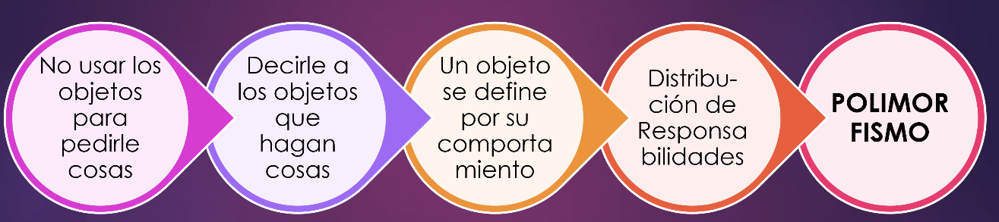

#### Patrones SOLID 

- **S $\rightarrow$ Single Responsability:** Una clase deberia tener una unica responsabilidad global. Entonces, sus metodos deben estar directamente relacionados a dicho modelo. Apunta a la _alta cohesion_ de las clases, conocido tambien como _Cohesion Funcional_.

- **O $\rightarrow$ Open-Close:** Se debe analizar la variabilidad (posibilidad de cambiar) del metodo, permitiendo hacer crecer la estructura de clases. Es decir que si el sistema esta "aboerto" a modificaciones, entonces se pueden crear nuevas clases con nueva funcionalidad, mientras que si esta "cerrado" ya no se podra crear una nueva clase y por lo tanto agregar nuevas funcionalidades. Apunta a la _Flexibilidad_.

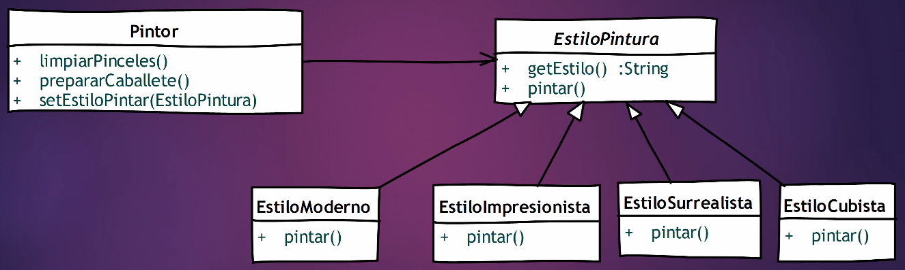

- **L $\rightarrow$ Sustitucion de Liskov:** Se basa en la herencia, que busca principalmente la reutilizacion de _metodos_ y no de _atributos_. Apunta a una _herencia bien diseñada_, al sustituir Tipos sustituibles por sus Tipos Base. Permite revelar problemas de estructura, si estos existieran.

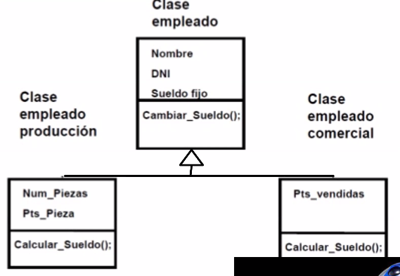

- **I $\rightarrow$ Segregacion de Interfaces:** Permite la implementacion de comportamientos mediante n interfaces, lo que evita romper el encapsulamiento. Apunta al bajo acoplamiento, la facilidad de implementacion y la prueba.

- **D $\rightarrow$ Inversion de Dependencias:** Busca que los componentes dependan de servicios en el mismo nivel, mediante el uso de interfaces. Dichos servicios estarn compuestos por componenetes de nivel inferior. Apunta a la flexibilidad, robustez y movilidad.dc

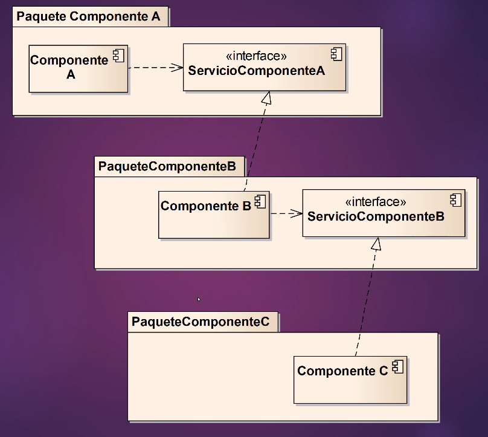

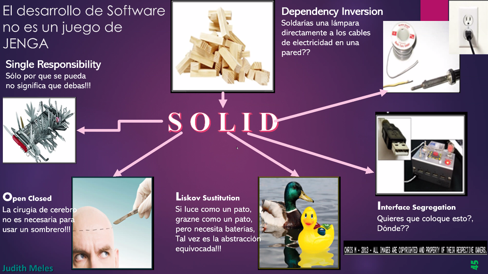

---

### 13/09/2021

Una **interfaz** es una clase abstracta que se caracteriza porque sus metodos estan vacios (unicamente tienen la signatura, que es la parte publica de la clase). Tienen fundamentalmente 2 propositos:
- Definir comportamientos que aplican a multiples tipos. 
- Hacer foco principal en las clases que usan esos tipos. 

Es importante _programar hacia la interfaz y no hacia la implementacion_. Es decir, pensando en lo que es mejor para el cliente y no la solucion.

Vamos a trabjar con 3 relaciones entre clases <mark>(buscar info)</mark>:
- **Herencia**
- **Asociacion (en terminos de UML)**
- **Realizacion**

Estas relaciones se caracterizan por el reuso de los _comportamientos_ (traducido a reusar codigo para no tener que escribirlo n veces).

La **composicion** es la relacion mas estricta de todas. Detalla que el todo no puede existir sin las partes, y las aprtes no pueden existir sin el todo. Se lo conoce como caja negra, ya que busca no romper el encapsulamiento al reutilizar los comportamientos. Esto produce un software muchomas flexible, donde los objetos se instancian en forma dinamica y permitiendo introducir cambios incluso en tiempo de ejecucion (lo cual no eprmitira poder postergar la toma de decisiones para mas adelante). El reuso de caja negra solo es posible con el uso de _delegaciones_ (se invoca el metodo en otro objeto para que este lo resuelva). Debe favorecerse siempre por encima de la herencia.

La **herencia** es lo que conocemos como caja blanca, ya que las clases padres deben abrirse (declararse como publicas, al menos para sus subclases) para que las clases hijo tomen todo de ellas (no solo los metodos sino tambien la implementacion, etc). Todo eso se define estaticamente (sucede en tiempo de compilacion), rompiendo el encapsulamiento de la clase padre.

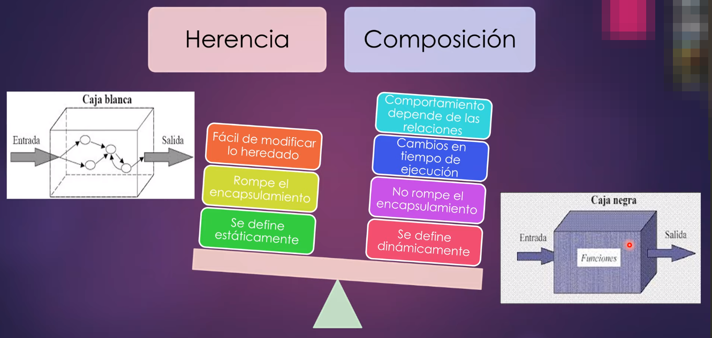

#### Patrones de Diseño

Un patron posee:
- _Nombre_
- _Proposito_
- _Sinonimos_
- _Motivacion_
- _Aplicabilidad_
- _Estructura_
- _Participantes_
- _Colaboraciones_

Los patrones se caracterizan de esta forma para poder facilitar el trabajao en equipo a la hora del desarollo.

Los patrones de diseño ayudan a:
- _Encontrar objetos:_ Se refiere a que los patrones nos ayudan a poder identificar clases de fabricacion pura, es decir, significativas para el diseño y que nos permitiran resolverlo (no para el dominio porque estas ya deberian estar identificacas).
- _Determinar granularidad:_ Nos permiten poder decidir el nivel de comportamiento de cada clase, es decir, su cantidad de trabajo. Se relaciona intimamente con la cohesion, por lo que una granularidad mas fina lleva a un mayor numero de clases.
- _Especificar interfaces:_ Permiten ayudar a determinar que interfaces se deben especificar y que comportamientos deben incluirse en cada clase.
- _Especificar implementacion:_ Algunos patrones nos ayudan especificamente a la hora del codigo de las clases para poder implementar comportamientos.
- _Favorecer reutilizacion:_ El reuso es el objetivo a alcanzar, potenciando la cohesion y bajo acoplamiento. Es importante favorecer la composicion por sobre la herencia (caja negra por sobre caja blanca).
- _Diseñar para el cambio:_ 

<mark>LEER LIBRO DE GAMMA, CAPITULO "INTRODUCCION"</mark>

**Tipos de Patrones de Diseño (Gamma):**

- _Patrones de Creacion [5]:_
Abstraen el proceso de creacion de los objetos, incrementando la flexibilidad y reutilizacion de codigo existente (que se crea, como se crea, como se crea y cuando se crea). Buscan separar responsabilidades mediante la Cohesion Funcional, creando entonces sistemas independientes de como es que los objetos son creados, compuestos y representados. Identificamos:
  1. Factory Method
  2. Abstract Factory 
  3. Builder 
  4. Prototype 
  5. Singleton 

- _Patrones de Estructura [7]:_
Explican como ensamblar objetos y clases en estructuras mas grandes, pero manteniendo la flexibilidad y eficiencia de la misma. Identificamos: 
  1. Adapter
  2. Bridge 
  3. Composite 
  4. Decorator 
  5. Facade 
  6. Flyweight 
  7. Proxy 

- _Patrones de Comportamiento [11]:_
Se encargan de una comunicacion efectiva y la asignacion de responsabilidades entre objetos. Identificamos: 
  1. Chain of Responsability 
  2. Command
  3. Iterator 
  4. Mediator 
  5. Memento 
  6. Observer 
  7. State 
  8. Strategy 
  9. Template Method 
  10. Visitor
  11. Interpreter

A su vez, los patrones se clasifican segun su ambito:
- _Clase:_ Usan herencia para varias la clase que es instanciada.
- _Objetos:_ Delegan instanciacion a otro objeto. 

#### Patron State 

- **Definicion:** El patrón de diseño State se utiliza cuando el comportamiento de un objeto cambia dependiendo del estado del mismo. Es decir, que posee multiples estados internos posibles. Cada uno de estos estados debera convertirse en una clase abstracta independiente que herede comportamientos comunes de la clase padre Estado, e implemente dentro de si misma comportamientos especificos.

- **Motivacion:** Esta motivado por aquellos objetos con comportamiento polimorfico, de forma que su comportamiento varia segun su estado actual y los diferentes mensajes. Surge de la idea de que cada clase posee un numero finito de estados y de transiciones entre estos.

- **Ventajas:** Al incrementar el numero de subclases, favorece a la alta cohesion. Ademas cada estado se vuelve responsable de sus propias tareas y crear instancias que dpeende de si, por lo que apoya el bajo acoplamiento. Naturalmente, el costo de mantenimiento se ve reducido al poder reutilizar el codigo de los comportamientos comunes. Cumple con el principio de _Single Repsonsability_ y el _Open/Closed_.

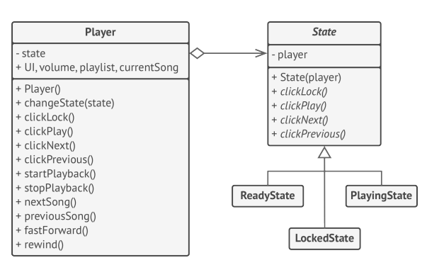

#### Patron Strategy

- **Definicion:** El patron Strategy sugiere que, en caso de que una clase tenga un comportamiento especifico que pueda realizar de distintas maneras (distintos algoritmos), estos se pueden extraer como clases independientes a las que llamamos _estrategias_, de forma tal que la clase original posea un campo para poder referenciar a cada una de las estrategias cuando sea necesario. La clase contexto trabaja con cada una de las estrategias de la misma forma, mediante el uso de la misma interfaz generica, lo que permite que esta clase se vuelva independiente de las estrategias, permitiendo añadir, eliminar y moddificar estos con total libertad y sin impactar en la clase. Esta patron se utiliza para poder evitar clases de bajo acoplamiento, con una excesiva cantidad de comportamientos que aumente su complejidady que poseen poca independencia del resto del sistema.

- **Motiviacion:** Esta motviado por clases concretas que poseen algoritmos proponensos al cambio y cuyo comportamiento varia. Implementa una interaz comun que vincula a todos los algoritmos extraidas con la clase de la cual se extrajeron.

- **Ventajas:**
  - Los algoritmos o estrateias se pueden cambiar y añadir en tiempo de ejecucion.
  - Se pueden aislar los detalles de implementacion de algoritmos particulares del codigo que los utilizan. 
  - Permite poder reemplazar herencia por composicion (aplica principio de diseño).
  - Sigue el principio Open/Closed.

- **Desventajas:**
  - Requiere que el cliente sea conciente de las diferencias entre las distintas estrategias para poder escogerlas.
  - No es recomensable si hay muy pocos algoritmos en la clase.

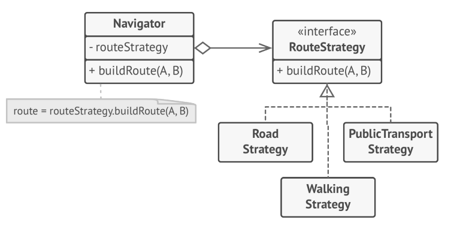

#### Patron Template Method 

- **Definicion:** El patron Template Method se utiliza cuando, entre distintas clases, podemos identificar algoritmos que poseen porciones o fragmentos de codigos identicos, de forma tal que dicho codigo se podria reutilizar. Para ello se propone la division del algoritmo en una serie de pasos, donde cada paso se corresponde con un metodo de la clase padre (llamada _abstracta_), de la cual heredaran las clases hijas (llamadas _concretas_), y cada hija tendra definido pasos que permitiran sobreescribir a los de su clase padre. Definimos pasos _abstractos_ (deben ser implementados por cada subclase) y _opcionales_ (ya poseen una implementacion por defecto, pero pueden ser sobreescritos de ser necesario).

- **Motivacion:** Esta motivado por el uso de "metodos de plantilla", que son metodos que invocan a los metodos que conforman al algoritmo en su totalidad. Esto facilita la reutilizacion de codigo para algoritmos que lo requieran. Busca que se extiendan unicamnete pasos o etapas particulares de un algoritmo, y n otodo el algoritmo o su estrcutura.

- **Ventajas:** 
  - Se permite que se sobreescriban unicamente porciones de codigo especificas, haciendo el codigo mas resistente a cambios en otrass partes del algoritmo.
  - El codigo duplicado se puede ubicar en una superclase.

- **Desventajas:**
  - Algunos clientes pueden verse limitados por la estructura provista por el algoritmo. 
  - Es probable violar el principio de Sustitucion de Liskov.
  - Los Template Methods suelen ser mas dificiles de mantener meintras mas pasos tengan.

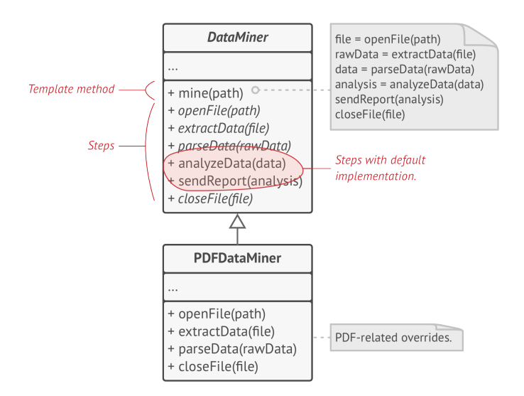

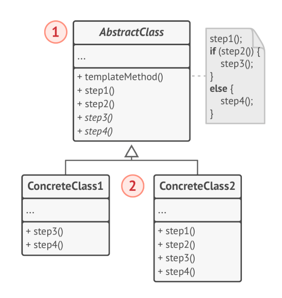

#### Patron Observer

- **Definicion:** El patron Observer define mecanismos de suscripcion para notificar a multiples objetos de cualquier evento que estos esten observando. Se utiliza a fin de evitar perdidas de tiempos al chequear cosntantemente la ocurrecnia del evneto, asi como la posibilidad de desperdiciar recursos al notificar un evento que no es de interes para el objeto en cuestion. Para lograr esto, dividimos a los objetos en _suscriptores_ (se queiren enterar de la ocurrecnia del evento) y _publicantes_ (son los encargados de notificar a los suscriptores). Este patron deberia utilizarse cuando, al cambiar el estado de un objeto, se requiera cambiar otros objetos, o bien cuando algun objeto deba observar a otros por tiempo limitado o casos especificos.

- **Motivacion:** Esta motivado por el uso de un mecanismo de suscripcion para los objetos interesados, mediante el uso de un array que almacena una lista con las referencias a los suscriptores y de metodos publicos que permiten tanto añadir como eliminar suscriptores de la lista. Luego, ocurrido el evento, el publicante invoca un metodo para notificar a los suscriptores de la lista. Todos los suscriptores deben implementar la misma interace apra comunicarse con el publicante.

- **Ventajas:** 
  - Sigue el principio Open/Closed: Se pueden añadir suscriptores sin necesidad de alterar el codigo del publicante. 
  - Las relaciones entre objetos (añadir/eliminar objetos de la lista de suscriptores) en tiempo de ejecucion. 

- **Desventajas:** 
  - Los suscriptorres son notificados en forma aleatoria. 

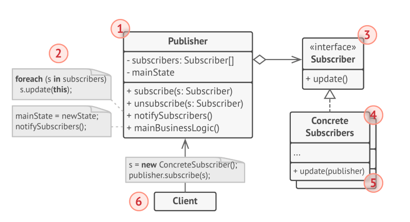

#### Patron Factory Method 

- **Definicion:** Es un patron de creacion que provee una interfaz para crear objetos en una superclase, pero permite que las subclases puedan alterar el tipo de objetos que seran creados. Este patron sugiere sustituir las invocaciones directas del cosntructor _new_ por un metodo _factory_. Las subclases deben utilizar la misma interfaz. Se utiliza cuando es dificil determinan con anterioridad los tipos y depenedencias de los objetos del codigo, o bien cuando se desea proveer una forma de extender los componenetes internos del producto.

- **Motivacion:** Esta motivado por la creacion de metodos _factory_ dentro de los cuales se encuntran los cosntrucctores _new_, lo cual permite poder sobreescribir los _factory methods_ en las subclases.

- **Ventajas:**
  - Permite evitar que el creador y el producto concreto esten juntos. 
  - Sigue el principio de Single Responsability (se puede mover el factory method a un unico lugar del codigo)
  - Sigue el principio Open/Closed (se pueden introducir nuevos tipos de prodcutos al sistema sin romper el codigo existente)

- **Desventajas:** 
  - El codigo puede volverse mas complicado, ya que se añaden numerosas subclases que implementen el patron. 

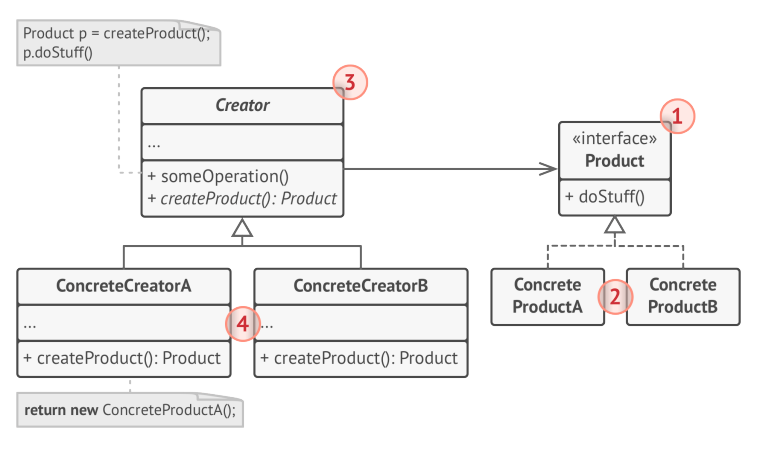

#### Patron Builder 

- **Definicion:** Es un patron de creacion que permite la construccion de objetos complejos complejos paso a paso, permitiendo que atraves de un mismo codigo de cconstruccion se puedan producir diferentes tipos y representaciones de objetos. El patron sugiere la extracccion del codigo de construccion del objeto fuera de su clase, para relocalizarlo dentro de objetos separados denominados _builders_. Cada builder puede ejecutar las mismas tareas en formas diversas, y pueden responder a una clase _director_ que ordena los pasos de construccion de los objetos.

- **Motivacion:** Esta motivado por el uso de clases denominadas _builders_, dentro de los cuales se organizanlos pasos para la cosntruccion de un objeto mediante metodos especificos que pueden ser llamados cuando el objeto lo requiera. Pueden organizarse para responder a una clase _director_, que puede ser ventajoso para casos donde haya cuhos builders, o cuando el proceso de construccion de un objeto sea complejo para el usuario.

- **Ventajas:** 
  - Se pueden crear multiples constructores pequeños que respondan al principal, pero que son mas faciles de manejar y comprender.
  - Facilita la creacion de multiples representaciones de un mismo producto.
  - Los pasos para la cosntruccion se pueden ejeccutar en forma secuencial, recursiva o de cualqueir otra manera.
  - Se promueve la reutilizacion del codigo de construccion.
  - Sigue el principio de _Single Responsability_.

- **Desventajas:**
  - 
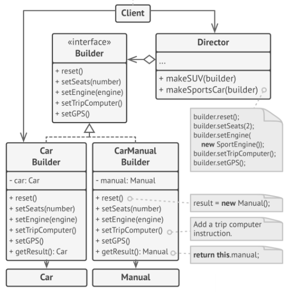

#### Patron Composite 

- **Definicion:** Es un patron estructural que permite la composicion de objetos en estructuras de arbol, con las cuales se puede trabajar como si fueran objetos individuales. Deberia utilizaarse unicamente si el nucleo del modelo de la app puede ser representado como un arbol, y si se desea que el codigo cliente pueda tratar tanto objetos simples como complejos en forma uniforme. 

- **Motivacion:** Esta motivado por el uso de una interfaz comun que permita trabajar con los objetos identados o _nested_, que posea los metodos de calculo que se desea hacer sobre alguno de los objetos dentro del arbol.

- **Ventajas:** 
  - Mediante el polimorfismo y la recursion, se permite trabajar con estructuras complejas com oarboles mas facilmente.
  - Sigue el principio _Open/Closed_

- **Desventajas:**
  - Puede ser dificultodo proveer una interfaz coun para clases cuya funcionalidad difiere mucho.
  
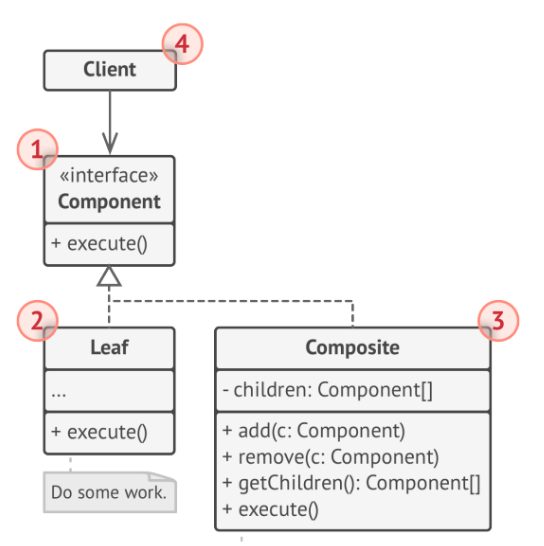

#### Patron Adapter 

- **Definicion:** Es un principio estructural que establece el uso de un adaptador para facilitar el entendimiento entre objetos mediante sus interfaces. Se presenta cuando exista algun problema de compatibilidad de formatos, o bien cuando se requiera facilitar la comunicacion entre interfaces. Tambien promueve la reutilizacion de codigo para que sea añadido a la superclase. 

- **Motivacion:** Esta motivado por la creacion de un _adaptador_, que es un obejto especial que convierte la interfaz de un objeto para que otro/s objeto/s puedan entenderlo. Es decir, permite adaptar el formato y facilitar la colaboracion entre interfaces. El objeto nunca se entera de que esta siendo interpretado por un adaptador.

- **Ventajas:** 
  - Sigue el principio de _Single Responsability_
  - Sigue el principio _Open/Closed_

- **Desventajas:** 
  - La complejidad del codigo incrementa porque se reuqiere la adicion de nuevas clases e interfaces.
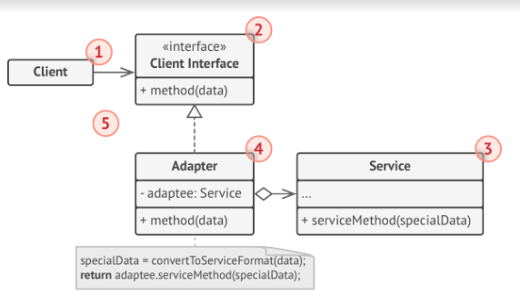

---

## 04/10/2021

### Diseño de Persistencia 

- **Paradigma Orientado a Objetos:** Se definen una serie de objetos que se comunicacn entre si mediante mensajes, colaborando para poder cumplir con el objetivo del sistema. Buscan poder facilitar la integracion y reutilizacion del codigo.

- **Paradigma Estructurado:** Buscan la separacion dato/funcion en terminos de bloques de funciones que son invocadas para que el sistema pueda realziar sus funcionalidades. 

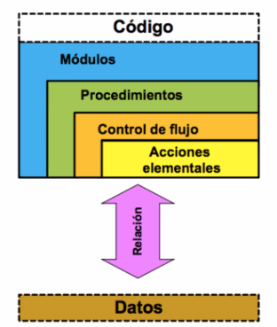

Un **objeto** posee:
- _Estado_
- _Identidad_
- _Comportamientos_ 

Una **clase** es una definicion de un conjunto de objetos que comparten una estructura comun y un comportamiento comun. 

#### Modelo Entidad-Relacion 

Una **relacion** es la abstraccion de un conjunto de asociaciones que existen entre las instancias de 2 entidades. Es _bidireccional_.

La **cardinalidad** indica, para una instancia de una entidad A, la ... 

Este modelo estable 2 _reglas de integridad_:
- **Integridad Relacional:** Ningun componente del atributo identificador en una entidad aceptara NULOS (la primary key no puede ser NULL). 

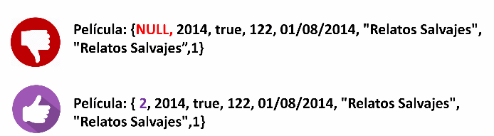

La clave primaria de una relacion R deberia ser _minima_ y _unica_, es decir, que la pk de R no posea valores duplicados (_unicidad_) y que si yo elimino un atributo de la pk esta deja de ser unica (_minimalidad_).

- **Integrdiad Referencial:** Un modelo de datos no debe contener valores en sus atributos referenciales para los cuales no exista un valor concordante en el (o los) atributos identificadores en la entidad objetivo. Los valores de la pk deben pertenecer a la clave foranea de alguna instancia de la tabla referenciada.

El problema de la **impedancia** surge a partir de que las BD no permiten guardar/almacenar comportamientos. En una BD Relacional, se pueden guardar unicamente unos tipos de datos basicos conocidos como _tipos primitivos_, para lo cual se debe poder transformar la estrucutura del objeto que se desea almacenar en una estructura orienetada a tablas que si pueda ser almacenada.

## 18/10/2021 

### Temas Parcial Teorico

- Diseño de Persistencia
- Patrones de Diseño
- Principios de Diseño 
- Evolucion del Software 

### Modalidad Parcial Practico

Hay que rediseñar usando 2 aptrones de diseño. Hay que identificar 1, el otro ya esta identificado.

Hay que realizar Diagrama de Secuencia y de Clases.

### Repaso

El **patron Observer** tiene 2 modalidades:
- _Push:_ En cuanto detecta un cambio en alguno de sus atribtuos en el estado, directamente hace la actualiacion de los suscriptores.
- _Push:_ Se puede utilizar cuando hay situaciones dodne no se toleran/soprotan las interrupciones.

